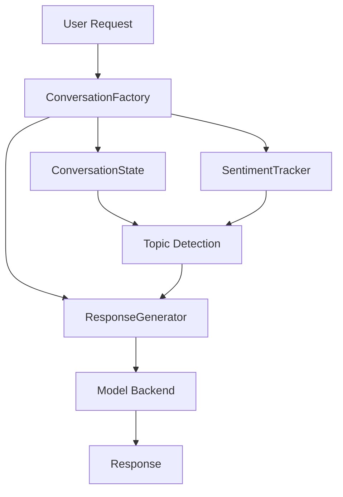

# Conversation Flow

The Opossum chatbot implements a sophisticated conversation management system that coordinates multiple components to handle user interactions.

## Architecture

### ConversationFactory

The system uses a factory pattern to create and manage conversation components:

```python
class ConversationFactory:
    def __init__(self):
        self.conversation_manager = ConversationManager()
        self.response_generator = ResponseGenerator()
```

### State Management

The `ConversationState` class maintains:

- Session tracking
- Message history
- Topic transitions
- Context information
- User preferences

```python
class ConversationState:
    def __init__(self, session_id: str):
        self.session_id = session_id
        self.current_stage = "greeting"
        self.last_topic = None
        self.topic_history = []
        self.message_history = []
        self.last_interaction = datetime.now()
        self.context = {}
        self.user_preferences = {}
```

### Conversation Lifecycle

1. **Initialization**
   - Create session-specific conversation state
   - Initialize sentiment tracker
   - Set up response generator

2. **Message Processing**
   - Check cache for existing responses
   - Update conversation state
   - Track sentiment and engagement
   - Generate contextual responses

3. **Cleanup**
   - Auto-expire inactive sessions
   - Clean up resources
   - Save relevant analytics

## Component Integration



## Session Management

- Sessions timeout after 30 minutes of inactivity
- Automatic cleanup runs every 5 minutes
- Resources are freed immediately on explicit end

```python
def get_conversation(self, session_id: str) -> ConversationState:
    """Get or create a conversation state for a session."""
    self._cleanup_expired()
    
    if session_id not in self.conversations:
        self.conversations[session_id] = ConversationState(session_id)
    return self.conversations[session_id]
```

## Context Window

Conversations maintain a context window of recent messages:

```python
def get_context_window(self, window_size: int = 5) -> List[Dict[str, Any]]:
    """Get recent conversation context."""
    return self.message_history[-window_size:] if self.message_history else []
```

## Error Handling

The system provides several layers of resilience:

1. **Cache Layer**
   - Caches successful responses
   - Reduces duplicate processing
   - Improves response time

2. **Fallback Chain**
   - Model backend failures
   - Topic detection issues
   - General error handling

3. **State Recovery**
   - Session restoration
   - Context preservation
   - Graceful degradation

## Example Flow

1. User sends message:
```json
{
    "message": "Tell me about opossums",
    "session_id": "user123",
    "has_image": false
}
```

2. System processes:
   - Creates/retrieves conversation state
   - Analyzes message sentiment
   - Determines topic and stage
   - Generates contextual response
   - Updates conversation history

3. Response includes:
```json
{
    "response": "...",
    "next_stage": "general_info",
    "sentiment": {
        "polarity": 0.2,
        "subjectivity": 0.5
    },
    "needs_reengagement": false
}
```

## Configuration

Key configuration parameters:

```python
CACHE_TTL = 600  # Response cache lifetime (10 minutes)
SESSION_TIMEOUT = 1800  # Session timeout (30 minutes)
CLEANUP_INTERVAL = 300  # Cleanup interval (5 minutes)
```