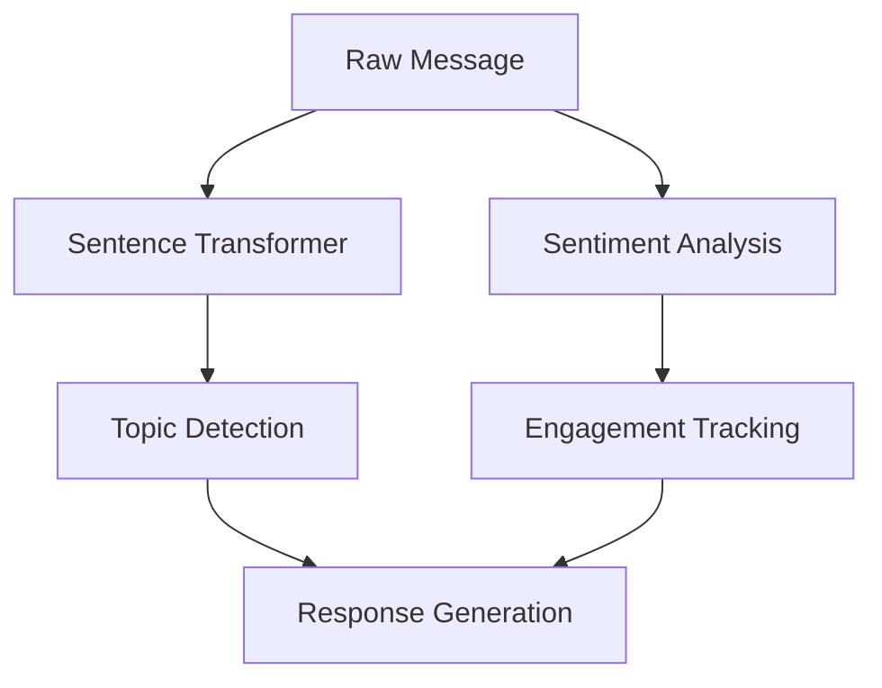

# NLP Components

The Opossum system uses several Natural Language Processing (NLP) components for different aspects of conversation
handling.

## Sentence Transformers

### Model Configuration

- Model: `all-MiniLM-L6-v2`
- Purpose: Semantic similarity and topic detection
- Implementation: Sentence-transformers library

### Usage Areas

1. Topic Detection
    - Embedding generation for topic sentences
    - Similarity scoring for topic matching
    - Follow-up question detection

2. Message Understanding
    - User intent classification
    - Context preservation
    - Semantic similarity calculations

## Sentiment Analysis

The system uses TextBlob for sentiment analysis:

```python
def analyze_message(self, message: str, is_follow_up: bool = False) -> Dict[str, Any]:
    """Analyze message sentiment and update metrics."""
    blob = TextBlob(message)
    sentiment_scores = {
        "polarity": blob.sentiment.polarity,
        "subjectivity": blob.sentiment.subjectivity
    }
    
    # Update sentiment history
    self.sentiment_history.append(sentiment_scores["polarity"])
    
    # Calculate sentiment trend
    if len(self.sentiment_history) >= 2:
        trend = np.polyfit(
            range(len(self.sentiment_history)),
            list(self.sentiment_history),
            1
        )[0]
        self.engagement_metrics["sentiment_trend"] = float(trend)
        
    # Update engagement metrics...
    
    return {
        "sentiment": sentiment_scores,
        "engagement": self.engagement_metrics
    }
```

### Metrics Tracked

- Message polarity (-1 to 1)
- Subjectivity (0 to 1)
- Engagement trends
- Response patterns

## Topic Classification

Topic detection uses a combination of:

1. Semantic Embeddings
    - Pre-computed topic embeddings
    - Real-time message embedding
    - Cosine similarity matching

2. Rule-based Detection
    - Follow-up indicators
    - Greeting patterns
    - Closing phrases

### Topic Categories

```python
topic_sentences = {
    "snake_resistance": "Opossums are resistant to snake venom...",
    "florida_opossums": "Opossums in Florida...",
    "diet_query": "What opossums eat...",
    "habitat_query": "Where opossums live...",
    "behavior_query": "Opossum behavior...",
}
```

## Performance Optimization

### Caching Strategy

- Topic embeddings pre-computed
- Sentiment scores cached
- Recent analyses retained

### Batch Processing

- Message history analysis
- Trend calculation
- Engagement scoring

## Integration Points



## Error Handling

1. Model Loading

```python
try:
    self.model = SentenceTransformer(Config.SENTENCE_TRANSFORMER_MODEL)
except ImportError:
    logger.error("Required NLP packages not available")
    raise
```

2. Embedding Generation

```python
try:
    message_embedding = self.model.encode(user_message.lower())
except Exception as e:
    logger.error(f"Embedding generation failed: {e}")
    return "general_info"  # Fallback topic
```

## Configuration

Key NLP settings from Config:

```python
SENTENCE_TRANSFORMER_MODEL = 'all-MiniLM-L6-v2'
SIMILARITY_THRESHOLD = 0.35
CACHE_TTL = 600  # 10 minutes
MAX_CONTEXT_WINDOW = 5
```

## Engagement Detection

The system identifies several engagement signals:

- Sentiment trend (declining vs. improving)
- Message length over time
- Follow-up question frequency
- Overall conversation mood

## Re-engagement Triggers

```python
def _needs_reengagement(self) -> bool:
    """Determine if conversation needs reengagement strategies."""
    if not self.sentiment_history:
        return False
        
    conditions = [
        self.engagement_metrics["sentiment_trend"] < -0.2,
        self.engagement_metrics["avg_response_length"] < 10,
        len(self.sentiment_history) >= 3 and 
        all(s < 0 for s in list(self.sentiment_history)[-3:])
    ]
    
    return any(conditions)
```