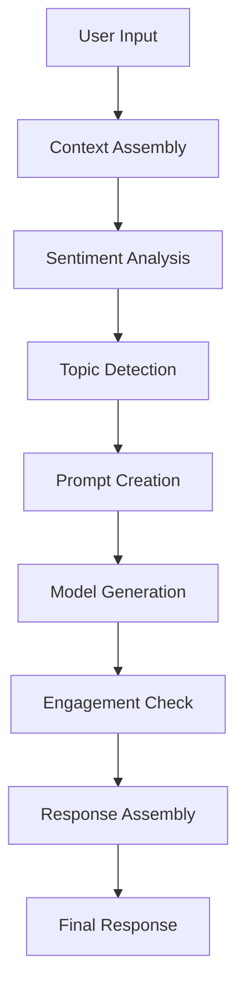

# Response Generation

The response generation system combines sentiment analysis, conversation state, and model backend selection to generate
contextually appropriate responses.

## Core Components

### ResponseGenerator

The `ResponseGenerator` class orchestrates:

- Topic-aware prompt creation
- Sentiment-based response adjustment
- Engagement monitoring and reengagement
- Backend model selection

## Engagement Management

The system maintains user engagement through:

### Reengagement Prompts

```python
reengagement_prompts = {
    "snake_resistance": [
        "Would you like to know more about how opossums handle encounters with snakes?",
        "Did you know opossums have fascinating adaptations for dealing with venomous snakes?"
    ],
    "diet_query": [
        "I know some interesting facts about opossum dietary preferences.",
        "Would you like to learn about the unique things opossums eat?"
    ]
    # ... other topic-specific prompts
}
```

### Engagement Detection

- Monitors message length
- Tracks sentiment trends
- Identifies follow-up questions
- Measures topic coherence

## Context-Aware Generation

### Prompt Creation

The system builds prompts that include:

1. Current conversation stage
2. Recent message history
3. User sentiment analysis
4. Topic relevance scores

Example prompt structure:

```
Current topic: {conversation_state.current_stage}
User sentiment: {sentiment_analysis['sentiment']['polarity']}
Recent context:
{context_window}
User message: {user_message}
```

### Response Assembly

1. Base response generation from model
2. Engagement prompt addition when needed
3. Message history updates
4. Metadata attachment

## Integration with Model Backends

The response generator works with multiple model backends:

1. **Gemini Backend**
    - High-capability responses
    - Multimodal processing
    - Advanced reasoning

2. **Ollama Backend**
    - Local processing
    - Custom model support
    - Efficient response generation

3. **Transformers Backend**
    - Fallback capability
    - Offline operation
    - Basic response generation

## Performance Considerations

### Caching Strategy

- Caches complete responses
- Stores sentiment analysis
- Preserves context windows

### Response Times

| Operation      | Target Time |
|----------------|-------------|
| Basic Response | < 1s        |
| With Context   | < 2s        |
| With Image     | < 3s        |

## Error Handling

1. **Graceful Degradation**
   ```python
   if sentiment_tracker.get_engagement_summary()["needs_reengagement"]:
       response_text = self._add_engagement_prompt(
           response_text,
           next_stage
       )
   ```

2. **Fallback Responses**
    - Default to simpler responses
    - Preserve conversation context
    - Maintain user engagement

## Monitoring and Metrics

The system tracks:

- Response generation times
- Engagement success rates
- Sentiment trends
- Topic transition effectiveness

## Example Flow



## Sample Code

```python
async def generate_response(
    self,
    user_message: str,
    conversation_state: ConversationState,
    sentiment_tracker: SentimentTracker,
    model_backend: Any
) -> Dict[str, Any]:
    # Analyze message sentiment
    sentiment_analysis = sentiment_tracker.analyze_message(
        user_message,
        self._is_follow_up(user_message)
    )
    
    # Determine next conversation stage
    next_stage = self.topic_detector.determine_next_stage(
        user_message,
        conversation_state.current_stage
    )
    
    # Update conversation state
    conversation_state.update_stage(next_stage)
    
    # Generate base response
    base_prompt = self._create_prompt(
        user_message,
        conversation_state,
        sentiment_analysis
    )
    
    response_text = await model_backend.generate_response(
        base_prompt,
        next_stage
    )
    
    # Add engagement prompts if needed
    if sentiment_tracker.get_engagement_summary()["needs_reengagement"]:
        response_text = self._add_engagement_prompt(
            response_text,
            next_stage
        )
        
    # Record the interaction
    conversation_state.add_message(...)
    
    return {
        "response": response_text,
        "next_stage": next_stage,
        "sentiment": sentiment_analysis,
        "needs_reengagement": sentiment_tracker.get_engagement_summary()["needs_reengagement"]
    }
```

## Re-engagement Strategies

The system can detect waning user interest and automatically add re-engagement prompts:

```python
def _add_engagement_prompt(self, response: str, stage: str) -> str:
    """Add an engagement prompt to the response if appropriate."""
    if stage in self.reengagement_prompts:
        prompt = self.reengagement_prompts[stage][0]
        return f"{response}\n\n{prompt}"
    return response
```