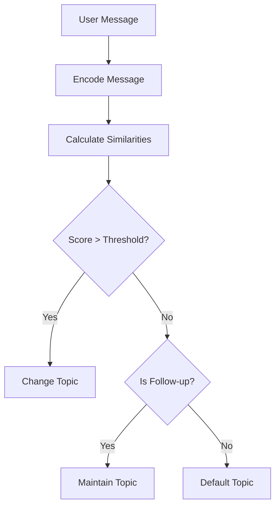

# Topic Detection

The topic detection system uses sentence transformers and semantic similarity to manage conversation flow and context.

## Overview

The `TopicDetector` class analyzes user messages to:

- Classify message intent and topic
- Determine appropriate conversation stage transitions
- Maintain topic continuity throughout conversations

## Implementation

The `TopicDetector` class implements NLP-based topic detection using the following components:

### Pre-defined Topics

```python
topic_sentences = {
    "snake_resistance": "Opossums are resistant to snake venom and can eat venomous snakes",
    "florida_opossums": "Opossums in Florida and the southeastern United States",
    "diet_query": "What opossums eat and their diet habits",
    "habitat_query": "Where opossums live and their natural habitat",
    "behavior_query": "Opossum behavior, playing dead, and nocturnal activities",
    "general_info": "General information about opossums",
    "closing": "Thank you, goodbye, or ending the conversation"
}
```

### Sentence Transformer Model

- Uses the `all-MiniLM-L6-v2` model for generating embeddings
- Pre-computes embeddings for all topic sentences during initialization
- Calculates cosine similarity between user messages and topic embeddings

### Stage Determination

The topic detector determines conversation stages through:

1. Automatic progression from greeting to initial query
2. Semantic similarity scoring between user message and topic embeddings
3. Follow-up detection using indicator words:
   - more, also, another, explain, elaborate
   - why, how, what, tell me more

## Configuration

Topic detection can be tuned through the following settings:

```python
SENTENCE_TRANSFORMER_MODEL = 'all-MiniLM-L6-v2'
SIMILARITY_THRESHOLD = 0.35  # Minimum similarity score for topic change
```

## Stages

The system tracks conversation through defined stages:

- `greeting`: Initial conversation stage
- `snake_resistance`: Discussions about opossum immunity to snake venom
- `florida_opossums`: Regional opossum information
- `diet_query`: Questions about opossum diet
- `habitat_query`: Information about opossum habitats
- `behavior_query`: Questions about opossum behaviors

## Integration

The topic detector integrates with other conversation components through:

1. **Conversation State**: Updates the current stage based on detected topics
2. **Response Generator**: Informs response generation with topic context
3. **Model Selection**: Helps choose appropriate model based on topic requirements

## Example Flow



```python
# Determine the next conversation stage
next_stage = topic_detector.determine_next_stage(
    user_message,
    conversation_state.current_stage
)

# Update conversation state
conversation_state.update_stage(next_stage)
```
