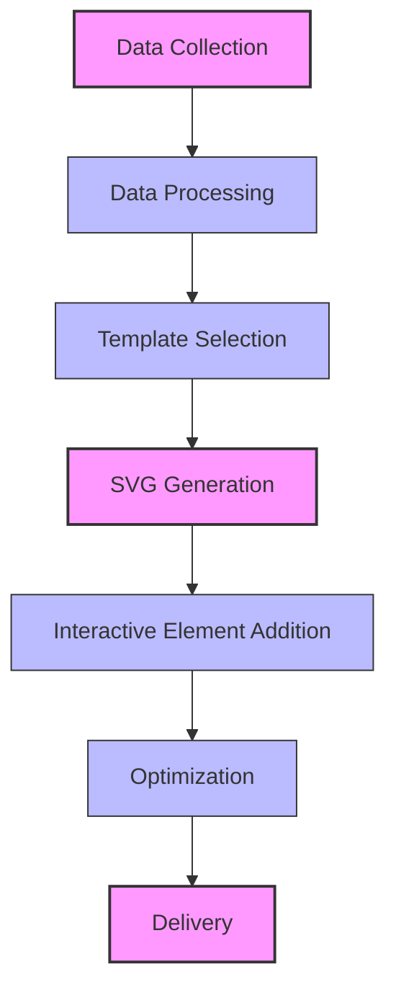

# Service Visualizations

## Overview

Opossum Search provides dynamic visualizations of system services, performance metrics, and operational status through
its SVG generation capabilities. These visualizations help users and administrators understand system behavior, monitor
performance, and diagnose issues through intuitive graphical representations.

## Visualization Types

### System Status Dashboard

The System Status Dashboard provides a real-time overview of all Opossum Search services:

- **Service Health Indicators**: Color-coded status indicators for each component
- **Response Time Metrics**: Visual representation of current and historical response times
- **Resource Utilization**: CPU, memory, and network usage visualizations
- **Error Rate Tracking**: Error frequency and distribution charts

```graphql
query SystemStatusDashboard {
  systemStatus {
    serviceHealth {
      name
      status
      uptime
      lastIncident
    }
    performanceMetrics {
      responseTime
      throughput
      errorRate
    }
    resourceUtilization {
      cpu
      memory
      network
    }
  }
}
```

### Model Selection Flow

Visualizes the dynamic model selection process in real-time:

- **Decision Tree Visualization**: Shows how queries are routed to different models
- **Capability Matching**: Highlights which capabilities influenced model selection
- **Fallback Chains**: Visualizes primary and fallback paths for resilience
- **Performance Comparison**: Compares response times across different models

```graphql
query ModelSelectionFlow($query: String!) {
  modelSelection(query: $query) {
    visualizationSvg
    decisionPath {
      step
      criteriaEvaluated
      result
    }
    selectedModel {
      name
      capabilities
      responseTime
    }
    fallbackOptions {
      name
      priority
    }
  }
}
```

### Caching Efficiency Map

Provides insights into the multi-level caching system:

- **Cache Hit/Miss Visualization**: Visual representation of cache efficiency
- **TTL Heatmap**: Shows expiration patterns across different cache types
- **Memory Usage Diagram**: Displays Redis memory allocation by key type
- **Invalidation Patterns**: Visualizes cache invalidation frequency and triggers

### Request Journey Timeline

Traces the complete lifecycle of a request through the system:

- **Component Interaction Flow**: Shows how a request moves through services
- **Timing Breakdown**: Visual representation of time spent in each component
- **Bottleneck Identification**: Highlights potential performance bottlenecks
- **Parallel Processing Visualization**: Shows concurrent operations

## Accessing Visualizations

### GraphQL Endpoint

Visualizations are available through the GraphQL API using the `visualization` field:

```graphql
query ServiceVisualization($type: VisualizationType!, $parameters: VisualizationParameters) {
  visualization(type: $type, parameters: $parameters) {
    svg
    interactiveElements {
      id
      type
      action
    }
    dataPoints {
      label
      value
      timestamp
    }
    metadata {
      generatedAt
      dataFreshness
    }
  }
}
```

### Web Dashboard

All visualizations are accessible through the administrative dashboard at `/admin/visualizations`:

- Filter visualizations by type, timeframe, and components
- Save custom visualization configurations
- Export SVGs for documentation or reporting
- Schedule automatic visualization generation

## Implementation Details

### SVG Generation Process



1. **Data Collection**: Telemetry data is gathered from OpenTelemetry and internal metrics
2. **Processing**: Raw data is transformed into visualization-ready format
3. **Template Selection**: Appropriate SVG template is chosen based on visualization type
4. **SVG Generation**: Dynamic SVG is created with current data values
5. **Interactive Elements**: Tooltips, clickable regions, and other interactive features are added
6. **Optimization**: SVG is optimized for size and rendering performance
7. **Delivery**: Final SVG is delivered via API or embedded in dashboard

### Rendering Engine

Visualizations use a custom SVG rendering engine built on:

- **Data-driven templates**: Base SVG templates with data binding points
- **Dynamic scaling**: Automatic adjustment to display size
- **Theme support**: Light/dark mode compatibility
- **Accessibility features**: ARIA attributes and keyboard navigation
- **Animation capabilities**: Smooth transitions between data states

## Examples

### System Health Overview

The system health visualization provides an at-a-glance view of all services:

```
┌─────────────────────────────────────────┐
│ Opossum Search System Health            │
├─────────────┬─────────────┬─────────────┤
│ API Gateway │ Model Svc   │ Redis Cache │
│ ● HEALTHY   │ ● HEALTHY   │ ● HEALTHY   │
│ 99.9% up    │ 99.8% up    │ 100% up     │
├─────────────┼─────────────┼─────────────┤
│ Image Proc  │ GraphQL     │ Auth Service│
│ ● HEALTHY   │ ● DEGRADED  │ ● HEALTHY   │
│ 99.7% up    │ 97.2% up    │ 99.9% up    │
└─────────────┴─────────────┴─────────────┘
Last updated: 2025-03-23 14:32:05 UTC
```

### Response Time Histogram

Visualizes response time distribution across percentiles:

```
Response Time Distribution (ms)
│
900┤                                 █
800┤                                 █
700┤                                 █
600┤                               ▄▄█
500┤                               ███
400┤                             ▄▄███
300┤                           ▄▄█████
200┤                     ▄▄▄▄▄▄███████
100┤ ▄▄▄▄▄▄▄▄▄▄▄▄▄▄▄▄▄▄▄██████████████
  └─┬─────┬─────┬─────┬─────┬─────┬────
    50    75    90    95    99    99.9
                 Percentile
```

## Customization Options

Visualizations can be customized through the API:

- **Time Range**: Adjust the period for time-series data
- **Color Scheme**: Select from predefined themes or custom palettes
- **Granularity**: Control data resolution and aggregation level
- **Components**: Filter which services or components to include
- **Layout**: Choose between compact, detailed, or custom layouts

## Technical Requirements

- **Browser Support**: Modern browsers with SVG support (Chrome, Firefox, Safari, Edge)
- **Minimum Resolution**: 800x600 for optimal viewing
- **Data Freshness**: Visualizations reflect data no older than 60 seconds
- **Rendering Performance**: SVGs optimized to render in under 500ms

## Future Enhancements

Upcoming visualization features include:

- **3D Service Maps**: Three-dimensional visualization of service interactions
- **Animated Traffic Flows**: Visual representation of request volume between components
- **Predictive Scaling Visualizations**: Forecasting visualizations for resource needs
- **Comparative Performance Views**: Side-by-side comparison of different deployment configurations

---

Service visualizations are designed to provide intuitive understanding of complex system behavior, helping both
developers and administrators maintain optimal performance and quickly diagnose issues when they arise.