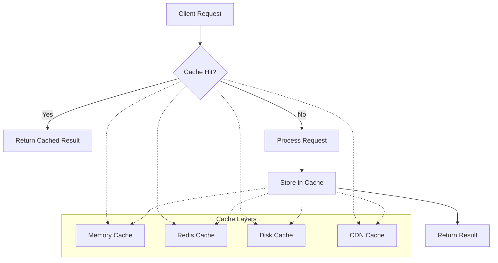

# Caching Strategy

## Overview

The Opossum Search image processing system implements a sophisticated multi-tiered caching architecture to optimize performance, reduce resource consumption, and improve response times. This document details the caching strategies used throughout the image processing pipeline.

!!! note
    Effective caching is crucial for maintaining high performance in image processing. This document outlines the caching architecture and strategies used in Opossum Search.

## Caching Architecture

The caching system employs a layered approach to maximize efficiency across different types of operations and data:



### Cache Tiers

| Cache Tier | Storage Medium | Access Speed | Capacity | Persistence | Use Case |
|------------|----------------|--------------|----------|-------------|----------|
| L1: Memory | RAM | <1ms | Limited | None | Frequently accessed small results |
| L2: Redis | Redis Cluster | 1-5ms | Medium | Configurable | Shared results across instances |
| L3: Disk | Local SSD | 5-20ms | Large | Full | Larger results, backup layer |
| L4: CDN | Distributed | Variable | Very Large | Extended | Public, static results |

## Cache Categories

The system implements specialized caching for different types of processed content:

### 1. Result Caching

Stores complete processing results based on input parameters:

```python
def get_processed_image(image_id, operations, options):
    # Generate cache key from parameters
    cache_key = generate_cache_key(image_id, operations, options)
    
    # Check if result exists in cache
    cached_result = cache.get(cache_key)
    if cached_result:
        return cached_result
    
    # Process image if not in cache
    result = process_image(image_id, operations, options)
    
    # Store in cache with appropriate TTL
    cache.set(
        key=cache_key,
        value=result,
        ttl=calculate_ttl(operations, options)
    )
    
    return result
```

### 2. Intermediate Result Caching

Caches partial results to optimize multi-step processing chains:

```python
def apply_filter_chain(image, filters):
    result = image
    last_cached_state = None
    
    for i, filter_op in enumerate(filters):
        # Generate intermediate cache key
        intermediate_key = f"{image.id}:step{i}:{filter_op.hash}"
        
        # Try to retrieve from cache
        cached_state = cache.get(intermediate_key)
        if cached_state:
            result = cached_state
            last_cached_state = i
            continue
            
        # Apply filter and cache result
        result = apply_filter(result, filter_op)
        cache.set(
            key=intermediate_key,
            value=result,
            ttl=INTERMEDIATE_CACHE_TTL
        )
    
    return result
```

### 3. Resource Caching

Caches frequently used resources like filters, presets, and templates:

```python
def get_filter_preset(preset_name, version=None):
    # Generate cache key
    version = version or CURRENT_VERSION
    cache_key = f"preset:{preset_name}:v{version}"
    
    # Check cache
    cached_preset = resource_cache.get(cache_key)
    if cached_preset:
        return cached_preset
    
    # Load preset from storage
    preset = load_preset_from_storage(preset_name, version)
    
    # Cache with long TTL
    resource_cache.set(
        key=cache_key,
        value=preset,
        ttl=RESOURCE_CACHE_TTL  # Typically 24+ hours
    )
    
    return preset
```

### 4. Thumbnail Caching

Specialized caching for generated thumbnails and previews:

```python
def get_thumbnail(image_id, width, height, format="webp"):
    cache_key = f"thumb:{image_id}:{width}x{height}:{format}"
    
    # Check cache
    cached_thumb = thumbnail_cache.get(cache_key)
    if cached_thumb:
        return cached_thumb
    
    # Generate thumbnail
    original = load_image(image_id)
    thumbnail = resize_image(original, width, height)
    
    if format != original.format:
        thumbnail = convert_format(thumbnail, format)
    
    # Cache with relatively long TTL
    thumbnail_cache.set(
        key=cache_key,
        value=thumbnail,
        ttl=THUMBNAIL_CACHE_TTL  # Typically 7+ days
    )
    
    return thumbnail
```

## Cache Key Generation

The system uses deterministic cache key generation to ensure consistency:

```python
def generate_cache_key(image_id, operations, options):
    """Generate a deterministic cache key for image operations"""
    
    # Base components
    components = [
        f"img:{image_id}",
        f"v:{IMAGE_PROCESSING_VERSION}"
    ]
    
    # Add normalized operation signatures
    for op in operations:
        op_signature = normalize_operation(op)
        components.append(f"op:{op_signature}")
    
    # Add normalized options
    for key, value in sorted(options.items()):
        components.append(f"opt:{key}:{normalize_value(value)}")
    
    # Generate hash for the full key
    full_key = ":".join(components)
    hashed_key = hashlib.sha256(full_key.encode()).hexdigest()
    
    return f"img_proc:{hashed_key}"
```

## TTL Strategies

Different cache items have different time-to-live (TTL) values based on their characteristics:

| Content Type | Default TTL | Rationale |
|--------------|-------------|-----------|
| Final Results | 24 hours | Balance between freshness and efficiency |
| Intermediate Results | 1 hour | Temporary computation savings |
| Thumbnails | 7 days | Rarely change, high request frequency |
| Resources | 24-48 hours | Static content with version checks |
| Error Results | 5 minutes | Prevent repeated processing of problematic inputs |

TTLs are dynamically adjusted based on:

- Resource constraints (lower TTLs when storage is limited)
- Usage patterns (longer TTLs for frequently accessed items)
- Content type (images vs. generated SVGs)
- Processing complexity (longer TTLs for expensive operations)

## Cache Invalidation Strategies

### Time-Based Invalidation

The primary invalidation mechanism is time-based expiration through TTLs.

### Explicit Invalidation

```python
def invalidate_image_caches(image_id):
    """Invalidate all caches related to a specific image"""
    
    # Pattern-based invalidation in Redis
    redis_client.delete_by_pattern(f"img_proc:*:img:{image_id}:*")
    
    # Clear from memory cache
    memory_cache.delete_by_pattern(f"*{image_id}*")
    
    # Mark for disk cache cleanup
    disk_cache.mark_for_cleanup(image_id)
    
    # Purge from CDN if applicable
    if cdn_enabled:
        cdn_client.purge_object(f"images/{image_id}/*")
```

### Version-Based Invalidation

Cache keys include version information to automatically invalidate when:
- Processing algorithms change
- New filters are added
- Quality improvements are implemented

```python
# When the algorithm version changes
IMAGE_PROCESSING_VERSION = "2.5.0"  # Included in all cache keys
```

### LRU/LFU Policies

Different cache tiers implement appropriate eviction policies:

| Cache Tier | Primary Policy | Secondary Policy |
|------------|----------------|------------------|
| Memory | LRU (Least Recently Used) | Size limit |
| Redis | LFU (Least Frequently Used) | TTL |
| Disk | FIFO with size limits | Manual purge |
| CDN | TTL | None |

## Performance Metrics

### Cache Hit Rates

| Cache Type | Target Hit Rate | Observed Hit Rate |
|------------|-----------------|-------------------|
| Result Cache | >60% | 65-75% |
| Intermediate Cache | >40% | 45-55% |
| Thumbnail Cache | >80% | 85-95% |
| Resource Cache | >95% | 98-99% |

### Latency Improvements

| Operation | Uncached Latency | Cached Latency | Improvement |
|-----------|------------------|----------------|-------------|
| Basic Filter | 100-200ms | 5-15ms | 93-95% |
| Filter Chain | 300-800ms | 10-30ms | 96-97% |
| SVG Generation | 500-2000ms | 15-50ms | 97-98% |
| Image Analysis | 1000-3000ms | 20-70ms | 98-99% |

## Cache Storage Sizing

Guidelines for allocating cache storage:

| Traffic Level | Memory Cache | Redis Cache | Disk Cache |
|--------------|--------------|-------------|------------|
| Low (<100k req/day) | 1-2GB | 5-10GB | 20-50GB |
| Medium (100k-1M req/day) | 4-8GB | 20-50GB | 100-200GB |
| High (1M+ req/day) | 16-32GB | 100-200GB | 500GB-1TB |

## Integration with Redis

The Redis cache implementation leverages specialized data structures:

```python
class RedisCacheManager:
    def __init__(self, redis_client, namespace="img_proc"):
        self.redis = redis_client
        self.namespace = namespace
    
    def get(self, key):
        """Retrieve an item from cache"""
        full_key = f"{self.namespace}:{key}"
        
        # Get value and metadata
        pipeline = self.redis.pipeline()
        pipeline.get(full_key)
        pipeline.hgetall(f"{full_key}:meta")
        value, metadata = pipeline.execute()
        
        if not value:
            return None
        
        # Update access metrics
        self.redis.hincrby(f"{full_key}:meta", "access_count", 1)
        self.redis.hset(f"{full_key}:meta", "last_access", time.time())
        
        # Deserialize value
        return pickle.loads(value)
    
    def set(self, key, value, ttl=86400):
        """Store an item in cache with metadata"""
        full_key = f"{self.namespace}:{key}"
        
        # Serialize value
        serialized = pickle.dumps(value)
        
        # Store value and metadata
        pipeline = self.redis.pipeline()
        pipeline.setex(full_key, ttl, serialized)
        
        # Store metadata for analytics and management
        pipeline.hmset(f"{full_key}:meta", {
            "created_at": time.time(),
            "size_bytes": len(serialized),
            "ttl": ttl,
            "access_count": 0,
            "last_access": time.time()
        })
        pipeline.expire(f"{full_key}:meta", ttl)
        
        pipeline.execute()
        
    def delete_by_pattern(self, pattern):
        """Delete all keys matching a pattern"""
        full_pattern = f"{self.namespace}:{pattern}"
        
        # Find all matching keys
        keys = self.redis.keys(full_pattern)
        meta_keys = [f"{key}:meta" for key in keys]
        
        # Delete keys and metadata
        if keys:
            pipeline = self.redis.pipeline()
            pipeline.delete(*keys)
            if meta_keys:
                pipeline.delete(*meta_keys)
            pipeline.execute()
```

## Cache Warming Strategies

The system implements proactive cache warming to improve performance:

1. **Predictive Warming**: Analyzes usage patterns to pre-cache likely-to-be-requested variants
2. **Background Warming**: Fills caches during low-traffic periods
3. **Related Content Warming**: When one variant is requested, preemptively caches related variants

```python
def warm_cache_for_popular_images(top_n=100):
    """Warm cache for most popular images with common operations"""
    
    # Get most frequently accessed images
    popular_images = analytics.get_top_images(limit=top_n)
    
    # Common operations to pre-cache
    common_operations = [
        {"type": "resize", "width": 800, "height": 600},
        {"type": "thumbnail", "size": 200},
        {"type": "grayscale"},
        # More common operations
    ]
    
    # Queue cache warming tasks
    for image_id in popular_images:
        for operation in common_operations:
            task_queue.enqueue(
                warm_image_cache,
                image_id=image_id,
                operation=operation,
                priority="low"  # Don't interfere with user requests
            )
```

## Cache Analytics and Monitoring

The system collects detailed cache performance metrics:

```python
class CacheAnalytics:
    def collect_metrics(self):
        """Collect and report cache performance metrics"""
        metrics = {
            "memory_cache": {
                "size": memory_cache.size(),
                "item_count": memory_cache.count(),
                "hit_rate": memory_cache.hit_rate(),
                "miss_rate": memory_cache.miss_rate(),
                "eviction_rate": memory_cache.eviction_rate(),
                "avg_ttl": memory_cache.avg_ttl()
            },
            "redis_cache": {
                "size": redis_cache.size(),
                "item_count": redis_cache.count(),
                "hit_rate": redis_cache.hit_rate(),
                "miss_rate": redis_cache.miss_rate(),
                "eviction_rate": redis_cache.eviction_rate(),
                "avg_ttl": redis_cache.avg_ttl(),
                "memory_usage": redis_cache.memory_usage()
            },
            # Similar metrics for other cache tiers
        }
        
        # Report to monitoring system
        monitoring.report_metrics("cache_performance", metrics)
        
        # Log periodic summary
        logger.info(f"Cache performance summary: hit_rate={metrics['redis_cache']['hit_rate']}%, "
                   f"size={metrics['redis_cache']['size']/1024/1024:.2f}MB")
```

## Configuration Options

The caching system is highly configurable:

```yaml
# Example configuration
caching:
  # Global settings
  enabled: true
  log_level: "info"
  
  # Memory cache
  memory_cache:
    enabled: true
    max_size: "2GB"
    ttl: 600  # seconds
    
  # Redis cache
  redis_cache:
    enabled: true
    host: "redis.example.com"
    port: 6379
    db: 0
    ttl: 86400  # seconds
    max_memory: "50GB"
    eviction_policy: "lfu"
    
  # Disk cache
  disk_cache:
    enabled: true
    path: "/var/cache/opossum_images"
    max_size: "200GB"
    cleanup_interval: 3600  # seconds
```

!!! tip
    Properly configuring the caching system is essential for achieving optimal performance. Adjust the cache sizes, TTLs, and eviction policies based on your specific workload and resource constraints.

## Related Documentation

- Image Processing Overview
- Effects and Filters
- SVG Generation
- Performance Optimization
- Infrastructure Optimization Strategies