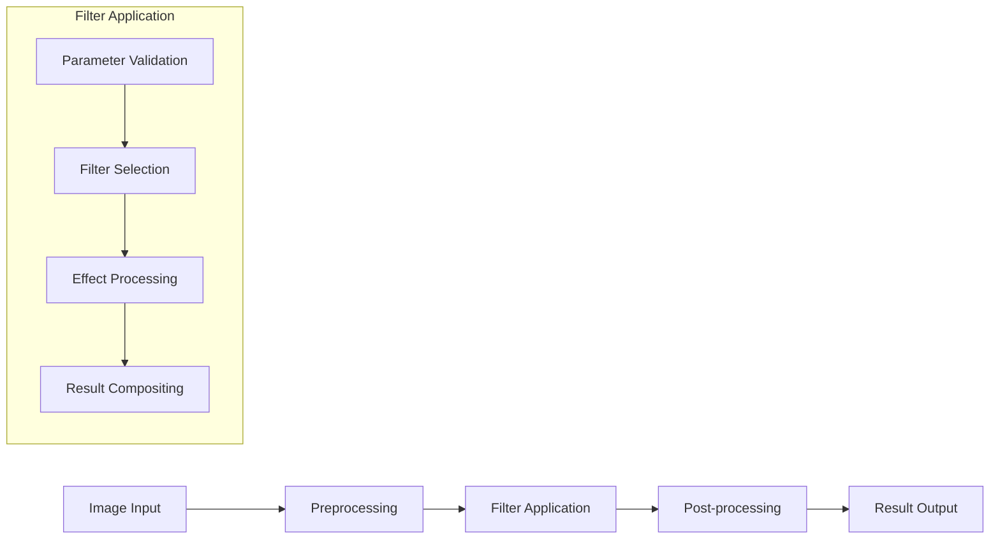

# Image Effects and Filters

## Overview

Opossum Search provides a comprehensive suite of image effects and filters to enhance, transform, and stylize images through its processing pipeline. This document outlines the available effects, their parameters, usage patterns, and implementation details.

## Available Filters

### Basic Adjustments

| Filter Name | Description | Parameters | Performance Impact |
|-------------|-------------|------------|-------------------|
| `brightness` | Adjusts image brightness | `level` (-100 to 100) | Low |
| `contrast` | Modifies image contrast | `level` (-100 to 100) | Low |
| `saturation` | Alters color intensity | `level` (-100 to 100) | Low |
| `sharpness` | Enhances or softens details | `level` (-100 to 100) | Medium |
| `exposure` | Adjusts light exposure | `stops` (-5.0 to 5.0) | Low |
| `gamma` | Applies gamma correction | `value` (0.1 to 5.0) | Low |

### Color Transformations

| Filter Name | Description | Parameters | Performance Impact |
|-------------|-------------|------------|-------------------|
| `grayscale` | Converts to black and white | `method` ('average', 'luminosity', 'lightness') | Low |
| `sepia` | Applies sepia tone | `intensity` (0.0 to 1.0) | Low |
| `invert` | Inverts all colors | `strength` (0.0 to 1.0) | Low |
| `colorize` | Applies color tint | `color` (hex), `strength` (0.0 to 1.0) | Low |
| `temperature` | Adjusts color temperature | `kelvin` (2000 to 12000) | Low |
| `channel_mixer` | Modifies RGB channels | `red`, `green`, `blue` (-2.0 to 2.0 each) | Medium |

### Stylistic Effects

| Filter Name | Description | Parameters | Performance Impact |
|-------------|-------------|------------|-------------------|
| `vignette` | Darkens image corners | `size` (0.0 to 1.0), `darkness` (0.0 to 1.0) | Low |
| `noise` | Adds grain to image | `amount` (0.0 to 1.0), `type` ('gaussian', 'salt', 'poisson') | Medium |
| `bloom` | Creates light glow effect | `intensity` (0.0 to 1.0), `threshold` (0.0 to 1.0) | High |
| `pixelate` | Creates pixel art style | `size` (1 to 100) | Medium |
| `posterize` | Reduces color palette | `levels` (2 to 16) | Low |
| `duotone` | Two-color gradient mapping | `highlight` (hex), `shadow` (hex) | Medium |

### Artistic Filters

| Filter Name | Description | Parameters | Performance Impact |
|-------------|-------------|------------|-------------------|
| `watercolor` | Mimics watercolor painting | `strength` (0.0 to 1.0), `detail` (0.0 to 1.0) | Very High |
| `oil_painting` | Simulates oil painting | `brushSize` (1 to 20), `coarseness` (1 to 10) | Very High |
| `sketch` | Creates pencil sketch effect | `style` ('simple', 'detailed'), `strength` (0.0 to 1.0) | High |
| `vintage` | Retro film look | `era` ('50s', '60s', '70s', '80s') | Medium |
| `comic` | Comic book style | `detail` (0.0 to 1.0), `colors` (2 to 8) | High |
| `halftone` | Newspaper print style | `size` (1 to 50), `angle` (0 to 360) | Medium |

### Spatial Transformations

| Filter Name | Description | Parameters | Performance Impact |
|-------------|-------------|------------|-------------------|
| `blur` | Gaussian blur effect | `radius` (0.0 to 50.0) | Medium-High (radius dependent) |
| `motion_blur` | Directional blur | `angle` (0 to 360), `distance` (0 to 200) | High |
| `radial_blur` | Circular blur pattern | `center_x`, `center_y` (0.0 to 1.0), `amount` (0.0 to 1.0) | High |
| `emboss` | Creates 3D embossed look | `strength` (0.0 to 5.0), `angle` (0 to 360) | Medium |
| `wave` | Applies wave distortion | `amplitude` (0 to 50), `wavelength` (0 to 200) | Medium |
| `fisheye` | Fisheye lens distortion | `strength` (0.0 to 1.0) | Medium |

## Usage Patterns

### Basic Implementation

```python
from opossum.image import filters

# Apply a single filter
result = filters.apply_filter(
    image_path='input.jpg',
    filter_name='grayscale',
    params={'method': 'luminosity'}
)

# Save the result
result.save('output.jpg')
```

### Filter Chaining

```python
from opossum.image import filters

# Create a filter chain
filter_chain = [
    {'name': 'brightness', 'params': {'level': 15}},
    {'name': 'contrast', 'params': {'level': 10}},
    {'name': 'vignette', 'params': {'size': 0.2, 'darkness': 0.3}}
]

# Apply the chain
result = filters.apply_filter_chain(
    image_path='input.jpg',
    filter_chain=filter_chain
)

# Save the result
result.save('output.jpg')
```

### API Usage

```graphql
mutation {
  processImage(
    inputUrl: "https://example.com/image.jpg",
    filters: [
      { name: "vintage", params: { era: "70s" } },
      { name: "vignette", params: { size: 0.3, darkness: 0.4 } }
    ]
  ) {
    resultUrl
    processingTime
    dimensions {
      width
      height
    }
  }
}
```

## Presets

The system includes several predefined filter combinations for common effects:

| Preset Name | Description | Included Filters |
|-------------|-------------|-----------------|
| `nostalgic` | Warm vintage look | `temperature(7500)` + `vignette` + `grain` |
| `cinematic` | Film-like color grading | `contrast` + `color_lut(cinematic)` + `letterbox` |
| `clarity` | Enhanced details | `sharpness` + `clarity` + `local_contrast` |
| `dramatic` | High-contrast look | `contrast` + `clarity` + `duotone` |
| `fresh` | Bright and vibrant | `brightness` + `saturation` + `vibrance` |
| `faded` | Subtle muted look | `fade` + `grain` + `curve_adjustment` |

## Implementation Details

### Processing Pipeline



### Performance Optimization

The filter system implements several optimizations:

1. **Progressive Processing**: Applies filters at reduced resolution first for preview
2. **Caching Strategy**: Caches intermediate results for filter chains
3. **Adaptive Sampling**: Adjusts processing resolution based on filter complexity
4. **Hardware Acceleration**: Uses GPU acceleration when available
5. **Parallel Processing**: Applies independent filters concurrently

## Technical Considerations

### Supported Image Formats

Input formats:
- JPEG, PNG, GIF, WEBP, HEIC, BMP, TIFF

Output formats:
- JPEG, PNG, WEBP, GIF

### Size Limitations

- Maximum input dimensions: 8192 × 8192 pixels
- Maximum file size: 20MB
- Recommended dimensions for optimal performance: 1024 × 1024 pixels

### Memory Usage

| Filter Complexity | Memory Overhead | Recommended Image Size |
|-------------------|-----------------|------------------------|
| Low | 1-2× image size | No limitation |
| Medium | 2-4× image size | ≤ 4096 × 4096 |
| High | 4-8× image size | ≤ 2048 × 2048 |
| Very High | 8-16× image size | ≤ 1024 × 1024 |

## Best Practices

1. **Chain Order Matters**: The sequence of filters can significantly affect the result
2. **Preview First**: Use lower resolution for previews before applying to full resolution
3. **Selective Application**: Consider using masks for applying effects to specific areas
4. **Parameter Restraint**: Subtle effects (0.2-0.5 range) often produce better results
5. **Resolution Matching**: Process at the final needed resolution to save resources

## Examples

### Before/After Gallery

| Effect | Before | After | Parameters |
|--------|--------|-------|------------|
| Vintage | Original | Processed | `era: '70s', strength: 0.7` |
| Duotone | Original | Processed | `highlight: #FF9500, shadow: #004A7F` |
| Sketch | Original | Processed | `style: 'detailed', strength: 0.8` |

### Custom Filter Development

For developers who want to create custom filters, the system provides an extension API:

```python
from opossum.image import FilterBase

class MyCustomFilter(FilterBase):
    """Custom rainbow gradient overlay filter"""
    
    def __init__(self, intensity=0.5, orientation='horizontal'):
        self.intensity = float(intensity)
        self.orientation = orientation
    
    def process(self, image):
        # Implementation details
        # ...
        return processed_image
    
    @property
    def performance_impact(self):
        return "medium"
        
# Register custom filter
from opossum.image import register_filter
register_filter('rainbow', MyCustomFilter)
```

## Future Development

Upcoming filter enhancements include:

- AI-powered style transfer filters
- Real-time video filter application
- User-created filter marketplace
- Image component selective filtering
- Platform-specific optimizations

## Related Documentation

- Image Processing Overview
- SVG Generation
- Performance Optimization
- Caching Strategy