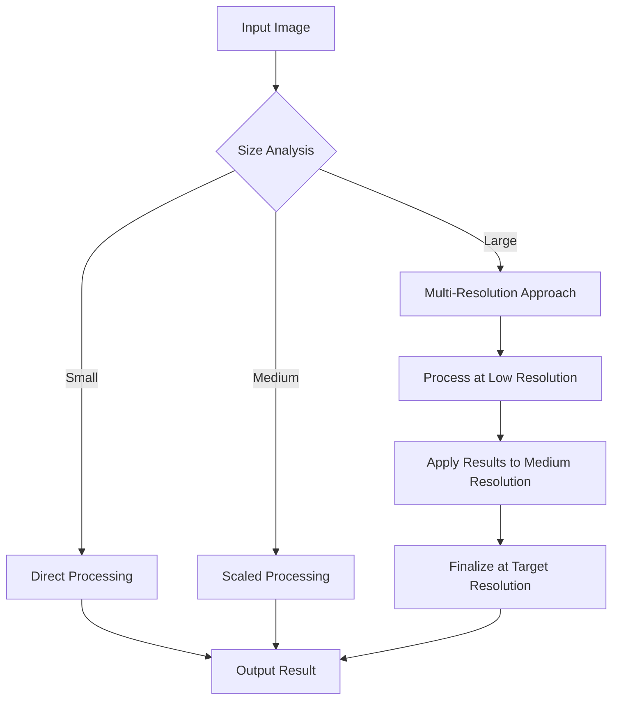

# Performance Optimization

## Overview

Opossum Search implements a comprehensive set of performance optimization strategies for its image processing pipeline. This document outlines the techniques used to maximize throughput, minimize latency, and efficiently utilize system resources while maintaining high-quality output.

## Performance Challenges

Image processing presents several unique performance challenges:

| Challenge | Description | Impact |
|-----------|-------------|--------|
| Memory Consumption | Image data requires significant memory, especially at high resolutions | Resource constraints, potential OOM errors |
| CPU Intensity | Many operations require intensive computation | Processing latency, system load |
| I/O Bottlenecks | Reading/writing large image files can create bottlenecks | Throughput limitations, increased latency |
| Scaling Complexity | Performance costs often scale non-linearly with image dimensions | Unpredictable processing times |
| Resource Contention | Multiple concurrent operations compete for system resources | Reduced throughput, increased latency variance |

## Optimization Strategies

### Resolution-Aware Processing



The system dynamically adjusts processing based on image dimensions:

| Image Size | Strategy | Performance Gain |
|------------|----------|------------------|
| <800px | Direct processing at original resolution | Baseline |
| 800-2000px | Scaled processing with selective upsampling | 40-60% faster |
| >2000px | Multi-resolution pyramid approach | 70-90% faster |

### Parallel Processing Architecture

The pipeline implements parallelism at multiple levels:

1. **Inter-image parallelism**: Processing multiple images concurrently
2. **Intra-image parallelism**: Dividing a single image into tiles for parallel processing
3. **Pipeline parallelism**: Executing sequential operations in parallel where dependencies allow
4. **Operation parallelism**: Utilizing SIMD and multi-threading for individual operations

```python
# Example of parallel processing implementation
from opossum.image import ParallelProcessor

def process_image_batch(image_paths, operations, max_workers=None):
    """Process multiple images in parallel with automatic resource management"""
    with ParallelProcessor(max_workers=max_workers) as processor:
        results = processor.map(
            function=apply_operations,
            items=image_paths,
            operations=operations,
            chunk_size=get_optimal_chunk_size()
        )
    return results
```

### Memory Management

Sophisticated memory management techniques minimize footprint:

| Technique | Description | Memory Reduction |
|-----------|-------------|------------------|
| Progressive Loading | Loads only necessary image parts into memory | 40-70% |
| In-place Operations | Modifies images in-place when possible | 30-50% |
| Image Tiling | Processes large images in smaller tiles | 60-80% |
| Format Optimization | Uses memory-efficient pixel formats | 20-40% |
| Reference Counting | Tracks image data usage for timely deallocation | 20-30% |
| Garbage Collection | Scheduled cleanup of unused resources | 10-20% |

### Hardware Acceleration

The system leverages available hardware:

- **GPU Acceleration**: Uses GPU for compatible operations (CUDA, OpenCL)
- **SIMD Instructions**: Vectorized processing with AVX2/NEON
- **Memory Hierarchy Optimization**: Cache-aware algorithms
- **Heterogeneous Computing**: Distributes work across CPU, GPU, and specialized processors

Performance gains from hardware acceleration:

| Operation | CPU Only | With Acceleration | Speedup |
|-----------|----------|-------------------|---------|
| Gaussian Blur | 100ms | 15ms | 6.7× |
| Color Conversion | 45ms | 8ms | 5.6× |
| Edge Detection | 120ms | 18ms | 6.7× |
| Neural Vectorization | 8,500ms | 950ms | 8.9× |

### Algorithm Selection

The system dynamically selects optimal algorithms based on image characteristics:

```python
def select_optimal_algorithm(image, operation, quality_target):
    """Selects the most efficient algorithm based on image characteristics"""
    
    # Analyze image complexity
    complexity = analyze_image_complexity(image)
    
    # Select algorithm based on complexity, operation, and quality target
    if complexity < 0.3:  # Low complexity image
        if quality_target == "high":
            return PreciseAlgorithm(operation)
        else:
            return FastApproximationAlgorithm(operation)
    elif complexity < 0.7:  # Medium complexity
        if quality_target == "high":
            return AdaptiveAlgorithm(operation)
        else:
            return OptimizedApproximationAlgorithm(operation)
    else:  # High complexity
        if quality_target == "high":
            return MultiStageAlgorithm(operation)
        else:
            return AcceleratedApproximationAlgorithm(operation)
```

### Caching System

The multi-level caching system significantly improves performance:

| Cache Level | Description | Hit Rate | Latency Reduction |
|-------------|-------------|----------|-------------------|
| In-memory Result Cache | Caches complete results for repeat requests | 15-25% | 95-100% |
| Intermediate Result Cache | Stores partial processing results for reuse | 20-30% | 40-60% |
| Thumbnail Cache | Caches scaled versions for preview and visualization | 30-40% | 70-90% |
| Disk Cache | Persists frequently accessed items to disk | 10-15% | 80-95% |
| CDN Integration | External caching of public results | 5-10% | 95-100% |

For detailed caching implementation, see Caching Strategy.

## Benchmarks and Performance Metrics

### Operation Performance by Image Size

| Operation | 512×512 | 1024×1024 | 2048×2048 | 4096×4096 |
|-----------|---------|-----------|-----------|-----------|
| Gaussian Blur | 12ms | 45ms | 170ms | 650ms |
| Color Adjustment | 8ms | 30ms | 110ms | 420ms |
| Edge Detection | 15ms | 55ms | 200ms | 780ms |
| Neural Vectorization | 950ms | 3,200ms | 12,500ms | 48,000ms |
| SVG Generation | 180ms | 720ms | 2,900ms | 11,000ms |

*Measured on reference hardware: 8-core CPU @ 3.5GHz, 16GB RAM, NVIDIA RTX 3060*

### Throughput Testing

| Concurrency | Images/Second (512×512) | Images/Second (1024×1024) | Memory Usage |
|-------------|-------------------------|---------------------------|--------------|
| 1 | 45 | 12 | 0.8GB |
| 4 | 160 | 42 | 2.2GB |
| 8 | 280 | 75 | 4.5GB |
| 16 | 320 | 85 | 9.0GB |
| 32 | 340 | 90 | 17.5GB |

*Test conditions: Basic image processing chain (resize, color adjustment, sharpening)*

### Memory Efficiency Improvements


Memory usage reduction over software versions:
- v1.0: Baseline
- v1.2: 35% reduction through tiled processing
- v1.5: Additional 25% reduction through format optimization
- Current: Further 20% reduction through algorithm refinement

## Configuration Options

The performance optimization system provides several configuration options:

### Resource Management

```yaml
# Example configuration section
performance:
  # Hardware utilization
  max_cpu_cores: 0  # 0 = automatic detection
  gpu_enabled: true
  gpu_memory_limit: "2GB"
  
  # Memory management
  max_memory_usage: "4GB"
  tile_size: 512
  enable_memory_monitoring: true
  
  # Processing strategy
  parallel_images: 4
  quality_vs_speed: 0.7  # 0=fastest, 1=highest quality
  
  # Caching
  enable_result_cache: true
  enable_intermediate_cache: true
  cache_ttl: 3600  # seconds
  persistent_cache_size: "10GB"
```

### Quality vs. Performance Balance

The system offers configurable quality-speed tradeoffs:

| Quality Setting | Description | Performance Impact | Visual Quality |
|-----------------|-------------|-------------------|----------------|
| ultra | Maximum quality, no compromises | Baseline | Reference |
| high | Visually indistinguishable from ultra | 2-3× faster | 99% of reference |
| balanced | Default setting, good tradeoff | 5-8× faster | 95% of reference |
| fast | Prioritizes performance | 10-15× faster | 90% of reference |
| draft | Maximum performance | 20-30× faster | 80% of reference |

### Automatic Profiling and Tuning

The system includes automatic performance optimization:

1. **Runtime Profiling**: Monitors execution time and resource usage
2. **Bottleneck Detection**: Identifies performance bottlenecks
3. **Parameter Tuning**: Automatically adjusts processing parameters
4. **Resource Allocation**: Dynamically allocates resources to operations
5. **Feedback Loop**: Incorporates execution history into future decisions

## Optimization for Specific Use Cases

### Batch Processing

For processing large numbers of images:

```python
from opossum.image import BatchProcessor, OperationChain

# Define operation chain
chain = OperationChain()
chain.add_operation("resize", width=800, height=600)
chain.add_operation("adjust_colors", brightness=1.1, contrast=1.2)
chain.add_operation("watermark", text="© Opossum Search")

# Configure batch processor
processor = BatchProcessor(
    operation_chain=chain,
    concurrency=8,
    input_dir="input_images",
    output_dir="processed_images",
    output_format="webp",
    quality=85,
    error_handling="continue"  # Skip errors and continue processing
)

# Process batch
results = processor.process()
print(f"Processed {results.success_count} images, {results.error_count} errors")
print(f"Average processing time: {results.avg_time_ms}ms per image")
```

### Real-time Processing

For low-latency requirements:

- **Simplified Pipeline**: Uses faster approximation algorithms
- **Warm-up Phase**: Pre-loads and initializes components
- **Persistent Workers**: Maintains worker processes for immediate availability
- **Priority Queue**: Processes urgent requests first
- **Deadline-aware Scheduling**: Adapts quality based on time constraints

## Best Practices

### General Recommendations

1. **Process at Target Resolution**: Avoid unnecessary upscaling/downscaling
2. **Batch Similar Operations**: Group similar images for better resource utilization
3. **Consider Output Format**: WebP often provides the best quality/size ratio
4. **Monitor Resource Usage**: Adjust concurrency based on system capabilities
5. **Implement Timeouts**: Prevent resource exhaustion from problematic images

### Hardware Recommendations

| Use Case | Recommended Hardware | Notes |
|----------|----------------------|-------|
| Development | 4+ cores, 16GB+ RAM | GPU optional but helpful |
| Small Production | 8+ cores, 32GB+ RAM, SSD | Entry-level GPU recommended |
| Medium Production | 16+ cores, 64GB+ RAM, NVMe | Mid-range GPU (RTX 3060+) |
| Large Production | 32+ cores, 128GB+ RAM, RAID | High-end GPU or multiple GPUs |
| Enterprise | Distributed processing cluster | Multiple specialized nodes |

### Code Examples

#### Optimized Filter Chain

```python
from opossum.image import OptimizedProcessor

# Create optimized processor
processor = OptimizedProcessor(
    quality_target="balanced",
    hardware_acceleration=True,
    memory_limit="4GB"
)

# Process image with optimized chain
result = processor.process(
    image_path="input.jpg",
    operations=[
        # Operations are automatically reordered for optimal performance
        {"type": "resize", "width": 1200, "height": 800},
        {"type": "sharpen", "amount": 0.3},
        {"type": "adjust_colors", "brightness": 1.1, "contrast": 1.05},
        {"type": "add_border", "size": 5, "color": "#000000"}
    ],
    output_format="webp",
    output_quality=85
)
```

#### Performance Monitoring

```python
from opossum.image import PerformanceMonitor, process_image

# Create performance monitor
monitor = PerformanceMonitor()

# Process with monitoring
with monitor.track("main_processing"):
    # Track overall processing
    
    with monitor.track("preprocessing"):
        # Preprocessing steps
        image = load_image("input.jpg")
        image = resize_image(image, width=1200)
    
    with monitor.track("filtering"):
        # Apply filters
        image = apply_filter(image, "sharpen")
        image = adjust_colors(image, brightness=1.1)
    
    with monitor.track("output_generation"):
        # Generate output
        save_image(image, "output.webp")

# Print performance report
print(monitor.report())
```

## Performance Testing Tools

The codebase includes several tools for performance testing:

1. **Benchmark Suite**: Comprehensive performance testing across operations
2. **Profiling Tools**: Memory and CPU profiling for optimization
3. **Load Testing**: Simulates high-concurrency scenarios
4. **Regression Testing**: Tracks performance changes between versions
5. **Hardware Comparison**: Tests performance across different hardware configurations

## Future Optimizations

Planned performance improvements include:

- **Neural Compute Optimization**: Specialized neural processing for appropriate operations
- **Distributed Processing**: Handling extremely large workloads across multiple machines
- **Predictive Resource Allocation**: Anticipating resource needs based on input characteristics
- **Custom CUDA Kernels**: Highly optimized GPU implementations of critical operations
- **Adaptive Quality Control**: Dynamic quality adjustment based on perceptual importance

## Related Documentation

- Image Processing Overview
- Effects and Filters
- SVG Generation
- Caching Strategy
- Infrastructure Optimization Strategies