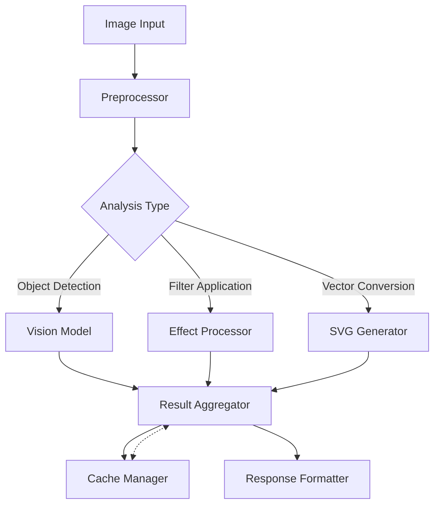

# Image Processing Overview

## Introduction

Opossum Search features a robust image processing pipeline designed to handle a wide range of operations from basic image manipulation to complex analysis and SVG generation. This system forms an integral part of Opossum's multimodal capabilities, allowing seamless integration of visual content within the search and response framework.

## Architecture

The image processing pipeline is built on a modular architecture that enables efficient resource utilization and high throughput:



### Key Components

1. **Preprocessor**: Handles image validation, normalization, and preparation
2. **Analysis Router**: Directs the image to appropriate processing modules
3. **Vision Model Interface**: Connects to Gemini and other vision models
4. **Effect Processor**: Applies filters and transforms to images
5. **SVG Generator**: Converts raster images to vector graphics
6. **Result Aggregator**: Combines outputs from multiple processing steps
7. **Cache Manager**: Implements intelligent caching for processed results

## Core Capabilities

### Image Analysis

- **Object Detection**: Identifies and locates objects within images
- **Scene Classification**: Categorizes image content and context
- **Text Extraction**: Detects and extracts text from images (OCR)
- **Facial Recognition**: Identifies facial features (with privacy controls)
- **Content Moderation**: Flags potentially inappropriate content

### Image Manipulation

- **Filtering**: Applies visual filters (grayscale, sepia, blur, etc.)
- **Transformations**: Resizes, crops, rotates, and adjusts images
- **Composition**: Combines multiple images or adds overlays
- **Enhancement**: Improves clarity, brightness, contrast, and color balance
- **Special Effects**: Adds artistic effects and stylized transformations

### SVG Processing

- **Raster to Vector Conversion**: Transforms bitmap images to scalable vectors
- **Path Optimization**: Simplifies vector paths while preserving quality
- **Dynamic SVG Generation**: Creates SVGs from data inputs
- **Interactive Elements**: Embeds interactive components in SVGs
- **Animation Support**: Implements SMIL and CSS animations in SVGs

## Integration Points

The image processing pipeline integrates with other Opossum components:

- **Conversation Management**: Enables image-related discussions
- **Model Selection**: Routes to appropriate vision models based on task requirements
- **Redis Caching**: Leverages the caching system for processed images
- **GraphQL API**: Exposes image processing capabilities through the API
- **Service Availability**: Implements resilience patterns for reliable operation

## Performance Characteristics

| Operation | Average Processing Time | Cache Impact |
|-----------|-------------------------|-------------|
| Basic Analysis | 300-500ms | 90% reduction |
| Advanced Detection | 800-1200ms | 85% reduction |
| Filter Application | 100-200ms | 95% reduction |
| SVG Generation | 500-1500ms | 80% reduction |
| Combined Operations | 1000-2000ms | 85% reduction |

*Times measured on standard hardware with 1024×768 images*

## Resource Management

The pipeline implements several strategies to optimize resource usage:

1. **Tiered Processing**: Scales complexity based on requirements
2. **Parallel Execution**: Processes compatible operations concurrently
3. **Dynamic Scaling**: Adjusts resource allocation based on system load
4. **Selective Computation**: Processes only necessary image regions
5. **Result Caching**: Stores and reuses processed outputs

## Common Use Cases

- **Content Discovery**: Analyzing images to enhance search relevance
- **Data Visualization**: Generating SVG charts and diagrams
- **Visual Response Enhancement**: Adding images to conversation responses
- **Content Moderation**: Screening for inappropriate imagery
- **Accessibility Improvements**: Converting visual content to accessible formats

## Getting Started

To use the image processing capabilities:

```python
from opossum.image import ImageProcessor

# Initialize processor
processor = ImageProcessor(config={
    'cache_enabled': True,
    'default_model': 'gemini-vision',
    'fallback_model': 'local-vision'
})

# Process an image
result = processor.analyze(
    image_path='path/to/image.jpg',
    operations=['object_detection', 'text_extraction'],
    output_format='json'
)

# Apply filters
filtered = processor.apply_filter(
    image_path='path/to/image.jpg',
    filter_name='nostalgic',
    intensity=0.7
)

# Generate SVG
svg = processor.to_svg(
    image_path='path/to/image.jpg',
    optimization_level='medium',
    include_interactive=True
)
```

## Related Documentation

For more detailed information, refer to:

- Effects and Filters: Detailed documentation on available filters
- SVG Generation: In-depth guide to SVG capabilities
- Performance Optimization: Strategies for maximizing performance
- Caching Strategy: How caching is implemented for image processing
- Vision Model Integration: Details on vision model providers

## Technical Requirements

- Supported input formats: JPEG, PNG, GIF, WEBP, HEIC, BMP
- Maximum input size: 20MB (configurable)
- Recommended minimum resolution: 300×300 pixels
- Optimal resolution range: 800×600 to 1920×1080 pixels
- SVG output complies with SVG 1.1 specifications

## Future Developments

Upcoming enhancements to the image processing pipeline include:

- Extended video frame processing capabilities
- Real-time image stream analysis
- Advanced style transfer algorithms
- 3D model rendering from 2D images
- Expanded medical and scientific image analysis

!!! note
    The image processing capabilities of Opossum Search continue to evolve, with new features and optimizations regularly added to enhance the system's multimodal capabilities.

## Related Documentation

- Effects and Filters
- SVG Generation
- Performance Optimization
- Caching Strategy
- Infrastructure Optimization Strategies