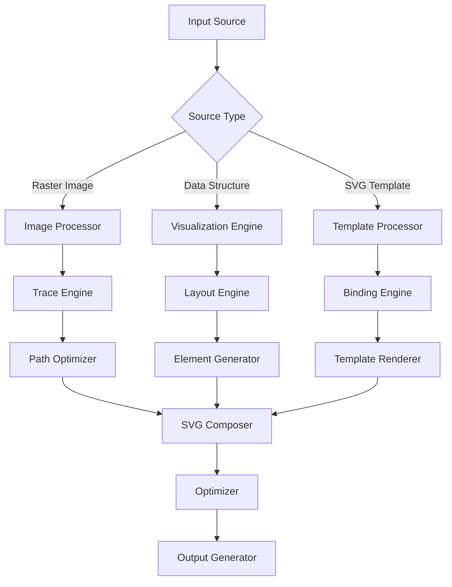

# SVG Generation

## Overview

Opossum Search includes a sophisticated SVG (Scalable Vector Graphics) generation system capable of creating, manipulating, and optimizing vector graphics for a variety of use cases. This component converts raster images to vector format, creates data visualizations, and generates interactive graphical elements that enhance the user experience.

## Core Capabilities

### Raster to Vector Conversion

The system transforms bitmap images into scalable vector graphics through multiple techniques:

| Conversion Method | Best For | Accuracy | Performance Cost |
|-------------------|----------|----------|------------------|
| Contour Tracing | Simple shapes, logos | High | Low-Medium |
| Color Quantization | Illustrations, cartoons | Medium-High | Medium |
| Path Simplification | Complex photographs | Medium | High |
| Spectral Clustering | Detailed artwork | High | Very High |
| Neural Vectorization | Photographs, complex images | Very High | Extreme |

### Data Visualization Generation

The SVG generator creates various data visualizations from structured input:

- **Charts**: Bar, line, area, pie, radar, and scatter plots
- **Diagrams**: Flow charts, network diagrams, tree structures
- **Maps**: Choropleth, bubble, and heatmap visualizations
- **Custom Visualizations**: Domain-specific visual representations
- **Dashboards**: Multi-component interactive displays

### Interactive Elements

SVG output can include interactive capabilities:

- **Hover Effects**: Visual feedback on element hovering
- **Click Actions**: Interaction with individual SVG components
- **Animations**: SMIL and CSS-based transitions and effects
- **Zoom and Pan**: Navigation within complex visualizations
- **Tooltips**: Contextual information displays
- **Responsive Behavior**: Adaptation to different viewports

## Implementation Architecture



## Usage Examples

### Basic SVG Generation

```python
from opossum.svg import SVGGenerator

# Initialize generator
generator = SVGGenerator(optimization_level='medium')

# Generate SVG from image
svg_content = generator.from_image(
    image_path='path/to/image.jpg',
    options={
        'max_colors': 12,
        'smoothing': 0.5,
        'detail_level': 'medium'
    }
)

# Save the SVG
with open('output.svg', 'w') as f:
    f.write(svg_content)
```

### Data Visualization

```python
from opossum.svg import ChartGenerator

# Create chart data
data = [
    {'month': 'Jan', 'value': 42},
    {'month': 'Feb', 'value': 56},
    {'month': 'Mar', 'value': 35},
    {'month': 'Apr', 'value': 68},
    {'month': 'May', 'value': 89}
]

# Generate bar chart
chart = ChartGenerator.bar_chart(
    data=data, 
    x_key='month',
    y_key='value',
    width=800,
    height=400,
    colors=['#4285F4', '#34A853', '#FBBC05', '#EA4335', '#8142F4'],
    title='Monthly Performance',
    animate=True
)

# Get SVG string
svg_content = chart.to_svg()
```

### Template-Based Generation

```python
from opossum.svg import TemplateRenderer

# Define data for template
data = {
    'title': 'System Status',
    'components': [
        {'name': 'API', 'status': 'healthy', 'uptime': 99.98},
        {'name': 'Database', 'status': 'degraded', 'uptime': 98.5},
        {'name': 'Cache', 'status': 'healthy', 'uptime': 100.0}
    ],
    'last_updated': '2023-03-15T14:32:45Z'
}

# Render template with data
renderer = TemplateRenderer()
svg_content = renderer.render(
    template_name='system_status',
    data=data,
    options={'width': 600, 'height': 300}
)
```

### GraphQL API Usage

```graphql
mutation {
  generateSVG(
    input: {
      type: CHART
      chartType: BAR
      data: "[{\"category\":\"A\",\"value\":10},{\"category\":\"B\",\"value\":15}]"
      options: {
        width: 800
        height: 400
        colors: ["#4285F4", "#34A853"]
        title: "Sample Chart"
        animate: true
      }
    }
  ) {
    svg
    dimensions {
      width
      height
    }
    optimizationLevel
    fileSize
  }
}
```

## Advanced Techniques

### Image Vectorization Options

The image vectorization engine provides several parameters to control the output:

| Parameter | Description | Values | Default |
|-----------|-------------|--------|---------|
| `max_colors` | Maximum colors in output | 2-256 | 16 |
| `detail_level` | Level of detail to preserve | 'low', 'medium', 'high', 'ultra' | 'medium' |
| `smoothing` | Path smoothing factor | 0.0-1.0 | 0.5 |
| `min_path_length` | Minimum path length to include | 0-100 pixels | 5 |
| `corner_threshold` | Angle for detecting corners | 10-170 degrees | 120 |
| `error_threshold` | Maximum allowed deviation | 0.1-10.0 | 1.0 |
| `stack_paths` | Layer paths by color | boolean | true |
| `simplify_paths` | Apply path simplification | boolean | true |

### Animation Options

SVG animations can be configured with these parameters:

| Parameter | Description | Values | Default |
|-----------|-------------|--------|---------|
| `animation_type` | Type of animation | 'fade', 'grow', 'slide', 'bounce', 'custom' | 'fade' |
| `duration` | Animation duration | 100-10000ms | 500 |
| `delay` | Delay before animation starts | 0-10000ms | 0 |
| `easing` | Easing function | 'linear', 'ease', 'ease-in', 'ease-out', 'ease-in-out' | 'ease' |
| `repeat_count` | Number of repetitions | 0-infinite | 1 |
| `trigger` | What triggers the animation | 'load', 'scroll', 'click', 'hover' | 'load' |

### Layout Algorithms

Different layout algorithms are available for data visualizations:

- **Force-Directed**: Network graphs with physical simulation
- **Tree**: Hierarchical tree structures (top-down, bottom-up, radial)
- **Grid**: Regular grid-based layouts
- **Circular**: Circular and radial arrangements
- **Stack**: Stacked compositions for part-to-whole relationships
- **Flow**: Directed graphs for process flows
- **Custom**: User-defined positioning functions

## Optimization Techniques

The SVG optimization engine improves output quality and file size:

### Size Optimization

- **Path Simplification**: Reduces point count while maintaining shape
- **Decimal Precision**: Truncates coordinates to necessary precision
- **SVGO Integration**: Applies comprehensive optimization techniques
- **Attribute Minimization**: Removes redundant or default attributes
- **ID Shortening**: Reduces the length of internal IDs

### Rendering Optimization

- **Paint Order Adjustment**: Optimizes rendering order for performance
- **Text to Path Conversion**: Ensures consistent display without fonts
- **Gradient Simplification**: Simplifies complex gradients
- **Filter Effect Optimization**: Streamlines filter definitions
- **View Box Normalization**: Standardizes coordinate systems

## Performance Considerations

### Processing Time

| Operation | Small Image (<500px) | Medium Image (500-1500px) | Large Image (>1500px) |
|-----------|----------------------|---------------------------|------------------------|
| Simple Trace | 0.2-0.5s | 0.5-2s | 2-10s |
| Color Quantized | 0.5-1s | 1-5s | 5-30s |
| Neural Vectorization | 5-10s | 10-60s | 60-300s |
| Chart Generation | 0.1-0.3s | 0.3-0.8s | 0.8-2s |
| Template Rendering | 0.1-0.2s | 0.2-0.5s | 0.5-1.5s |

### File Size Implications

| Content Type | Raster Equivalent (PNG) | SVG Output | Reduction Factor |
|--------------|--------------------------|------------|------------------|
| Simple Logo | 50-100KB | 5-15KB | 5-10× |
| Chart/Diagram | 100-500KB | 10-50KB | 8-12× |
| Illustration | 500KB-2MB | 50-200KB | 10-15× |
| Photograph | 1-5MB | 200-800KB | 5-8× |
| Complex Artwork | 5-20MB | 0.5-3MB | 7-10× |

## Integration with Other Components

The SVG generation system integrates with several other Opossum components:

- **Image Processing**: Provides input for vectorization
- **Caching System**: Stores generated SVGs for reuse
- **Response Generation**: Embeds SVGs in conversation responses
- **GraphQL API**: Exposes SVG generation capabilities
- **Model Integration**: Uses AI models for advanced vectorization

## Browser Compatibility

The generated SVGs are tested for compatibility with:

- Chrome 60+
- Firefox 60+
- Safari 10+
- Edge 16+
- Opera 50+
- iOS Safari 10+
- Android Browser 67+

Fallback mechanisms are implemented for older browsers.

## Future Development

The SVG generation system roadmap includes:

- **Animation Sequences**: Multi-step animation capabilities
- **3D Perspective**: 3D-like effects in SVG
- **Pattern Recognition**: Improved pattern detection for vectorization
- **Code Output**: Generated code for programmatic SVG creation
- **Style Transfer**: AI-powered artistic style application to SVGs
- **Collaborative Editing**: Real-time multi-user SVG editing

## Appendix: SVG Optimization Results

Sample optimization results for different input types:

| Input Type | Original SVG Size | Optimized Size | Reduction | Rendering Performance Improvement |
|------------|-------------------|----------------|-----------|-----------------------------------|
| Logo | 45.2KB | 12.8KB | 71.7% | 22% faster |
| Chart | 128.5KB | 36.2KB | 71.8% | 35% faster |
| Map | 876.3KB | 215.9KB | 75.4% | 48% faster |
| Illustration | 1.2MB | 380KB | 68.3% | 41% faster |
| Photo Trace | 3.5MB | 860KB | 75.4% | 56% faster |

!!! tip
    SVG optimization significantly reduces file sizes and improves rendering performance, making it ideal for web-based applications.

## Related Documentation

- Image Processing Overview
- Effects and Filters
- Performance Optimization
- Caching Strategy
- SVG Markup