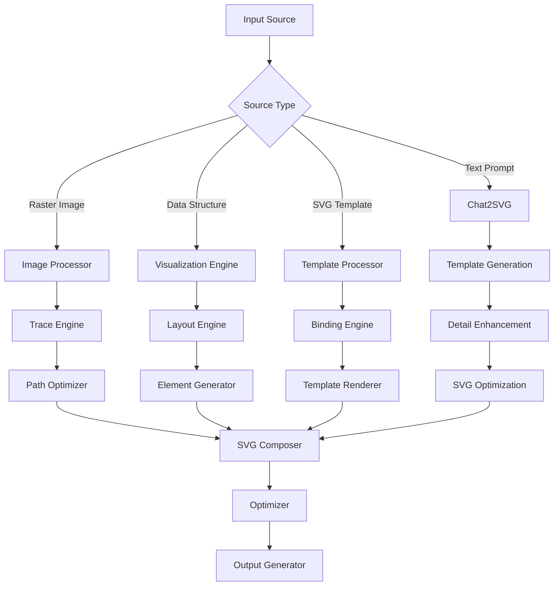

# SVG Generation

Opossum Search provides a sophisticated SVG (Scalable Vector Graphics) generation system that combines two complementary
approaches: a native template-based system and an AI-powered Chat2SVG integration. This document explains both systems,
their technical capabilities, and guidelines for when to use each approach.

## Overview of SVG Generation Approaches

| Feature                | Native Template System                  | Chat2SVG Integration                                   |
|------------------------|-----------------------------------------|--------------------------------------------------------|
| Primary Use Case       | Operational visualizations & dashboards | Creative, custom imagery                               |
| Source of Intelligence | Predefined templates with data binding  | Three-stage AI pipeline with LLMs and diffusion models |
| Response Time          | Fast (milliseconds)                     | Slower (seconds)                                       |
| Resource Usage         | Very low                                | Higher (especially with detail enhancement)            |
| Customization          | Limited to template parameters          | Open-ended text-to-image generation                    |
| Offline Capability     | Full support                            | Depends on configuration                               |
| Reliability            | Very high                               | Depends on model availability                          |

## Core Capabilities

### Raster to Vector Conversion

The system transforms bitmap images into scalable vector graphics through multiple techniques:

| Conversion Method    | Best For                    | Accuracy    | Performance Cost |
|----------------------|-----------------------------|-------------|------------------|
| Contour Tracing      | Simple shapes, logos        | High        | Low-Medium       |
| Color Quantization   | Illustrations, cartoons     | Medium-High | Medium           |
| Path Simplification  | Complex photographs         | Medium      | High             |
| Neural Vectorization | Photographs, complex images | Very High   | Extreme          |

### Data Visualization Generation

The SVG generator creates various data visualizations from structured input:

- **Charts**: Bar, line, area, pie, radar, and scatter plots
- **Diagrams**: Flow charts, network diagrams, tree structures
- **Maps**: Choropleth, bubble, and heatmap visualizations
- **Custom Visualizations**: Domain-specific visual representations
- **Dashboards**: Multi-component interactive displays

### Interactive Elements

SVG output can include interactive capabilities:

- **Hover Effects**: Visual feedback on element hovering
- **Click Actions**: Interaction with individual SVG components
- **Animations**: SMIL and CSS-based transitions and effects
- **Zoom and Pan**: Navigation within complex visualizations
- **Tooltips**: Contextual information displays

## Implementation Architecture



## 1. Native Template System

The native SVG generation system uses predefined templates with data binding to create operational visualizations.

### Available Visualization Types

- **Service Status** - Real-time dashboard of service availability
- **Failover Process** - Diagram showing the failover flow when services become unavailable
- **Capability Degradation** - Visualization of capability levels across different service states

### Implementation

The native system uses a simple, efficient approach:

```javascript
// Example of generating a service status visualization
async function generateSVGVisualization(svgType) {
    const response = await fetch('/generate-svg', {
        method: 'POST',
        headers: { 'Content-Type': 'application/json' },
        body: JSON.stringify({
            type: svgType,
            data: {} // Populated with real-time data
        })
    });

    const data = await response.json();
    addSVGMessage(data.svg_content, data.base64_image);
}
```

### Benefits

- **Speed** - Generates visualizations in milliseconds
- **Reliability** - No dependency on external AI services
- **Consistency** - Predictable output format every time
- **Resource Efficiency** - Minimal CPU and memory usage

### Use Cases

- Real-time operational dashboards
- System status visualizations
- Process flow diagrams
- Error state illustrations
- Easter egg visuals for special features

### Data Visualization Example

```python
from opossum.svg import ChartGenerator

# Create chart data
data = [
    {'month': 'Jan', 'value': 42},
    {'month': 'Feb', 'value': 56},
    {'month': 'Mar', 'value': 35},
    {'month': 'Apr', 'value': 68},
    {'month': 'May', 'value': 89}
]

# Generate bar chart
chart = ChartGenerator.bar_chart(
    data=data, 
    x_key='month',
    y_key='value',
    width=800,
    height=400,
    colors=['#4285F4', '#34A853', '#FBBC05', '#EA4335', '#8142F4'],
    title='Monthly Performance',
    animate=True
)

# Get SVG string
svg_content = chart.to_svg()
```

### Template-Based Generation

```python
from opossum.svg import TemplateRenderer

# Define data for template
data = {
    'title': 'System Status',
    'components': [
        {'name': 'API', 'status': 'healthy', 'uptime': 99.98},
        {'name': 'Database', 'status': 'degraded', 'uptime': 98.5},
        {'name': 'Cache', 'status': 'healthy', 'uptime': 100.0}
    ],
    'last_updated': '2023-03-15T14:32:45Z'
}

# Render template with data
renderer = TemplateRenderer()
svg_content = renderer.render(
    template_name='system_status',
    data=data,
    options={'width': 600, 'height': 300}
)
```

## 2. Chat2SVG Integration

The Chat2SVG integration uses a sophisticated AI pipeline to generate custom vector graphics from text descriptions.

### How Chat2SVG Works

The system uses a three-stage pipeline:

1. **Template Generation** - Uses large language models to create initial SVG templates
2. **Detail Enhancement** - Leverages image diffusion models to add visual details (optional)
3. **SVG Optimization** - Optimizes vector paths using VAE models

### Implementation

```javascript
async function generateTextToSVG(prompt) {
    const mutation = `
        mutation GenerateSVG($input: SVGGenerationInput!) {
            generate_svg(input: $input) {
                svg_content
                base64_image
                metadata
            }
        }
    `;
    
    const variables = {
        input: {
            prompt: prompt,
            style: "default"
        }
    };
    
    const data = await graphqlRequest(mutation, variables);
    addSVGMessage(data.generate_svg.svg_content, data.generate_svg.base64_image);
}
```

### Configuration Options

Configure Chat2SVG integration through environment variables:

- `CHAT2SVG_ENABLED` - Enable/disable the Chat2SVG integration (default: true)
- `CHAT2SVG_DETAIL_ENHANCEMENT` - Enable/disable the detail enhancement stage (default: false)
- `CHAT2SVG_PATH` - Path to Chat2SVG installation

### Benefits

- **Creative Freedom** - Generate any concept described in natural language
- **Custom Imagery** - Create unique, tailored visualizations
- **Artistic Styles** - Support for various visual styles
- **Complex Scenes** - Ability to generate intricate visual compositions

### Use Cases

- Custom user-requested visualizations
- Decorative elements and illustrations
- Creative images for special events
- Visual explanations of complex concepts
- National Opossum Day special visualizations

### GraphQL API Usage

```graphql
mutation {
  generateSVG(
    input: {
      type: TEXT_TO_SVG
      prompt: "An opossum playing with a keyboard under moonlight"
      style: "cartoon"
      options: {
        width: 800
        height: 600
        detailLevel: MEDIUM
      }
    }
  ) {
    svg_content
    base64_image
    metadata
  }
}
```

## Decision Guidelines

### Use the Native Template System when:

- You need **operational visualizations** with real-time data
- **Speed** and **reliability** are critical
- You need **consistent, predictable output**
- You're working with **limited resources**
- The visualization is part of a **critical system feature**
- You need high **performance at scale**

### Use Chat2SVG when:

- You need **creative, novel visualizations**
- The user has requested a **specific visual concept**
- You want to generate **illustrative examples**
- You're enhancing **special features** like National Opossum Day
- **Resource constraints** are not a concern
- The request falls outside existing templates

### Hybrid Approach

For optimal results, consider a hybrid approach:

1. Use native templates for operational data visualization
2. Use Chat2SVG for supplementary illustrations and unique requests
3. Cache frequently requested Chat2SVG generations for performance

## Technical Details

### Advanced Techniques

#### Image Vectorization Options

The image vectorization engine provides several parameters to control the output:

| Parameter          | Description                    | Values                           | Default  |
|--------------------|--------------------------------|----------------------------------|----------|
| `max_colors`       | Maximum colors in output       | 2-256                            | 16       |
| `detail_level`     | Level of detail to preserve    | 'low', 'medium', 'high', 'ultra' | 'medium' |
| `smoothing`        | Path smoothing factor          | 0.0-1.0                          | 0.5      |
| `min_path_length`  | Minimum path length to include | 0-100 pixels                     | 5        |
| `corner_threshold` | Angle for detecting corners    | 10-170 degrees                   | 120      |

#### Animation Options

SVG animations can be configured with these parameters:

| Parameter        | Description                   | Values                                                 | Default |
|------------------|-------------------------------|--------------------------------------------------------|---------|
| `animation_type` | Type of animation             | 'fade', 'grow', 'slide', 'bounce', 'custom'            | 'fade'  |
| `duration`       | Animation duration            | 100-10000ms                                            | 500     |
| `delay`          | Delay before animation starts | 0-10000ms                                              | 0       |
| `easing`         | Easing function               | 'linear', 'ease', 'ease-in', 'ease-out', 'ease-in-out' | 'ease'  |
| `repeat_count`   | Number of repetitions         | 0-infinite                                             | 1       |

### Optimization Techniques

The SVG optimization engine improves output quality and file size:

#### Size Optimization

- **Path Simplification**: Reduces point count while maintaining shape
- **Decimal Precision**: Truncates coordinates to necessary precision
- **SVGO Integration**: Applies comprehensive optimization techniques
- **Attribute Minimization**: Removes redundant or default attributes
- **ID Shortening**: Reduces the length of internal IDs

#### Rendering Optimization

- **Paint Order Adjustment**: Optimizes rendering order for performance
- **Text to Path Conversion**: Ensures consistent display without fonts
- **Gradient Simplification**: Simplifies complex gradients
- **Filter Effect Optimization**: Streamlines filter definitions
- **View Box Normalization**: Standardizes coordinate systems

### Fallback Mechanism

If Chat2SVG fails or is unavailable, the system automatically falls back to a simpler template:

```python
def _fallback_svg(self, prompt: str) -> str:
    """Generate a simple fallback SVG when the main pipeline fails."""
    return f"""
    <svg viewBox="0 0 512 512" xmlns="http://www.w3.org/2000/svg">
        <!-- Fallback SVG for: {prompt} -->
        <rect x="50" y="50" width="412" height="412" fill="#f8f8f8" stroke="#ccc" stroke-width="2" />
        <text x="256" y="236" text-anchor="middle" font-size="24" fill="#333">SVG Generation</text>
        <text x="256" y="276" text-anchor="middle" font-size="18" fill="#666">"{prompt}"</text>
    </svg>
    """
```

### Caching

Both systems implement caching to improve performance:

- Native templates cache visualizations for 5 minutes
- Chat2SVG generations are cached for 1 hour

### Performance Considerations

| Operation                        | Small Image (<500px) | Medium Image (500-1500px) | Large Image (>1500px) |
|----------------------------------|----------------------|---------------------------|-----------------------|
| Native Template Rendering        | 0.1-0.2s             | 0.2-0.5s                  | 0.5-1.5s              |
| Chart Generation                 | 0.1-0.3s             | 0.3-0.8s                  | 0.8-2s                |
| Chat2SVG Basic                   | 1-3s                 | 3-8s                      | 8-15s                 |
| Chat2SVG with Detail Enhancement | 5-10s                | 10-30s                    | 30-90s                |

### File Size Implications

| Content Type    | Raster Equivalent (PNG) | SVG Output | Reduction Factor |
|-----------------|-------------------------|------------|------------------|
| Simple Logo     | 50-100KB                | 5-15KB     | 5-10×            |
| Chart/Diagram   | 100-500KB               | 10-50KB    | 8-12×            |
| Illustration    | 500KB-2MB               | 50-200KB   | 10-15×           |
| Chat2SVG Output | 1-5MB                   | 50-300KB   | 10-20×           |

### Browser Compatibility

The generated SVGs are tested for compatibility with:

- Chrome 60+
- Firefox 60+
- Safari 10+
- Edge 16+
- Opera 50+
- iOS Safari 10+
- Android Browser 67+

## Special Feature: National Opossum Day

On October 18th (National Opossum Day), the system uses Chat2SVG to enhance the celebration with special opossum-themed
visualizations:

```python
# Example usage for National Opossum Day
if is_national_opossum_day():
    prompt = "A celebratory opossum wearing a party hat for National Opossum Day"
    svg_content = await chat2svg_generator.generate_svg_from_prompt(prompt)
    # Use the SVG in the celebration features
```

This integration enhances the existing Easter egg functionality, providing users with delightful custom visualizations
during the special event.

## Future Enhancements

- Style control parameters for guided Chat2SVG generation
- Additional template categories for the native system
- Integration of chat context for more relevant visualizations
- Performance optimizations for Chat2SVG pipeline
- **Animation Sequences**: Multi-step animation capabilities
- **3D Perspective**: 3D-like effects in SVG
- **Pattern Recognition**: Improved pattern detection for vectorization
- **Collaborative Editing**: Real-time multi-user SVG editing

## Appendix: SVG Optimization Results

Sample optimization results for different input types:

| Input Type      | Original SVG Size | Optimized Size | Reduction | Rendering Performance Improvement |
|-----------------|-------------------|----------------|-----------|-----------------------------------|
| Logo            | 45.2KB            | 12.8KB         | 71.7%     | 22% faster                        |
| Chart           | 128.5KB           | 36.2KB         | 71.8%     | 35% faster                        |
| Map             | 876.3KB           | 215.9KB        | 75.4%     | 48% faster                        |
| Chat2SVG Output | 520KB             | 180KB          | 65.4%     | 38% faster                        |

## Related Documentation

- Image Processing Overview
- Effects and Filters
- Performance Optimization
- Caching Strategy
- National Opossum Day