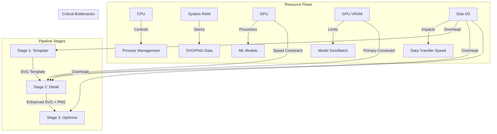

# Chat2SVG Pipeline Constraint Mapping

This document provides a comprehensive mapping of constraints in the Chat2SVG pipeline, highlighting boundaries, challenges, and optimization opportunities. This mapping is critical for understanding the system's limitations and informing design decisions for the optimized implementation.

## 1. Resource Constraints

| Constraint | Description | Impact on Chat2SVG | Optimization Strategy |
|------------|-------------|-------------------|----------------------|
| **CPU** | Processing power for non-GPU tasks | • Limits subprocess management<br>• Bottleneck for Stage 1 (LLM template generation)<br>• Controls overall orchestration speed | • Async subprocess management<br>• Resource-aware scheduling<br>• Batch processing when possible |
| **System RAM** | Memory for intermediate results and processes | • Limits concurrent requests<br>• SVG/PNG data storage needs<br>• Risk of OOM errors during peak loads | • In-memory streaming between stages<br>• Progressive garbage collection<br>• Adaptive resource monitoring |
| **GPU Compute** | ML processing power | • Critical bottleneck for Stage 2 (diffusion)<br>• Impacts Stage 3 VAE optimization speed<br>• Dictates queue length and wait times | • Model quantization (FP16/INT8)<br>• Dynamic parameter scaling<br>• Fine-tuned batch sizing |
| **GPU VRAM** | Memory on GPU | • *Primary bottleneck* - limits model loading<br>• Forces model swapping between requests<br>• May cause OOM errors with large batches | • Aggressive model quantization<br>• "Just enough" parameter settings<br>• Shared memory access patterns |
| **Disk I/O** | File read/write performance | • Major bottleneck in unoptimized pipeline<br>• Current design writes 5-12 files per request<br>• Adds 0.5-2s of overhead per stage | • Replace file I/O with memory streaming<br>• Unified temp directory structure<br>• Minimize model loading/unloading |
| **Network** | API connectivity and bandwidth | • Impacts LLM API calls in Stage 1<br>• Download time for initial model setup | • Response caching<br>• Offline operation mode<br>• Progressive enhancement for slow connections |

## 2. Pipeline Flow Constraints

| Constraint | Description | Impact on Chat2SVG | Optimization Strategy |
|------------|-------------|-------------------|----------------------|
| **Stage Dependencies** | S1 → S2 → S3 sequential flow | • Total latency = sum(stage_times)<br>• Single stage failure breaks entire pipeline<br>• Debugging complexity increases with each stage | • Unified pipeline controller<br>• Circuit breaker pattern<br>• Intelligent fallbacks between stages |
| **Data Handover** | Output format compatibility between stages | • Current implementation uses filesystem<br>• Directory/file path coordination needed<br>• Inconsistent naming patterns | • Standardized memory-based data structures<br>• Clear data validation between stages<br>• Type checking/conversion where needed |
| **Optional Stages** | Stages 2 & 3 can be skipped | • Quality vs. performance trade-off<br>• Resource availability influences decisions<br>• Different failure modes per stage | • Dynamic stage configuration matrix<br>• Resource-aware stage activation<br>• Progressive enhancement approach |
| **Subprocess Management** | Python subprocess calls for each stage | • Overhead for process creation<br>• Error propagation challenges<br>• Environment variable coordination | • Process pooling where possible<br>• Improved error handling<br>• Standardized environment management |

## 3. Performance Constraints

| Constraint | Description | Impact on Chat2SVG | Optimization Strategy |
|------------|-------------|-------------------|----------------------|
| **Latency** | Time from request to response | • 5-90s total process time<br>• Stage 2 (detail) is slowest: 3-30s<br>• I/O adds ~20-25% overhead | • Memory streaming (40-55% improvement)<br>• Parallel preparation of next stages<br>• Early response with progressive enhancement |
| **Throughput** | Requests processed per unit time | • Limited by slowest stage<br>• GPU becomes shared resource bottleneck<br>• Concurrent request handling is suboptimal | • Resource-aware scheduling<br>• Request prioritization framework<br>• Max-flow optimization for queue management |
| **Memory Growth** | RAM/VRAM usage over time | • Current design shows memory growth patterns<br>• File handles may leak under load<br>• VRAM fragmentation during long sessions | • Explicit resource cleanup<br>• Strategic model unloading<br>• Memory usage monitoring |
| **Cold Start** | Time for first request processing | • Model loading time: 5-15s<br>• Pipeline setup overhead: 1-3s<br>• Subprocess initialization: ~0.5s | • Model preloading for common cases<br>• Warm standby processes<br>• Cached initial responses |

## 4. Quality Constraints

| Constraint | Description | Impact on Chat2SVG | Optimization Strategy |
|------------|-------------|-------------------|----------------------|
| **Stage Quality Impact** | Contribution of each stage | • Stage 1 (Template): Basic structure (40%)<br>• Stage 2 (Detail): Visual fidelity (40%)<br>• Stage 3 (Optimization): Path quality (20%) | • Stage-specific resource allocation<br>• Quality impact weighting<br>• Quality-aware stage skipping |
| **Parameter Settings** | Configuration options | • Diffusion steps (20-30): Major quality factor<br>• SAM points_per_side (24-64): Detail level<br>• VAE iterations (500-1000): Path smoothness | • Dynamic parameter selection matrix<br>• Resource-adaptive settings<br>• User preference integration |
| **Style Consistency** | Visual coherence | • Stage transitions can create inconsistencies<br>• Template style may conflict with enhancements<br>• Parameter tuning affects style fidelity | • Style preservation signals<br>• Consistent enhancement algorithms<br>• Style validation between stages |
| **SVG Specification** | W3C SVG compliance | • Generated SVG must be valid/renderable<br>• Browser compatibility considerations<br>• Efficient path representation | • Post-processing validation<br>• Compatibility testing<br>• Path optimization without quality loss |

## 5. External Constraints

| Constraint | Description | Impact on Chat2SVG | Optimization Strategy |
|------------|-------------|-------------------|----------------------|
| **API Limits** | Rate limits on external services | • LLM API throttling for Stage 1<br>• Potential cost considerations<br>• Response time variation | • Request throttling<br>• Exponential backoff<br>• Local model fallbacks |
| **Model Availability** | Required models must be downloaded | • SAM model: ~2.4GB<br>• Diffusion models: 5-7GB<br>• VAE models: ~200MB | • Progressive model download<br>• Quantization to reduce size<br>• Fallback to simpler models |
| **Environment Compatibility** | OS/hardware requirements | • CUDA dependency for GPU acceleration<br>• Library version compatibilities<br>• Path handling differences (Windows/Unix) | • Container-based deployment<br>• Environment validation<br>• Cross-platform path handling |
| **Deployment Constraints** | Production deployment limitations | • Docker container size limits<br>• Cloud resource quotas<br>• API gateway timeouts (often <30s) | • Model pruning<br>• Asynchronous processing patterns<br>• Serverless-compatible architecture |

## Resource Interaction Diagram



## Constraint Relationship Matrix

| Resource Type | Stage 1 (Template) | Stage 2 (Detail) | Stage 3 (Optimize) |
|---------------|-------------------|------------------|---------------------|
| **CPU**       | Critical (4/5)    | Medium (2/5)     | High (3/5)          |
| **RAM**       | Low (1/5)         | High (4/5)       | Medium (2/5)        |
| **GPU**       | Optional (1/5)    | Critical (5/5)   | High (4/5)          |
| **VRAM**      | Optional (1/5)    | Critical (5/5)   | High (4/5)          |
| **Disk I/O**  | Medium (3/5)      | High (4/5)       | Medium (3/5)        |
| **Network**   | High (4/5)*       | Low (1/5)        | Low (1/5)           |

*If using external LLM API; low if using local model

## Sensitivity Analysis

The pipeline uses advanced sensitivity analysis based on Google OR-Tools to optimize resource allocation and improve
resilience:

### Analysis Capabilities

- **Variable Impact Analysis**: Quantifies the contribution of each pipeline stage to overall performance
- **Resource Bottleneck Detection**: Identifies which resources (CPU, memory, GPU, VRAM) are limiting factors
- **Objective Coefficient Ranging**: Determines how changes in stage importance affect solution quality
- **What-If Scenario Modeling**: Tests hypothetical resource configurations without service disruption
- **Automated Recommendations**: Suggests targeted improvements based on operational data

### Implementation Details

The `SensitivityAnalyzer` class provides:

1. **Complete Analysis Workflow**:
   ```python
   analyzer = SensitivityAnalyzer()
   model = analyzer.create_optimization_model(requests, resources)
   status = model.Solve()
   analysis = analyzer.analyze_model(model)
   recommendations = analyzer.generate_recommendations(analysis)

2. **Fallback Mechanisms**: Graceful degradation when
   advanced analysis features aren't available in the
   selected solver
3. **Telemetry Integration**: Performance monitoring for
   analysis operations

This analysis enables data-driven decisions about pipeline
configuration and hardware resource allocation.
## Key Observations & Optimization Priorities

1. **Memory Streaming Priority**: The current file I/O between stages adds 20-25% overhead. Moving to memory streaming could yield the most immediate performance gains.

2. **GPU Resource Management**: Stage 2 (detail enhancement) is the heaviest consumer of GPU resources. A dynamic scheduler should prioritize GPU allocation to this stage.

3. **Consolidated Resource Allocation**: Instead of individual resource checks per stage, implementing a unified resource assessment at the pipeline level allows for optimal allocation across all stages.

4. **Progressive Enhancement Strategy**: When resources are constrained, implementing quality reduction (fewer diffusion steps, lower SAM resolution) is better than complete stage skipping.

5. **Parallel Optimization Opportunities**: While the core S1→S2→S3 flow is sequential for a single request, preparation work for later stages can happen in parallel with execution of earlier stages.

6. **Quantization Impact**: Model quantization provides substantial resource savings with minimal quality impact. Reducing VRAM usage by 50-75% enables higher throughput and concurrent processing.

7. **Error Handling Optimization**: Current implementation has cascading failures. The circuit breaker pattern with stage-specific fallbacks would significantly improve reliability.

## Practical Implementation Notes

- Current implementation creates multiple temp directories that could be consolidated
- Error handling currently doesn't distinguish between different failure modes
- Model quantization appears to be configured but not fully implemented in the integration
- Pipeline treats each request independently, missing opportunities for batch processing
- Resource detection happens multiple times instead of once with monitoring
