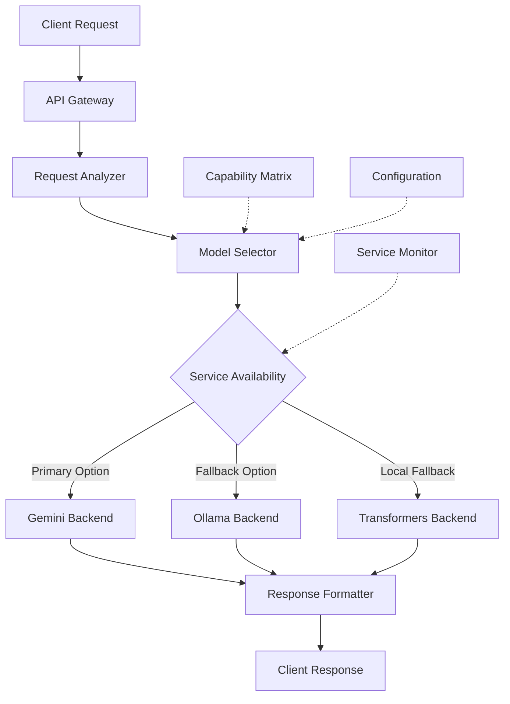

# Model Integration Architecture

## Overview

The Opossum Search system implements a sophisticated model integration architecture that dynamically selects and
utilizes various AI models based on request characteristics, service availability, and capability requirements. This
hybrid approach enables resilience, flexibility, and optimal performance across diverse search scenarios.

## Architectural Principles

The model integration architecture follows several key principles:

1. **Service Independence**: No hard dependencies on any single AI service provider
2. **Graceful Degradation**: System continues functioning when services are unavailable
3. **Capability-Based Routing**: Requests are directed to models best suited to fulfill them
4. **Transparent Fallbacks**: Fallback mechanisms operate without requiring client awareness
5. **Consistent Interface**: Uniform API regardless of underlying model implementation

## Core Components



### Key Components

1. **Request Analyzer**: Examines incoming requests to determine their characteristics and requirements.

2. **Model Selector**: The central decision-making component that determines which model backend to use for a given
   request.

3. **Service Availability**: Monitors the status and availability of each model service.

4. **Capability Matrix**: Defines the capabilities of each model backend and their suitability for different request
   types.

5. **Model Backends**:
    - **Gemini Backend**: Integration with Google's Gemini API
    - **Ollama Backend**: Integration with locally deployed Ollama models
    - **Transformers Backend**: Direct integration with Hugging Face Transformers

6. **Response Formatter**: Ensures consistent response format regardless of the model used.

## Request Flow

The typical flow of a request through the model integration system:

```python
def process_request(request):
    """Process an incoming request through the model integration pipeline"""
    
    # 1. Analyze request to determine characteristics and requirements
    request_profile = RequestAnalyzer.analyze(request)
    
    # 2. Select optimal model based on request profile and current availability
    selected_model = ModelSelector.select_model(
        request_profile=request_profile,
        capability_requirements=request_profile.capabilities_needed
    )
    
    # 3. Process request with selected model
    try:
        response = selected_model.process(request.content)
        return format_response(response)
    except ModelUnavailableError:
        # 4. Handle failures with automatic fallback
        fallback_model = ModelSelector.select_fallback(
            primary_model=selected_model,
            request_profile=request_profile
        )
        response = fallback_model.process(request.content)
        return format_response(response)
```

## Hybrid Model Backend

The core of the architecture is the `HybridModelBackend` class, which encapsulates the logic for selecting between
different model backends:

```python
class HybridModelBackend:
    """Manages multiple model backends with intelligent selection and fallback"""
    
    def __init__(self, config):
        self.config = config
        self.backends = {
            'gemini': GeminiBackend(config['gemini']),
            'ollama': OllamaBackend(config['ollama']),
            'transformers': TransformersBackend(config['transformers'])
        }
        self.availability = ServiceAvailability()
        self.capability_matrix = CapabilityMatrix()
    
    def process(self, query, context=None, requirements=None):
        """Process a query using the optimal model backend"""
        selected_backend = self._select_backend(query, requirements)
        
        try:
            return selected_backend.process(query, context)
        except ServiceUnavailableError:
            # Mark service as unavailable and try fallback
            self.availability.mark_unavailable(selected_backend.name)
            fallback = self._select_fallback(selected_backend.name, requirements)
            return fallback.process(query, context)
    
    def _select_backend(self, query, requirements=None):
        """Select the optimal backend based on query and requirements"""
        # Default requirements if none specified
        requirements = requirements or ['general_knowledge']
        
        # Get available backends
        available_backends = {
            name: backend for name, backend in self.backends.items()
            if self.availability.is_available(name)
        }
        
        if not available_backends:
            # If nothing is available, try the local transformers backend
            # which should always be available as a last resort
            return self.backends['transformers']
        
        # Score each available backend based on capability matrix
        scores = {}
        for name, backend in available_backends.items():
            scores[name] = self.capability_matrix.score_backend(
                backend_name=name,
                requirements=requirements,
                query=query
            )
        
        # Select backend with highest score
        selected_name = max(scores, key=scores.get)
        return self.backends[selected_name]
    
    def _select_fallback(self, failed_backend, requirements=None):
        """Select a fallback backend when the primary choice fails"""
        # Define fallback chain
        fallback_chain = {
            'gemini': 'ollama',
            'ollama': 'transformers',
            'transformers': 'gemini'  # Circular as last resort
        }
        
        # Try the next backend in the fallback chain
        next_backend = fallback_chain[failed_backend]
        
        # If that's available, use it
        if self.availability.is_available(next_backend):
            return self.backends[next_backend]
        
        # Otherwise find any available backend
        for name, backend in self.backends.items():
            if name != failed_backend and self.availability.is_available(name):
                return backend
        
        # If all else fails, use transformers as last resort
        return self.backends['transformers']
```

## Service Availability

The `ServiceAvailability` component monitors the health and availability of model services:

```python
class ServiceAvailability:
    """Tracks availability of model services and implements circuit breaker pattern"""
    
    def __init__(self):
        self.status = {
            'gemini': {'available': True, 'last_checked': time.time()},
            'ollama': {'available': True, 'last_checked': time.time()},
            'transformers': {'available': True, 'last_checked': time.time()}
        }
        self.failure_thresholds = {
            'gemini': 3,
            'ollama': 2,
            'transformers': 5
        }
        self.failure_counts = {'gemini': 0, 'ollama': 0, 'transformers': 0}
        self.recovery_intervals = {
            'gemini': 300,  # 5 minutes
            'ollama': 60,   # 1 minute
            'transformers': 120  # 2 minutes
        }
    
    def is_available(self, service_name):
        """Check if a service is currently available"""
        status = self.status.get(service_name, {'available': False})
        
        # If service is marked unavailable, check if recovery interval has passed
        if not status['available']:
            elapsed = time.time() - status['last_checked']
            if elapsed > self.recovery_intervals.get(service_name, 300):
                # Time to retry this service
                self.status[service_name]['available'] = True
                self.failure_counts[service_name] = 0
        
        return self.status.get(service_name, {'available': False})['available']
    
    def mark_unavailable(self, service_name):
        """Mark a service as unavailable after failure"""
        self.failure_counts[service_name] = self.failure_counts.get(service_name, 0) + 1
        
        # If we've hit the threshold, mark service as unavailable
        if self.failure_counts[service_name] >= self.failure_thresholds.get(service_name, 3):
            self.status[service_name] = {
                'available': False,
                'last_checked': time.time()
            }
            logger.warning(f"Service {service_name} marked unavailable after {self.failure_counts[service_name]} failures")
    
    def mark_successful(self, service_name):
        """Mark a successful service call to reset failure count"""
        self.failure_counts[service_name] = 0
        self.status[service_name] = {
            'available': True,
            'last_checked': time.time()
        }
```

## Multi-Modal Handling

The model integration architecture supports multi-modal requests involving text, images, and structured data:

```python
def process_multimodal_request(text, images=None, structured_data=None):
    """Process a request containing multiple input modalities"""
    
    # Determine required capabilities based on input types
    capabilities = ['text_understanding']
    
    if images:
        capabilities.append('image_understanding')
        
    if structured_data:
        capabilities.append('structured_data_processing')
    
    # Select model based on required capabilities
    model = ModelSelector.select_model(capabilities=capabilities)
    
    # Process with selected model
    if model.supports_multimodal_input():
        # Model can process all modalities together
        return model.process_multimodal(text, images, structured_data)
    else:
        # Handle with separate processing and integration
        text_result = model.process_text(text)
        
        if images and model.supports_capability('image_understanding'):
            image_results = [model.process_image(img) for img in images]
        else:
            # Fallback to image-specific model
            image_model = ModelSelector.select_model(capabilities=['image_understanding'])
            image_results = [image_model.process_image(img) for img in images]
        
        # Integrate results
        return integrate_multimodal_results(text_result, image_results, structured_data)
```

## Resilience Patterns

The architecture implements several resilience patterns:

1. **Circuit Breaker**: Temporarily disables services after consecutive failures
2. **Fallback Chain**: Defines explicit fallback paths when services fail
3. **Capability Degradation**: Adjusts capabilities based on available services
4. **Automatic Retry**: Implements retry with backoff for transient errors
5. **Health Monitoring**: Proactively checks service health

## Configuration Example

```yaml
model_integration:
  default_backend: "gemini"
  
  backends:
    gemini:
      api_key: "${GEMINI_API_KEY}"
      timeout: 10
      max_retries: 2
      model: "gemini-pro"
      
    ollama:
      host: "localhost"
      port: 11434
      timeout: 15
      models:
        - name: "llama2"
          default: true
        - name: "mistral"
        - name: "vicuna"
    
    transformers:
      model_path: "./models/local"
      default_model: "microsoft/phi-2"
      quantization: "int8"
      device: "cuda"
  
  availability:
    check_interval: 60
    failure_thresholds:
      gemini: 3
      ollama: 2
      transformers: 5
    recovery_intervals:
      gemini: 300
      ollama: 60
      transformers: 120
```

## Related Documentation

- Backend Selection: Details on how models are selected for specific requests
- Capability Matrix: Comprehensive mapping of model capabilities
- Provider Integration: Specific implementation details for each provider
- Model Configuration: Configuration options for model backends