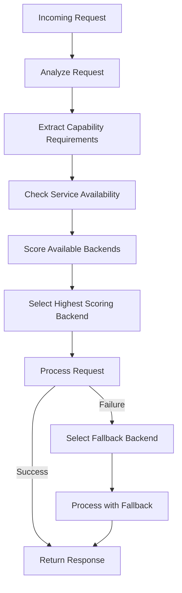

# Backend Selection

## Overview

Opossum Search implements a sophisticated backend selection system that dynamically chooses the optimal AI model for
each request. This selection process considers multiple factors including request characteristics, model capabilities,
service availability, and performance requirements to make intelligent routing decisions.

## Selection Process

The backend selection process follows this general flow:



### Request Analysis

The first step is analyzing the request to determine its characteristics and requirements:

```python
def analyze_request(request):
    """Analyze request to determine capabilities needed"""
    
    capabilities = ["general_knowledge"]  # Base capability for all requests
    
    # Check for multimodal content
    if request.has_images():
        capabilities.append("image_understanding")
        
        # Specific image capabilities
        if detect_image_type(request.images[0]) == "chart":
            capabilities.append("chart_analysis")
    
    # Check for code-related queries
    if is_code_related(request.query):
        capabilities.append("code_understanding")
        
        # Specific programming language
        lang = detect_language(request.query)
        if lang:
            capabilities.append(f"{lang}_expertise")
    
    # Check for specialized domains
    domain = detect_domain(request.query)
    if domain:
        capabilities.append(f"{domain}_knowledge")
    
    # Check complexity for resource allocation
    if estimate_complexity(request) > COMPLEXITY_THRESHOLD:
        capabilities.append("high_complexity_handling")
    
    return capabilities
```

## Scoring System

The backend selection system uses a weighted scoring approach to rank available backends:

### Capability Matching

Each backend is scored based on how well it matches the required capabilities:

```python
def score_backend_capabilities(backend_name, required_capabilities):
    """Score a backend based on capability matching"""
    
    # Get backend capabilities from the capability matrix
    backend_capabilities = capability_matrix.get_capabilities(backend_name)
    
    score = 0
    for capability in required_capabilities:
        # Check if backend supports this capability
        if capability in backend_capabilities:
            capability_score = capability_matrix.get_score(backend_name, capability)
            score += capability_score
        else:
            # Penalize missing critical capabilities
            if capability in CRITICAL_CAPABILITIES:
                score -= CRITICAL_CAPABILITY_PENALTY
    
    return score
```

### Performance Considerations

Performance characteristics are factored into the selection:

```python
def score_backend_performance(backend_name, request):
    """Score a backend based on performance characteristics"""
    
    performance_score = 0
    
    # Response time considerations
    if request.requires_low_latency():
        response_time_score = performance_metrics.get_response_time_score(backend_name)
        performance_score += LATENCY_WEIGHT * response_time_score
    
    # Resource efficiency
    if request.is_resource_intensive():
        efficiency_score = performance_metrics.get_efficiency_score(backend_name)
        performance_score += EFFICIENCY_WEIGHT * efficiency_score
    
    # Reliability score based on recent performance
    reliability_score = performance_metrics.get_reliability_score(backend_name)
    performance_score += RELIABILITY_WEIGHT * reliability_score
    
    return performance_score
```

### Cost Optimization

For systems with usage-based pricing (like Gemini API), cost factors are considered:

```python
def score_backend_cost(backend_name, request):
    """Score a backend based on cost considerations"""
    
    # Base cost for this backend
    base_cost = cost_model.get_base_cost(backend_name)
    
    # Estimated tokens for this request
    estimated_tokens = estimate_tokens(request)
    
    # Calculate estimated cost
    estimated_cost = base_cost * estimated_tokens
    
    # Convert to score (lower cost = higher score)
    max_cost = cost_model.get_max_cost()
    cost_score = 1.0 - (estimated_cost / max_cost)
    
    return cost_score * COST_WEIGHT
```

## Selection Algorithm

The core selection algorithm combines multiple factors to choose the optimal backend:

```python
def select_backend(request):
    """Select the optimal backend for a request"""
    
    # Analyze request
    required_capabilities = analyze_request(request)
    
    # Get available backends
    available_backends = service_availability.get_available_backends()
    
    if not available_backends:
        # If no backends are available, use local transformers as last resort
        logger.warning("No backends available, falling back to local transformers")
        return backends['transformers']
    
    # Score each available backend
    scores = {}
    for backend_name in available_backends:
        # Calculate capability score (weighted highest)
        capability_score = score_backend_capabilities(backend_name, required_capabilities)
        
        # Calculate performance score
        performance_score = score_backend_performance(backend_name, request)
        
        # Calculate cost score if applicable
        cost_score = score_backend_cost(backend_name, request)
        
        # Calculate overall score with appropriate weights
        scores[backend_name] = (
            CAPABILITY_WEIGHT * capability_score +
            PERFORMANCE_WEIGHT * performance_score +
            COST_WEIGHT * cost_score
        )
    
    # Select backend with highest score
    selected_backend = max(scores, key=scores.get)
    
    logger.info(f"Selected backend {selected_backend} with score {scores[selected_backend]}")
    logger.debug(f"All backend scores: {scores}")
    
    return backends[selected_backend]
```

## Fallback Mechanism

When a selected backend fails, the system implements a sophisticated fallback mechanism:

```python
def select_fallback(failed_backend, required_capabilities):
    """Select a fallback backend when the primary choice fails"""
    
    # Define the default fallback chain
    fallback_chain = {
        'gemini': 'ollama',
        'ollama': 'transformers',
        'transformers': 'gemini'  # Circular as last resort
    }
    
    # Try the default fallback if available
    next_backend = fallback_chain.get(failed_backend, 'transformers')
    if service_availability.is_available(next_backend):
        return backends[next_backend]
    
    # If default fallback isn't available, score remaining backends
    available_backends = [b for b in service_availability.get_available_backends() 
                         if b != failed_backend]
    
    if not available_backends:
        # If nothing else is available, use transformers as final fallback
        # (assumes transformers can always run locally)
        logger.error(f"No available fallbacks for {failed_backend}, using transformers as last resort")
        return backends['transformers']
    
    # Score available backends for this specific request
    scores = {}
    for backend_name in available_backends:
        capability_score = score_backend_capabilities(backend_name, required_capabilities)
        scores[backend_name] = capability_score
    
    # Select highest scoring available backend
    selected_fallback = max(scores, key=scores.get)
    logger.info(f"Selected {selected_fallback} as fallback for {failed_backend}")
    
    return backends[selected_fallback]
```

## Decision Factors

The backend selection considers these key factors:

### 1. Capability Requirements

Different request types require different model capabilities:

| Request Type      | Key Capabilities                             |
|-------------------|----------------------------------------------|
| Text-only queries | `general_knowledge`, `text_understanding`    |
| Image analysis    | `image_understanding`, `visual_reasoning`    |
| Code questions    | `code_understanding`, `[language]_expertise` |
| Creative tasks    | `creative_generation`, `long_context`        |
| Technical domains | `technical_knowledge`, `domain_expertise`    |

### 2. Service Characteristics

Each backend has different characteristics that affect selection:

| Backend      | Strengths                                            | Limitations                                       |
|--------------|------------------------------------------------------|---------------------------------------------------|
| Gemini       | Advanced reasoning, multimodal, up-to-date knowledge | External dependency, cost, potential latency      |
| Ollama       | Local deployment, customization, no data sharing     | Limited context window, less powerful than Gemini |
| Transformers | Maximum control, always available locally            | Most limited capabilities, higher resource usage  |

### 3. Operational Factors

Operational considerations that influence selection:

- **Availability**: Current status of each service
- **Response time**: Historical and current latency
- **Cost**: Usage-based pricing considerations
- **Resource usage**: CPU, memory, and GPU utilization
- **Error rates**: Recent failure patterns

## Selection Examples

### Example 1: General Knowledge Query

For a straightforward factual question:

```
Query: "What is the capital of France?"
```

Selection process:

1. Required capabilities: `["general_knowledge"]`
2. All backends support this capability
3. Assuming all are available, scores might be:
    - Gemini: 0.95 (highest accuracy)
    - Ollama: 0.85 (good accuracy, lower latency)
    - Transformers: 0.70 (limited knowledge)
4. Selected: Gemini

### Example 2: Image Analysis with Unavailable Primary

For an image analysis request when Gemini is unavailable:

```
Query: "What's shown in this image?" with attached image
```

Selection process:

1. Required capabilities: `["image_understanding"]`
2. Gemini scores highest but is unavailable
3. Fallback scores:
    - Ollama: 0.75 (limited image capabilities)
    - Transformers: 0.60 (basic image understanding)
4. Selected: Ollama as fallback

### Example 3: Complex Code Analysis

For a complex programming question:

```
Query: "Explain this Python decorator pattern and suggest improvements"
with code snippet
```

Selection process:

1. Required capabilities: `["code_understanding", "python_expertise"]`
2. Scores:
    - Gemini: 0.92 (strong code understanding)
    - Ollama: 0.88 (good code capabilities with CodeLlama)
    - Transformers: 0.65 (limited code analysis)
3. If optimizing for cost: Ollama might be selected despite slightly lower score
4. If optimizing for quality: Gemini would be selected

## Configuration Options

The backend selection system offers several configuration options:

```yaml
backend_selection:
  # Scoring weights
  weights:
    capability: 0.6  # Capability matching importance
    performance: 0.3  # Performance considerations
    cost: 0.1  # Cost optimization (if applicable)
  
  # Selection preferences
  preferences:
    prefer_local: false  # Prefer local models when capabilities are similar
    cost_sensitive: false  # Increase cost factor importance
    latency_threshold: 500  # Max acceptable latency in ms
  
  # Fallback configuration
  fallbacks:
    retry_original: true  # Whether to retry original backend after timeout
    fallback_chain:
      gemini: "ollama"
      ollama: "transformers"
      transformers: "gemini"
    max_fallbacks: 2  # Maximum number of fallbacks to attempt
  
  # Feature flags
  features:
    dynamic_scoring: true  # Adjust scores based on historical performance
    context_aware: true  # Consider conversation context in selection
    adaptive_routing: true  # Learn from successful/failed selections
```

## Monitoring and Telemetry

The backend selection system collects detailed telemetry to improve decision quality:

```python
def record_selection_telemetry(request, selected_backend, success, duration_ms):
    """Record telemetry data for backend selection"""
    
    telemetry = {
        "timestamp": time.time(),
        "request_type": categorize_request(request),
        "required_capabilities": analyze_request(request),
        "selected_backend": selected_backend.name,
        "success": success,
        "duration_ms": duration_ms,
        "fallback_used": selected_backend.is_fallback,
        "scores": backend_scores  # Scores from selection process
    }
    
    # Save telemetry
    telemetry_store.add(telemetry)
    
    # Update metrics for monitoring
    if success:
        metrics.increment(f"backend.{selected_backend.name}.success")
    else:
        metrics.increment(f"backend.{selected_backend.name}.failure")
    
    metrics.record(f"backend.{selected_backend.name}.duration", duration_ms)
```

This telemetry data enables:

- Optimization of scoring weights
- Identification of backend strengths and weaknesses
- Detection of patterns in backend performance
- Continuous improvement of selection accuracy

## Related Documentation

- Model Integration Architecture: Overall architecture of the model integration system
- Capability Matrix: Detailed mapping of model capabilities
- Provider Integration: Implementation details for each provider
- Model Configuration: Configuration options for model backends
- Service Availability: How service availability is monitored