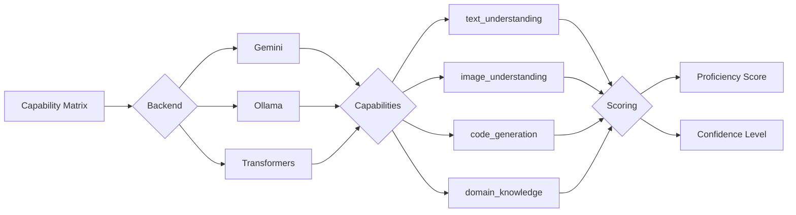

# Capability Matrix

## Overview

The Capability Matrix is a foundational component of Opossum Search's model integration system that maps specific AI capabilities to available model backends. This matrix enables the dynamic selection of the most appropriate model for each request based on required capabilities, creating an intelligent routing system that optimizes for both performance and quality.

## Purpose and Function

The Capability Matrix serves several critical functions:

1. **Capability Mapping**: Documents which capabilities each backend supports
2. **Quality Scoring**: Rates each backend's proficiency for specific capabilities
3. **Selection Support**: Provides data for the backend selection algorithm
4. **Gap Analysis**: Identifies capability gaps across the system
5. **Version Tracking**: Tracks capability changes across model versions

## Core Structure

The Capability Matrix is implemented as a multi-dimensional mapping:



## Matrix Implementation

The Capability Matrix is implemented as a nested dictionary structure:

```python
class CapabilityMatrix:
    """Maps AI capabilities to model backends with quality scores"""
    
    def __init__(self):
        # Initialize the base matrix structure
        self.matrix = {
            'gemini': self._init_gemini_capabilities(),
            'ollama': self._init_ollama_capabilities(),
            'transformers': self._init_transformers_capabilities()
        }
    
    def _init_gemini_capabilities(self):
        """Initialize Gemini capabilities"""
        return {
            # General capabilities
            'text_understanding': 0.95,
            'text_generation': 0.94,
            'conversation': 0.92,
            'general_knowledge': 0.93,
            
            # Specialized capabilities
            'image_understanding': 0.90,
            'code_understanding': 0.85,
            'code_generation': 0.82,
            'reasoning': 0.88,
            'math': 0.75,
            'creative_writing': 0.88,
            
            # Domain knowledge
            'science': 0.86,
            'medicine': 0.80,
            'finance': 0.82,
            'legal': 0.77,
            'current_events': 0.70,  # Limited by training cutoff
            
            # Languages
            'multilingual': 0.85,
            'translation': 0.83,
            
            # Advanced features
            'multimodal': 0.88,
            'long_context': 0.80,
            'structured_output': 0.85
        }
    
    def _init_ollama_capabilities(self):
        """Initialize Ollama capabilities"""
        return {
            # General capabilities
            'text_understanding': 0.85,
            'text_generation': 0.87,
            'conversation': 0.83,
            'general_knowledge': 0.84,
            
            # Specialized capabilities
            'image_understanding': 0.60,  # Limited in most models
            'code_understanding': 0.82,  # Good with CodeLlama
            'code_generation': 0.80,  # Good with CodeLlama
            'reasoning': 0.80,
            'math': 0.70,
            'creative_writing': 0.81,
            
            # Domain knowledge
            'science': 0.75,
            'medicine': 0.65,
            'finance': 0.70,
            'legal': 0.65,
            'current_events': 0.20,  # Very limited by training data
            
            # Languages
            'multilingual': 0.70,
            'translation': 0.65,
            
            # Advanced features
            'multimodal': 0.30,  # Very limited
            'long_context': 0.75,  # Varies by model
            'structured_output': 0.70
        }
    
    def _init_transformers_capabilities(self):
        """Initialize Transformers capabilities"""
        return {
            # General capabilities
            'text_understanding': 0.75,
            'text_generation': 0.72,
            'conversation': 0.65,
            'general_knowledge': 0.70,
            
            # Specialized capabilities
            'image_understanding': 0.50,  # With appropriate models
            'code_understanding': 0.65,
            'code_generation': 0.60,
            'reasoning': 0.60,
            'math': 0.55,
            'creative_writing': 0.65,
            
            # Domain knowledge
            'science': 0.60,
            'medicine': 0.50,
            'finance': 0.55,
            'legal': 0.50,
            'current_events': 0.10,  # Extremely limited
            
            # Languages
            'multilingual': 0.60,
            'translation': 0.65,  # With specialized models
            
            # Advanced features
            'multimodal': 0.20,  # Very limited
            'long_context': 0.40,  # Very limited
            'structured_output': 0.50
        }
    
    def get_score(self, backend, capability):
        """Get the capability score for a specific backend"""
        if backend not in self.matrix:
            return 0.0
        
        return self.matrix[backend].get(capability, 0.0)
    
    def get_capabilities(self, backend):
        """Get all capabilities supported by a backend"""
        if backend not in self.matrix:
            return []
        
        # Return capabilities with non-zero scores
        return [cap for cap, score in self.matrix[backend].items() 
                if score > 0.0]
    
    def get_best_backend_for_capability(self, capability):
        """Get the best backend for a specific capability"""
        best_score = 0.0
        best_backend = None
        
        for backend, capabilities in self.matrix.items():
            score = capabilities.get(capability, 0.0)
            if score > best_score:
                best_score = score
                best_backend = backend
        
        return best_backend, best_score
    
    def score_backend(self, backend_name, requirements, query=None):
        """Score a backend based on capability requirements"""
        if backend_name not in self.matrix:
            return 0.0
        
        total_score = 0.0
        capabilities = self.matrix[backend_name]
        
        for requirement in requirements:
            # Get score for this capability
            score = capabilities.get(requirement, 0.0)
            
            # Apply weighting based on importance
            weight = self._get_requirement_weight(requirement)
            total_score += score * weight
        
        return total_score / len(requirements)
    
    def _get_requirement_weight(self, requirement):
        """Get weight for a requirement based on importance"""
        # Critical capabilities have higher weights
        critical_capabilities = {
            'image_understanding': 1.5,  # Critical for image queries
            'code_generation': 1.3,      # Important for coding tasks
            'current_events': 1.2,       # Important for news queries
            'long_context': 1.2          # Important for context-heavy tasks
        }
        
        return critical_capabilities.get(requirement, 1.0)
```

## Capability Categories

The matrix organizes capabilities into several categories:

### General Capabilities

| Capability | Description | Importance |
|------------|-------------|------------|
| `text_understanding` | Comprehension of natural language | Critical |
| `text_generation` | Production of coherent text | Critical |
| `conversation` | Multi-turn dialogue capabilities | High |
| `general_knowledge` | Broad factual knowledge | High |

### Specialized Capabilities

| Capability | Description | Importance |
|------------|-------------|------------|
| `image_understanding` | Visual content analysis | Critical for visual tasks |
| `code_understanding` | Source code comprehension | Critical for code tasks |
| `code_generation` | Source code production | Critical for code tasks |
| `reasoning` | Logical inference and problem-solving | High |
| `math` | Mathematical computation and analysis | Medium |
| `creative_writing` | Generation of creative content | Medium |

### Domain Knowledge

| Capability | Description | Importance |
|------------|-------------|------------|
| `science` | Scientific knowledge and reasoning | Medium |
| `medicine` | Medical and health information | Medium |
| `finance` | Financial and economic knowledge | Medium |
| `legal` | Legal concepts and reasoning | Medium |
| `current_events` | Recent world events | Medium |

### Language Capabilities

| Capability | Description | Importance |
|------------|-------------|------------|
| `multilingual` | Support for multiple languages | Medium |
| `translation` | Language translation | Medium |

### Advanced Features

| Capability | Description | Importance |
|------------|-------------|------------|
| `multimodal` | Processing multiple input types | High |
| `long_context` | Handling extended context windows | High |
| `structured_output` | Producing structured data formats | Medium |

## Complete Capability Matrix

The following table shows the complete capability scoring across all backends:

| Capability | Gemini | Ollama | Transformers |
|------------|--------|--------|--------------|
| **General Capabilities** |
| text_understanding | 0.95 | 0.85 | 0.75 |
| text_generation | 0.94 | 0.87 | 0.72 |
| conversation | 0.92 | 0.83 | 0.65 |
| general_knowledge | 0.93 | 0.84 | 0.70 |
| **Specialized Capabilities** |
| image_understanding | 0.90 | 0.60 | 0.50 |
| code_understanding | 0.85 | 0.82 | 0.65 |
| code_generation | 0.82 | 0.80 | 0.60 |
| reasoning | 0.88 | 0.80 | 0.60 |
| math | 0.75 | 0.70 | 0.55 |
| creative_writing | 0.88 | 0.81 | 0.65 |
| **Domain Knowledge** |
| science | 0.86 | 0.75 | 0.60 |
| medicine | 0.80 | 0.65 | 0.50 |
| finance | 0.82 | 0.70 | 0.55 |
| legal | 0.77 | 0.65 | 0.50 |
| current_events | 0.70 | 0.20 | 0.10 |
| **Languages** |
| multilingual | 0.85 | 0.70 | 0.60 |
| translation | 0.83 | 0.65 | 0.65 |
| **Advanced Features** |
| multimodal | 0.88 | 0.30 | 0.20 |
| long_context | 0.80 | 0.75 | 0.40 |
| structured_output | 0.85 | 0.70 | 0.50 |

## Model-Specific Capabilities

Some capabilities are specific to particular model configurations:

### Ollama-Specific Capabilities

Ollama capabilities vary by the specific model loaded:

```python
def get_ollama_model_specific_capabilities(model_name):
    """Get capability adjustments for specific Ollama models"""
    
    # Model-specific capability adjustments
    adjustments = {
        'llama2': {
            'reasoning': +0.05,
            'math': +0.05
        },
        'codellama': {
            'code_understanding': +0.10,
            'code_generation': +0.15
        },
        'mistral': {
            'text_understanding': +0.05,
            'reasoning': +0.07
        },
        'vicuna': {
            'conversation': +0.08,
            'creative_writing': +0.05
        },
        'orca-mini': {
            'instruction_following': +0.10
        }
    }
    
    return adjustments.get(model_name, {})
```

## Usage in Backend Selection

The capability matrix is a key input to the backend selection process:

```python
def select_optimal_backend(request, available_backends, capability_matrix):
    """Select the optimal backend based on request capabilities"""
    
    # Extract required capabilities from request
    required_capabilities = analyze_request(request)
    
    # Score each available backend
    scores = {}
    for backend_name in available_backends:
        # Calculate base capability score
        capability_score = 0
        for capability in required_capabilities:
            score = capability_matrix.get_score(backend_name, capability)
            weight = get_capability_weight(capability)
            capability_score += score * weight
        
        # Normalize score
        if required_capabilities:
            capability_score /= len(required_capabilities)
        
        # Apply other factors (performance, cost, etc.)
        adjusted_score = apply_scoring_factors(
            backend_name, 
            capability_score,
            request
        )
        
        scores[backend_name] = adjusted_score
    
    # Select highest scoring backend
    if not scores:
        return DEFAULT_BACKEND
        
    return max(scores.items(), key=lambda x: x[1])[0]
```

## Capability Detection from Queries

The system detects required capabilities from queries:

```python
def detect_capabilities_from_query(query):
    """Detect required capabilities from a query"""
    capabilities = ['text_understanding']  # Base capability
    
    # Check for image content
    if contains_images(query):
        capabilities.append('image_understanding')
        
        # Detect specific image types
        if detect_chart(query.images[0]):
            capabilities.append('chart_analysis')
            
        if detect_document(query.images[0]):
            capabilities.append('document_analysis')
    
    # Check for code content
    if contains_code(query):
        capabilities.append('code_understanding')
        
        # Detect programming language
        language = detect_language(query)
        if language:
            capabilities.append(f'{language}_expertise')
    
    # Detect domain-specific needs
    domain = detect_domain(query)
    if domain:
        capabilities.append(f'{domain}_knowledge')
    
    # Check for specific tasks
    if is_creative_task(query):
        capabilities.append('creative_writing')
        
    if is_reasoning_task(query):
        capabilities.append('reasoning')
        
    if is_math_task(query):
        capabilities.append('math')
    
    return capabilities
```

## Extending the Capability Matrix

The capability matrix can be extended with new capabilities:

```python
def extend_capability_matrix(matrix, new_capabilities):
    """Add new capabilities to the capability matrix"""
    
    for capability_name, capability_info in new_capabilities.items():
        # Add to each backend with default scores
        for backend in matrix.matrix:
            default_score = capability_info.get('default_scores', {}).get(backend, 0.0)
            matrix.matrix[backend][capability_name] = default_score
    
    return matrix
```

## Dynamic Capability Adjustments

The system can dynamically adjust capability scores based on performance feedback:

```python
def adjust_capability_scores(matrix, feedback_data):
    """Adjust capability scores based on performance feedback"""
    
    for item in feedback_data:
        backend = item['backend']
        capability = item['capability']
        success = item['success']
        
        if backend not in matrix.matrix:
            continue
            
        if capability not in matrix.matrix[backend]:
            continue
        
        # Get current score
        current_score = matrix.matrix[backend][capability]
        
        # Adjust score based on success/failure
        adjustment = 0.01 if success else -0.02
        new_score = max(0.0, min(1.0, current_score + adjustment))
        
        # Update score
        matrix.matrix[backend][capability] = new_score
    
    return matrix
```

## Configuration

The capability matrix can be configured through settings:

```yaml
capability_matrix:
  # Enable dynamic adjustments based on performance
  enable_dynamic_adjustment: true
  
  # Minimum score threshold for capability support
  minimum_score_threshold: 0.2
  
  # Custom capability weights
  capability_weights:
    image_understanding: 1.5
    code_generation: 1.3
    reasoning: 1.2
    math: 1.1
  
  # Override default scores
  score_overrides:
    gemini:
      math: 0.85  # Override math score for Gemini
    ollama:
      code_understanding: 0.90  # Override for CodeLlama model
```

## Related Documentation

- Model Integration Architecture
- Backend Selection
- Provider Integration
- Model Configuration
- Service Availability