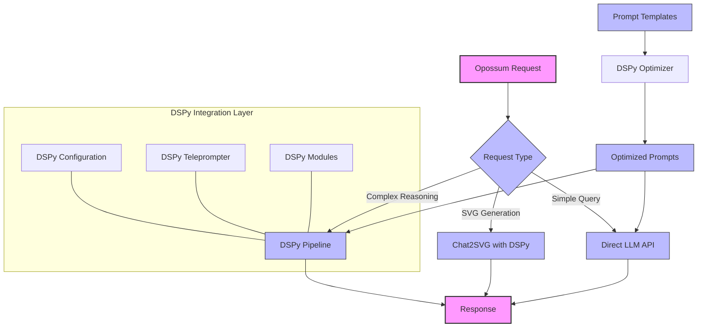

# DSPy Integration

## Overview

Opossum Search integrates DSPy, a framework for programming Language Models (LLMs), to enhance prompt optimization and create more robust multi-stage LLM pipelines. This integration follows Opossum's core principles of adaptability and resilience while adding powerful prompt engineering capabilities.

## Core Benefits

| Benefit | Description | Implementation Area |
|---------|-------------|---------------------|
| **Prompt Optimization** | Systematic approach to tuning and refining prompts | `app/prompts` integration |
| **Pipeline Construction** | Building robust multi-step reasoning chains | `app/models/chat2svg` pipeline enhancement |
| **Evaluation Framework** | Metrics-driven assessment of prompt effectiveness | Monitoring and development tools |
| **Few-Shot Learning** | Structured approach to example management | Extended capabilities for existing modules |
| **Provider Abstraction** | Common interface across multiple LLM backends | Complements existing provider system |

## Integration Architecture

## Implementation Approach

Opossum Search implements DSPy integration with a clock-like precision:

1. **Consistent Timing**: Optimization runs at development time, with results cached for runtime
2. **Reliable Mechanics**: Clear separation between optimization and execution
3. **Precision Components**: Each DSPy module has a single, well-defined responsibility
4. **Self-Regulating**: Performance metrics drive continuous improvement

## Related Documentation

- [DSPy Technical Implementation](./dspy-technical.md)
- [DSPy Usage Examples](./dspy-examples.md)
- [DSPy Metrics & Performance](./dspy-metrics.md)
- [Prompt Management](../technical/prompt-management.md)
- [Chat2SVG Pipeline](../infrastructure/pipeline-optimization.md)
