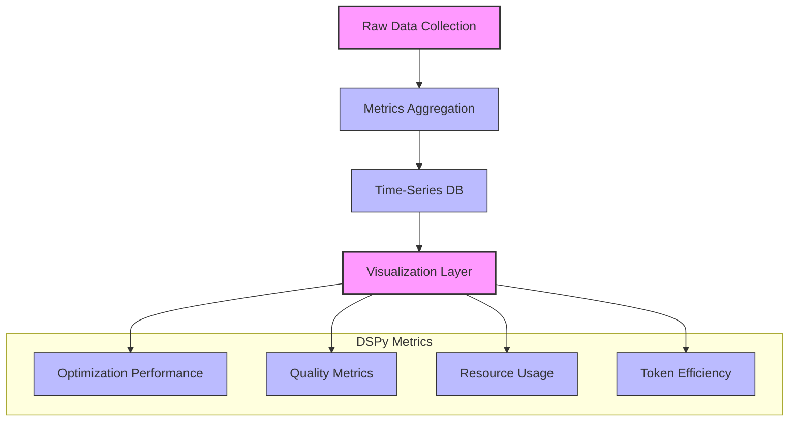

# DSPy Metrics & Performance

## Measuring DSPy Performance

Opossum Search implements comprehensive metrics and monitoring for DSPy integration to ensure optimal performance, quality, and resource utilization.

### Key Metrics

| Metric | Description | Target | Implementation |
|--------|-------------|--------|----------------|
| Prompt Optimization Score | Effectiveness improvement of optimized prompts | >15% improvement | A/B testing framework |
| Optimization Time | Time required to run DSPy optimizers | <60s per prompt | Performance tracking |
| Memory Consumption | RAM usage during optimization | <2GB peak | Resource monitoring |
| Quality Improvement | Enhanced response quality measured by evaluators | >20% improvement | Automated evaluation |
| Token Efficiency | Token reduction while maintaining quality | >10% reduction | Token counter |

## Monitoring Implementation

```python
# app/integrations/dspy/metrics.py
import time
import psutil
import statistics
from prometheus_client import Counter, Gauge, Histogram

# Define Prometheus metrics
DSPY_OPTIMIZATION_TIME = Histogram(
    "opossum_dspy_optimization_time_seconds",
    "Time taken for DSPy optimization in seconds",
    ["prompt_type", "optimizer"]
)

DSPY_MEMORY_USAGE = Gauge(
    "opossum_dspy_memory_usage_mb",
    "Memory used during DSPy optimization in MB",
    ["optimizer"]
)

DSPY_QUALITY_IMPROVEMENT = Gauge(
    "opossum_dspy_quality_improvement_percent",
    "Quality improvement percentage from DSPy optimization",
    ["prompt_type"]
)

DSPY_TOKEN_REDUCTION = Gauge(
    "opossum_dspy_token_reduction_percent",
    "Token reduction percentage from DSPy optimization",
    ["prompt_type"]
)

# Helper class for tracking DSPy performance
class DSPyPerformanceTracker:
    def __init__(self, prompt_type, optimizer_name):
        self.prompt_type = prompt_type
        self.optimizer_name = optimizer_name
        self.start_time = None
        self.start_memory = None
        
    def __enter__(self):
        self.start_time = time.time()
        self.start_memory = psutil.Process().memory_info().rss / (1024 * 1024)
        return self
        
    def __exit__(self, exc_type, exc_val, exc_tb):
        if exc_type is None:  # Only track successful completions
            duration = time.time() - self.start_time
            peak_memory = psutil.Process().memory_info().rss / (1024 * 1024)
            memory_used = peak_memory - self.start_memory
            
            # Record metrics
            DSPY_OPTIMIZATION_TIME.labels(
                prompt_type=self.prompt_type,
                optimizer=self.optimizer_name
            ).observe(duration)
            
            DSPY_MEMORY_USAGE.labels(
                optimizer=self.optimizer_name
            ).set(memory_used)
```

## Performance Visualization

Opossum Search's service visualization system includes dedicated dashboards for DSPy performance monitoring:



## Quality Evaluation

To measure the quality improvements from DSPy, Opossum implements automatic evaluation:

```python
# app/integrations/dspy/evaluation.py
import dspy

class ResponseQualityEvaluator:
    """Evaluate the quality of responses before and after DSPy optimization."""
    
    def __init__(self):
        self.evaluator = dspy.Predict(
            instruction="Evaluate the quality of the given response based on accuracy, helpfulness, and clarity.",
            input_keys=["question", "response"],
            output_keys=["score", "reasoning"]
        )
    
    def evaluate(self, question, response):
        """Evaluate a response on a 0-100 scale."""
        result = self.evaluator(
            question=question,
            response=response
        )
        return {
            "score": float(result.score),
            "reasoning": result.reasoning
        }
    
    def compare(self, question, baseline_response, optimized_response):
        """Compare baseline and optimized responses."""
        baseline_eval = self.evaluate(question, baseline_response)
        optimized_eval = self.evaluate(question, optimized_response)
        
        improvement = optimized_eval["score"] - baseline_eval["score"]
        percent_improvement = (improvement / baseline_eval["score"]) * 100 if baseline_eval["score"] > 0 else 0
        
        DSPY_QUALITY_IMPROVEMENT.labels(
            prompt_type=self._detect_prompt_type(question)
        ).set(percent_improvement)
        
        return {
            "baseline_score": baseline_eval["score"],
            "optimized_score": optimized_eval["score"],
            "absolute_improvement": improvement,
            "percent_improvement": percent_improvement,
            "baseline_reasoning": baseline_eval["reasoning"],
            "optimized_reasoning": optimized_eval["reasoning"]
        }
```

## Resource Optimization

DSPy integration is designed for efficient resource utilization:

1. **Caching Strategy**: All optimization results are cached to avoid redundant processing
2. **Selective Application**: DSPy optimization targets high-value prompts most likely to benefit
3. **Scheduled Execution**: Heavy optimization runs during off-peak hours
4. **Progressive Implementation**: Gradual rollout with careful monitoring of system impact

### Memory Management

To prevent memory issues during optimization:

```python
# app/integrations/dspy/memory.py
import gc
import torch

def optimize_memory_usage():
    """Optimize memory usage before/after DSPy operations."""
    # Clear Python garbage collector
    gc.collect()
    
    # Clear CUDA cache if available
    if torch.cuda.is_available():
        torch.cuda.empty_cache()
    
    # Return current memory usage for monitoring
    import psutil
    return {
        "ram_percent": psutil.virtual_memory().percent,
        "ram_used_gb": psutil.virtual_memory().used / (1024**3),
        "process_mb": psutil.Process().memory_info().rss / (1024**2)
    }
```

◔ Section 1/4 Complete: Metrics Framework
◑ Section 2/4 Complete: Monitoring Implementation
◕ Section 3/4 Complete: Quality Evaluation
● Section 4/4 Complete: Resource Optimization

## Temporal Markers

┌─────────────────────────────────────────────────────────┐
│ Last updated: 2025-04-11                                │
│ Estimated reading time: 10 minutes                      │
│ Documentation heartbeat: 0 days since last validation   │
└─────────────────────────────────────────────────────────┘

## Related Documentation

- DSPy Integration Overview
- DSPy Technical Implementation
- DSPy Usage Examples
- OpenTelemetry Integration
