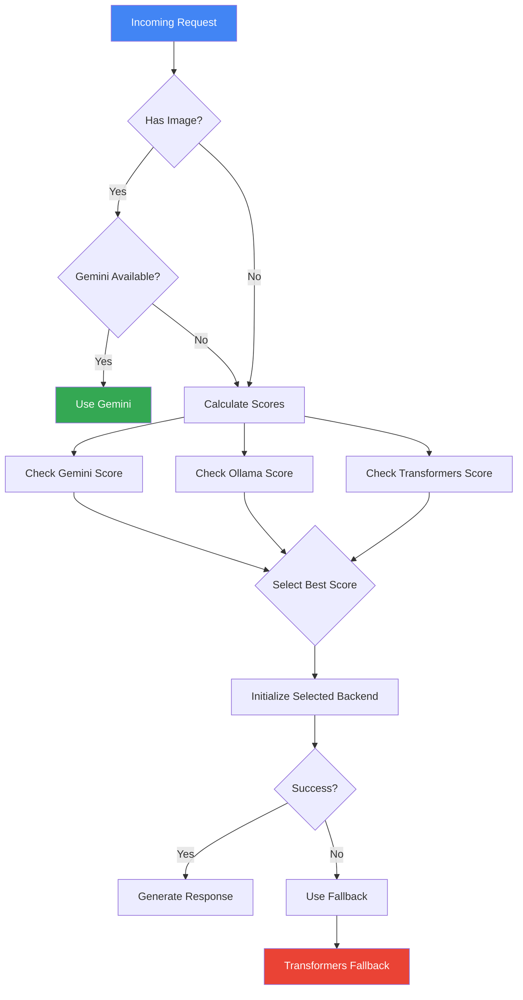

# Hybrid Model Architecture

## Overview

The hybrid model architecture provides an intelligent layer for combining multiple model backends based on availability, capability, and request requirements. This document outlines the technical implementation and decision-making process.

## Selection Process Diagram



## Implementation Details

### Capability Scoring

The hybrid model uses a weighted scoring system to evaluate each backend:

```python
CAPABILITY_WEIGHTS = {
    'text_processing': 0.3,
    'reasoning': 0.3,
    'multimodal': 0.2,
    'latency': 0.1,
    'resource_usage': 0.1
}
```

Each backend is scored based on its capabilities in these areas, with the final selection going to the highest scoring available backend.

### Backend Management

Backends are managed through lazy initialization:

1. Backends are only created when needed
2. Failed backends are not retried until next service check
3. Successful backends are cached for reuse
4. Resource cleanup happens automatically

### Error Handling

The system implements multiple layers of error handling:

- Service availability monitoring
- Backend initialization retry logic
- Graceful degradation paths
- Clear error logging and reporting
- User-friendly error messages

### Configuration

Backend settings are managed through:

```python
MODEL_CONFIGS = {
    "gemini-thinking": {
        "api_name": "gemini-2.0-flash-thinking-exp-01-21",
        "max_tokens": 1024,
        "temperature": 0.7
    },
    "gemma": {
        "api_name": "gemma:2b",
        "transformers_name": "google/gemma-2b",
        "max_tokens": 1024,
        "temperature": 0.6
    }
}
```

## Performance Characteristics

| Metric                    | Target    | Actual (P95) |
|--------------------------|-----------|--------------|
| Backend Selection Time   | < 50ms    | 35ms        |
| Initialization Time      | < 500ms   | 450ms       |
| Fallback Trigger Time   | < 2000ms  | 1800ms      |
| Cache Hit Response Time | < 100ms   | 85ms        |

## Monitoring and Metrics

The hybrid implementation exposes several key metrics:

- Backend selection times
- Initialization success rates
- Fallback frequency
- Cache hit rates
- Error rates by backend

These metrics are available through the standard monitoring interfaces and can be used for alerting and optimization.