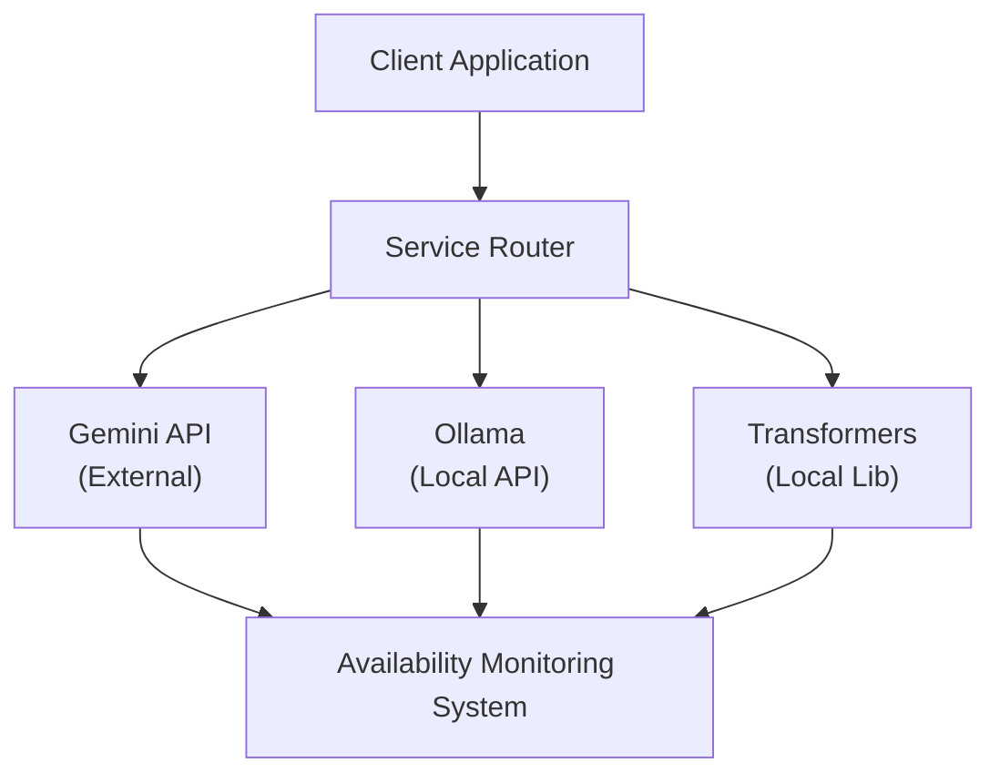
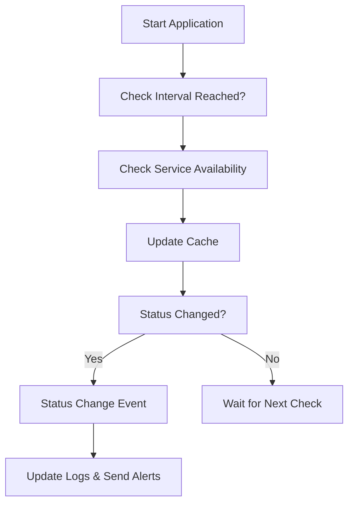
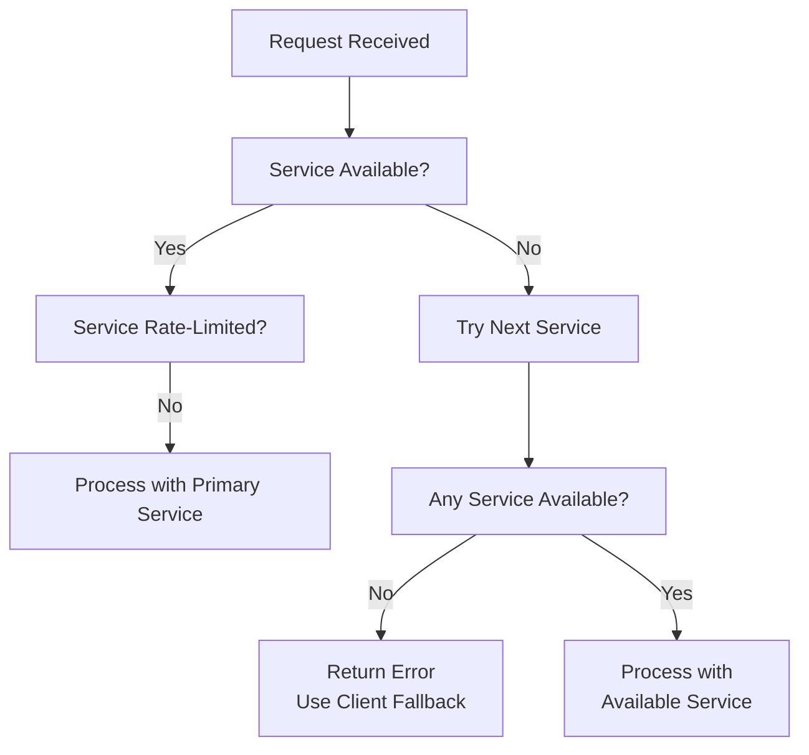
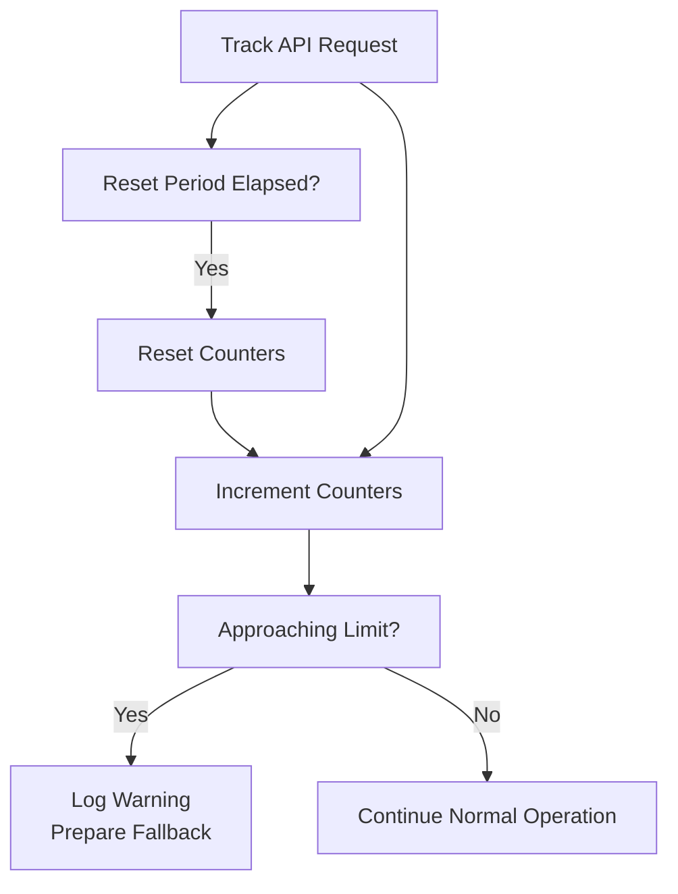
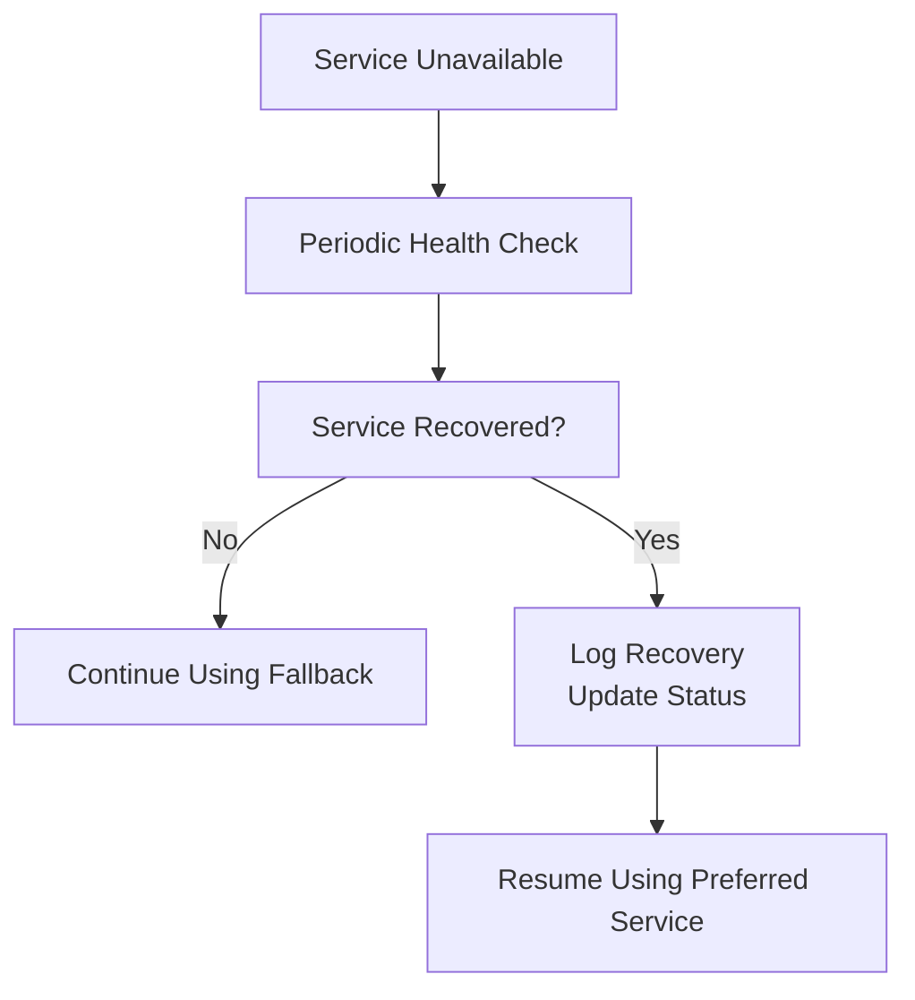
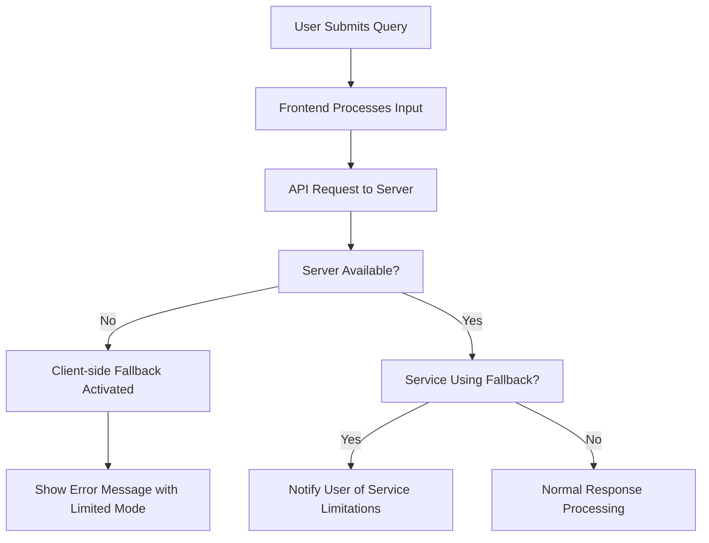
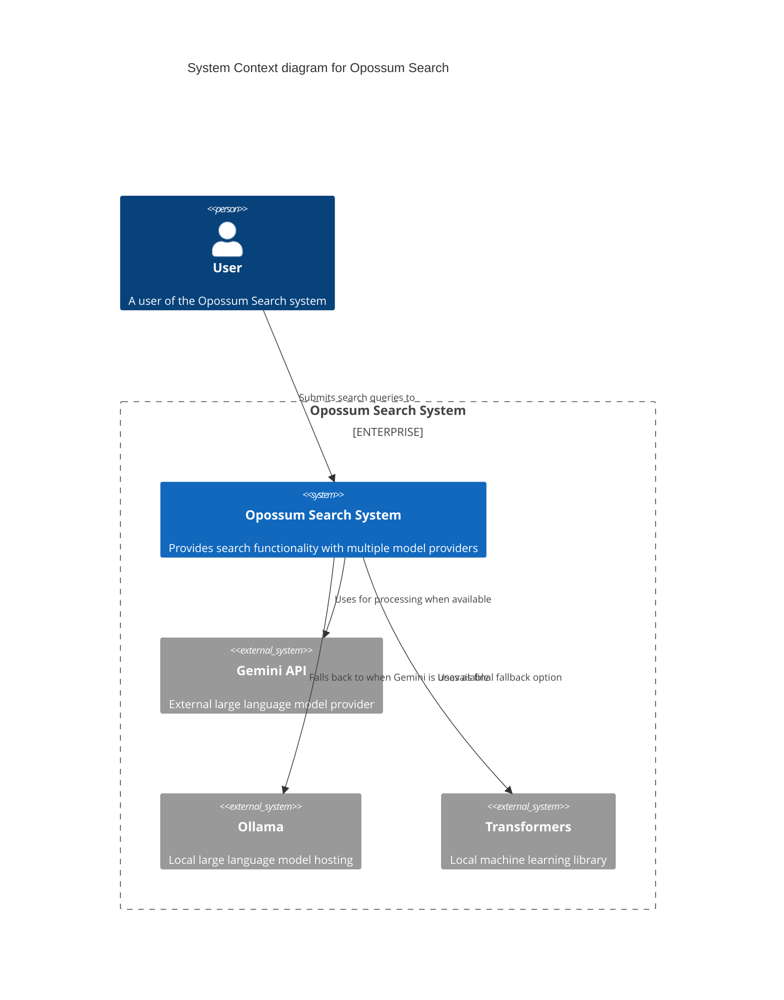

# 10. Diagrams and Visuals

## 10.1 System Architecture Diagram

## 10.2 Service Monitoring Flowchart

## 10.3 Failover Process Diagram

## 10.4 Rate Limit Monitoring Diagram

## 10.5 Recovery Detection Process

## 10.6 User Experience Flow

## 10.7 C4 Context Diagram

