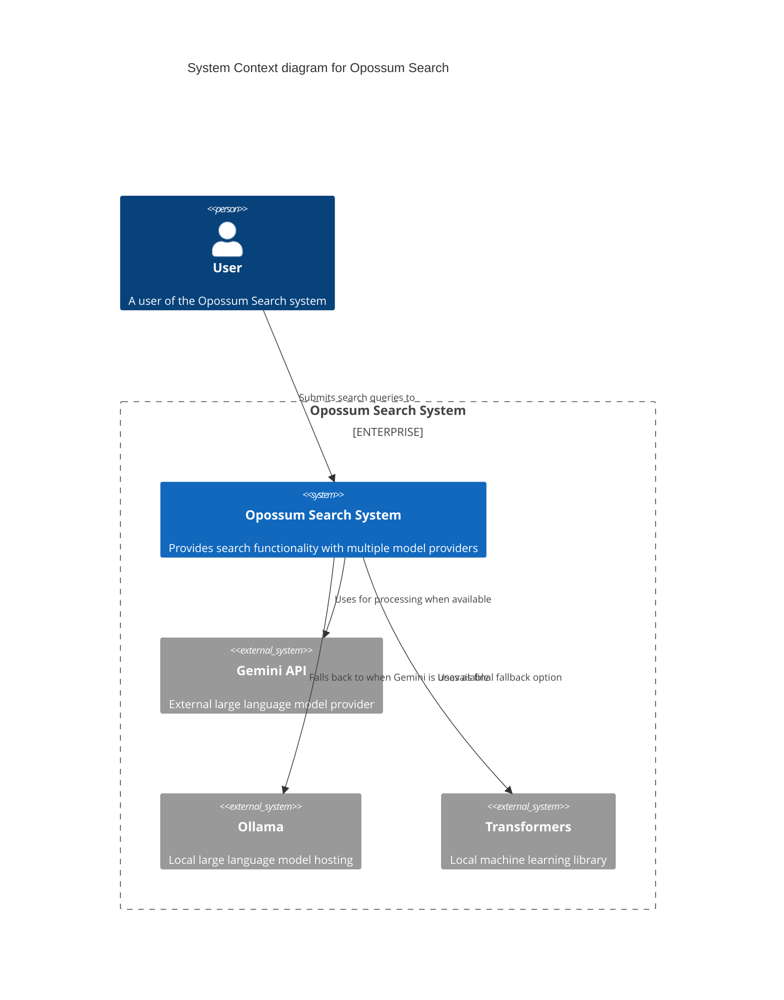

# 10. Diagrams and Visuals

## 10.1 System Architecture Diagram

<!DOCTYPE html>
<html>

<head>
  <meta charset="utf-8">
  <meta name="viewport" content="width=device-width, initial-scale=1.0">
  <title>try</title>
  <link rel="stylesheet" href="https://stackedit.io/style.css" />
</head>

<body class="stackedit">
  
<pre class=" language-mermaid"><svg id="mermaid-svg-FxL1E0DKPqjTQdKE" width="100%" xmlns="http://www.w3.org/2000/svg" xmlns:xlink="http://www.w3.org/1999/xlink" height="359.59375" style="max-width: 407.487548828125px;" viewBox="0 0 407.487548828125 359.59375"><g transform="translate(0, 0)"><marker id="flowchart-pointEnd" class="marker flowchart" viewBox="0 0 10 10" refX="9" refY="5" markerUnits="userSpaceOnUse" markerWidth="12" markerHeight="12" orient="auto"><path d="M 0 0 L 10 5 L 0 10 z" class="arrowMarkerPath" style="stroke-width: 1; stroke-dasharray: 1, 0;"></path></marker><marker id="flowchart-pointStart" class="marker flowchart" viewBox="0 0 10 10" refX="0" refY="5" markerUnits="userSpaceOnUse" markerWidth="12" markerHeight="12" orient="auto"><path d="M 0 5 L 10 10 L 10 0 z" class="arrowMarkerPath" style="stroke-width: 1; stroke-dasharray: 1, 0;"></path></marker><marker id="flowchart-circleEnd" class="marker flowchart" viewBox="0 0 10 10" refX="11" refY="5" markerUnits="userSpaceOnUse" markerWidth="11" markerHeight="11" orient="auto"><circle cx="5" cy="5" r="5" class="arrowMarkerPath" style="stroke-width: 1; stroke-dasharray: 1, 0;"></circle></marker><marker id="flowchart-circleStart" class="marker flowchart" viewBox="0 0 10 10" refX="-1" refY="5" markerUnits="userSpaceOnUse" markerWidth="11" markerHeight="11" orient="auto"><circle cx="5" cy="5" r="5" class="arrowMarkerPath" style="stroke-width: 1; stroke-dasharray: 1, 0;"></circle></marker><marker id="flowchart-crossEnd" class="marker cross flowchart" viewBox="0 0 11 11" refX="12" refY="5.2" markerUnits="userSpaceOnUse" markerWidth="11" markerHeight="11" orient="auto"><path d="M 1,1 l 9,9 M 10,1 l -9,9" class="arrowMarkerPath" style="stroke-width: 2; stroke-dasharray: 1, 0;"></path></marker><marker id="flowchart-crossStart" class="marker cross flowchart" viewBox="0 0 11 11" refX="-1" refY="5.2" markerUnits="userSpaceOnUse" markerWidth="11" markerHeight="11" orient="auto"><path d="M 1,1 l 9,9 M 10,1 l -9,9" class="arrowMarkerPath" style="stroke-width: 2; stroke-dasharray: 1, 0;"></path></marker><g class="root"><g class="clusters"></g><g class="edgePaths"><path d="M196.06875610351562,49.71875L196.06875610351562,53.885416666666664C196.06875610351562,58.052083333333336,196.06875610351562,66.38541666666667,196.06875610351562,74.71875C196.06875610351562,83.05208333333333,196.06875610351562,91.38541666666667,196.06875610351562,95.55208333333333L196.06875610351562,99.71875" id="L-Client-Router" class=" edge-thickness-normal edge-pattern-solid flowchart-link LS-Client LE-Router" style="fill:none;" marker-end="url(#flowchart-pointEnd)"></path><path d="M136.67188262939453,139.7816741251574L122.93073590596516,144.2243117709645C109.18958918253581,148.6669494167716,81.70729573567708,157.5522247083858,67.96614901224773,166.16152902085958C54.22500228881836,174.77083333333334,54.22500228881836,183.10416666666666,54.22500228881836,187.27083333333334L54.22500228881836,191.4375" id="L-Router-GeminiAPI" class=" edge-thickness-normal edge-pattern-solid flowchart-link LS-Router LE-GeminiAPI" style="fill:none;" marker-end="url(#flowchart-pointEnd)"></path><path d="M196.06875610351562,141.4375L196.06875610351562,145.60416666666666C196.06875610351562,149.77083333333334,196.06875610351562,158.10416666666666,196.06875610351562,166.4375C196.06875610351562,174.77083333333334,196.06875610351562,183.10416666666666,196.06875610351562,187.27083333333334L196.06875610351562,191.4375" id="L-Router-Ollama" class=" edge-thickness-normal edge-pattern-solid flowchart-link LS-Router LE-Ollama" style="fill:none;" marker-end="url(#flowchart-pointEnd)"></path><path d="M255.46562957763672,138.79593005040968L270.4859428405762,143.4028583753414C285.5062561035156,148.0097867002731,315.54688262939453,157.22364335013654,330.567195892334,165.99723834173494C345.58750915527344,174.77083333333334,345.58750915527344,183.10416666666666,345.58750915527344,187.27083333333334L345.58750915527344,191.4375" id="L-Router-Transformers" class=" edge-thickness-normal edge-pattern-solid flowchart-link LS-Router LE-Transformers" style="fill:none;" marker-end="url(#flowchart-pointEnd)"></path><path d="M54.22500228881836,259.875L54.22500228881836,264.0416666666667C54.22500228881836,268.2083333333333,54.22500228881836,276.5416666666667,67.11256651956882,284.875C80.00013075031929,293.2083333333333,105.7752592118202,301.5416666666667,118.66282344257066,305.7083333333333L131.55038767332113,309.875" id="L-GeminiAPI-Monitoring" class=" edge-thickness-normal edge-pattern-solid flowchart-link LS-GeminiAPI LE-Monitoring" style="fill:none;" marker-end="url(#flowchart-pointEnd)"></path><path d="M196.06875610351562,259.875L196.06875610351562,264.0416666666667C196.06875610351562,268.2083333333333,196.06875610351562,276.5416666666667,196.06875610351562,284.875C196.06875610351562,293.2083333333333,196.06875610351562,301.5416666666667,196.06875610351562,305.7083333333333L196.06875610351562,309.875" id="L-Ollama-Monitoring" class=" edge-thickness-normal edge-pattern-solid flowchart-link LS-Ollama LE-Monitoring" style="fill:none;" marker-end="url(#flowchart-pointEnd)"></path><path d="M345.58750915527344,259.875L345.58750915527344,264.0416666666667C345.58750915527344,268.2083333333333,345.58750915527344,276.5416666666667,332.00261393194506,284.875C318.41771870861675,293.2083333333333,291.24792826196,301.5416666666667,277.6630330386316,305.7083333333333L264.07813781530325,309.875" id="L-Transformers-Monitoring" class=" edge-thickness-normal edge-pattern-solid flowchart-link LS-Transformers LE-Monitoring" style="fill:none;" marker-end="url(#flowchart-pointEnd)"></path></g><g class="edgeLabels"><g class="edgeLabel"><g class="label" transform="translate(0, 0)"><foreignObject width="0" height="0">

</foreignObject></g></g><g class="edgeLabel"><g class="label" transform="translate(0, 0)"><foreignObject width="0" height="0">

</foreignObject></g></g><g class="edgeLabel"><g class="label" transform="translate(0, 0)"><foreignObject width="0" height="0">

</foreignObject></g></g><g class="edgeLabel"><g class="label" transform="translate(0, 0)"><foreignObject width="0" height="0">

</foreignObject></g></g><g class="edgeLabel"><g class="label" transform="translate(0, 0)"><foreignObject width="0" height="0">

</foreignObject></g></g><g class="edgeLabel"><g class="label" transform="translate(0, 0)"><foreignObject width="0" height="0">

</foreignObject></g></g><g class="edgeLabel"><g class="label" transform="translate(0, 0)"><foreignObject width="0" height="0">

</foreignObject></g></g></g><g class="nodes"><g class="node default default" id="flowchart-Client-126" transform="translate(196.06875610351562, 28.859375)"><rect class="basic label-container" style="" rx="0" ry="0" x="-71.35625076293945" y="-20.859375" width="142.7125015258789" height="41.71875"></rect><g class="label" style="" transform="translate(-63.85625076293945, -13.359375)"><foreignObject width="127.7125015258789" height="26.71875">
Client Application
</foreignObject></g></g><g class="node default default" id="flowchart-Router-127" transform="translate(196.06875610351562, 120.578125)"><rect class="basic label-container" style="" rx="0" ry="0" x="-59.39687728881836" y="-20.859375" width="118.79375457763672" height="41.71875"></rect><g class="label" style="" transform="translate(-51.89687728881836, -13.359375)"><foreignObject width="103.79375457763672" height="26.71875">
Service Router
</foreignObject></g></g><g class="node default default" id="flowchart-GeminiAPI-128" transform="translate(54.22500228881836, 225.65625)"><rect class="basic label-container" style="" rx="0" ry="0" x="-46.22500228881836" y="-34.21875" width="92.45000457763672" height="68.4375"></rect><g class="label" style="" transform="translate(-38.72500228881836, -26.71875)"><foreignObject width="77.45000457763672" height="53.4375">
Gemini API (External)
</foreignObject></g></g><g class="node default default" id="flowchart-Ollama-129" transform="translate(196.06875610351562, 225.65625)"><rect class="basic label-container" style="" rx="0" ry="0" x="-45.618751525878906" y="-34.21875" width="91.23750305175781" height="68.4375"></rect><g class="label" style="" transform="translate(-38.118751525878906, -26.71875)"><foreignObject width="76.23750305175781" height="53.4375">
Ollama (Local API)
</foreignObject></g></g><g class="node default default" id="flowchart-Transformers-130" transform="translate(345.58750915527344, 225.65625)"><rect class="basic label-container" style="" rx="0" ry="0" x="-53.900001525878906" y="-34.21875" width="107.80000305175781" height="68.4375"></rect><g class="label" style="" transform="translate(-46.400001525878906, -26.71875)"><foreignObject width="92.80000305175781" height="53.4375">
Transformers (Local Lib)
</foreignObject></g></g><g class="node default default" id="flowchart-Monitoring-131" transform="translate(196.06875610351562, 330.734375)"><rect class="basic label-container" style="" rx="0" ry="0" x="-115.1312484741211" y="-20.859375" width="230.2624969482422" height="41.71875"></rect><g class="label" style="" transform="translate(-107.6312484741211, -13.359375)"><foreignObject width="215.2624969482422" height="26.71875">
Availability Monitoring System
</foreignObject></g></g></g></g></g></svg></pre>

</body>

</html>

## 10.2 Service Monitoring Flowchart

<!DOCTYPE html>
<html>

<head>
  <meta charset="utf-8">
  <meta name="viewport" content="width=device-width, initial-scale=1.0">
  <title>try</title>
  <link rel="stylesheet" href="https://stackedit.io/style.css" />
</head>

<body class="stackedit">
  
<pre class=" language-mermaid"><svg id="mermaid-svg-JPTzStuAU7T3u43Y" width="100%" xmlns="http://www.w3.org/2000/svg" class="statediagram" height="832.34375" style="max-width: 838.7449645996094px;" viewBox="0.000003814697265625 0 479.2828369140625 832.34375"><g><defs><marker id="statediagram-barbEnd" refX="19" refY="7" markerWidth="20" markerHeight="14" markerUnits="strokeWidth" orient="auto"><path d="M 19,7 L9,13 L14,7 L9,1 Z"></path></marker></defs><g class="root"><g class="clusters"></g><g class="edgePaths"><path d="M233.31562995910645,22L233.31562995910645,26.166666666666668C233.31562995910645,30.333333333333332,233.31562995910645,38.666666666666664,233.31562995910645,47C233.31562995910645,55.333333333333336,233.31562995910645,63.666666666666664,233.31562995910645,67.83333333333333L233.31562995910645,72" id="edge0" class=" edge-thickness-normal transition" style="fill:none" marker-end="url(#statediagram-barbEnd)"></path><path d="M233.31562995910645,113.71875L233.31562995910645,120.11197916666667C233.31562995910645,126.50520833333333,233.31562995910645,139.29166666666666,233.31562995910645,152.078125C233.31562995910645,164.86458333333334,233.31562995910645,177.65104166666666,233.31562995910645,184.04427083333334L233.31562995910645,190.4375" id="edge1" class=" edge-thickness-normal transition" style="fill:none" marker-end="url(#statediagram-barbEnd)"></path><path d="M212.40937995910645,218.79419583253465L188.37187925974527,227.4144340271122C164.33437856038412,236.0346722216898,116.25937716166179,253.2751486108449,92.22187646230061,268.2886159720891C68.18437576293945,283.3020833333333,68.18437576293945,296.0885416666667,68.18437576293945,302.4817708333333L68.18437576293945,308.875" id="edge2" class=" edge-thickness-normal transition" style="fill:none" marker-end="url(#statediagram-barbEnd)"></path><path d="M68.18437576293945,350.59375L68.18437576293945,356.9869791666667C68.18437576293945,363.3802083333333,68.18437576293945,376.1666666666667,68.18437576293945,388.953125C68.18437576293945,401.7395833333333,68.18437576293945,414.5260416666667,68.18437576293945,420.9192708333333L68.18437576293945,427.3125" id="edge3" class=" edge-thickness-normal transition" style="fill:none" marker-end="url(#statediagram-barbEnd)"></path><path d="M68.18437576293945,469.03125L68.18437576293945,475.4244791666667C68.18437576293945,481.8177083333333,68.18437576293945,494.6041666666667,68.18437576293945,507.390625C68.18437576293945,520.1770833333334,68.18437576293945,532.9635416666666,68.18437576293945,539.3567708333334L68.18437576293945,545.75" id="edge4" class=" edge-thickness-normal transition" style="fill:none" marker-end="url(#statediagram-barbEnd)"></path><path d="M68.18437576293945,587.46875L68.18437576293945,593.8619791666666C68.18437576293945,600.2552083333334,68.18437576293945,613.0416666666666,79.23892715885226,625.828125C90.29347855476506,638.6145833333334,112.40258134659068,651.4010416666666,123.45713274250348,657.7942708333334L134.51168413841629,664.1875" id="edge5" class=" edge-thickness-normal transition" style="fill:none" marker-end="url(#statediagram-barbEnd)"></path><path d="M230.65156745910645,675.8445334024188L243.33420668707956,673.9016945020157C256.01684591505267,671.9588556016125,281.38212437099884,668.0731778008063,297.23542340596515,666.1303389004032C313.0887224409316,664.1875,319.43004205491803,664.1875,325.7713616689046,667.6640625C332.1126812828912,671.140625,338.4540008968777,678.09375,338.4540008968777,685.046875C338.4540008968777,692,332.1126812828912,698.953125,325.7713616689046,702.4296875C319.43004205491803,705.90625,313.0887224409316,705.90625,297.23542340596515,703.9634110995968C281.38212437099884,702.0205721991937,256.01684591505267,698.1348943983875,243.33420668707956,696.1920554979843L230.65156745910645,694.2492165975812" id="edge6" class=" edge-thickness-normal transition" style="fill:none" marker-end="url(#statediagram-barbEnd)"></path><path d="M170.57969093322754,705.90625L170.57969093322754,712.2994791666666C170.57969093322754,718.6927083333334,170.57969093322754,731.4791666666666,184.06484731038412,744.7891708118769C197.55000368754068,758.0991749570873,224.52031644185385,771.9327249141747,238.0054728190104,778.8494998927184L251.490629196167,785.7662748712621" id="edge7" class=" edge-thickness-normal transition" style="fill:none" marker-end="url(#statediagram-barbEnd)"></path><path d="M320.5781307220459,788.5177203286571L337.6007874806722,781.1423711072142C354.6234442392985,773.7670218857714,388.6687577565511,759.0163234428857,405.6914145151774,741.7711825547761C422.7140712738037,724.5260416666666,422.7140712738037,704.7864583333334,422.7140712738037,685.046875C422.7140712738037,665.3072916666666,422.7140712738037,645.5677083333334,422.7140712738037,625.828125C422.7140712738037,606.0885416666666,422.7140712738037,586.3489583333334,422.7140712738037,566.609375C422.7140712738037,546.8697916666666,422.7140712738037,527.1302083333334,422.7140712738037,507.390625C422.7140712738037,487.6510416666667,422.7140712738037,467.9114583333333,422.7140712738037,448.171875C422.7140712738037,428.4322916666667,422.7140712738037,408.6927083333333,422.7140712738037,388.953125C422.7140712738037,369.2135416666667,422.7140712738037,349.4739583333333,422.7140712738037,329.734375C422.7140712738037,309.9947916666667,422.7140712738037,290.2552083333333,394.6320393880208,271.6050760567191C366.550007502238,252.9549437801049,310.3859437306722,235.3942625602098,282.30391184488934,226.61392195026224L254.22187995910645,217.83358134031468" id="edge8" class=" edge-thickness-normal transition" style="fill:none" marker-end="url(#statediagram-barbEnd)"></path><path d="M206.6476977280388,664.1875L217.7022491239516,657.7942708333334C228.7568005198644,651.4010416666666,250.86590331169,638.6145833333334,261.9204547076028,622.3515625C272.9750061035156,606.0885416666666,272.9750061035156,586.3489583333334,272.9750061035156,566.609375C272.9750061035156,546.8697916666666,272.9750061035156,527.1302083333334,272.9750061035156,507.390625C272.9750061035156,487.6510416666667,272.9750061035156,467.9114583333333,272.9750061035156,448.171875C272.9750061035156,428.4322916666667,272.9750061035156,408.6927083333333,272.9750061035156,388.953125C272.9750061035156,369.2135416666667,272.9750061035156,349.4739583333333,272.9750061035156,329.734375C272.9750061035156,309.9947916666667,272.9750061035156,290.2552083333333,268.69339799293846,273.9921875C264.4117898823613,257.7291666666667,255.84857366120698,244.94270833333334,251.56696555062982,238.54947916666666L247.28535744005268,232.15625" id="edge9" class=" edge-thickness-normal transition" style="fill:none" marker-end="url(#statediagram-barbEnd)"></path><path d="M219.3459024781602,232.15625L215.06429436758307,238.54947916666666C210.7826862570059,244.94270833333334,202.2194700358516,257.7291666666667,197.93786192527443,272.8255208333333C193.65625381469727,287.921875,193.65625381469727,305.328125,193.65625381469727,314.03125L193.65625381469727,322.734375" id="edge10" class=" edge-thickness-normal transition" style="fill:none" marker-end="url(#statediagram-barbEnd)"></path></g><g class="edgeLabels"><g class="edgeLabel"><g class="label" transform="translate(0, 0)"><rect rx="0" ry="0" width="0" height="0"></rect><foreignObject width="0" height="0">

</foreignObject></g></g><g class="edgeLabel" transform="translate(233.31562995910645, 152.078125)"><g class="label" transform="translate(-69.2906265258789, -13.359375)"><rect rx="0" ry="0" width="138.5812530517578" height="26.71875"></rect><foreignObject width="138.5812530517578" height="26.71875">
Application Started
</foreignObject></g></g><g class="edgeLabel" transform="translate(68.18437576293945, 270.515625)"><g class="label" transform="translate(-46.15312576293945, -13.359375)"><rect rx="0" ry="0" width="92.3062515258789" height="26.71875"></rect><foreignObject width="92.3062515258789" height="26.71875">
Time Elapses
</foreignObject></g></g><g class="edgeLabel" transform="translate(68.18437576293945, 388.953125)"><g class="label" transform="translate(-60.18437576293945, -13.359375)"><rect rx="0" ry="0" width="120.3687515258789" height="26.71875"></rect><foreignObject width="120.3687515258789" height="26.71875">
Interval Reached
</foreignObject></g></g><g class="edgeLabel" transform="translate(68.18437576293945, 507.390625)"><g class="label" transform="translate(-49.93437576293945, -13.359375)"><rect rx="0" ry="0" width="99.8687515258789" height="26.71875"></rect><foreignObject width="99.8687515258789" height="26.71875">
Update Cache
</foreignObject></g></g><g class="edgeLabel" transform="translate(68.18437576293945, 625.828125)"><g class="label" transform="translate(-55.290626525878906, -13.359375)"><rect rx="0" ry="0" width="110.58125305175781" height="26.71875"></rect><foreignObject width="110.58125305175781" height="26.71875">
Evaluate Status
</foreignObject></g></g><g class="edgeLabel" transform="translate(344.79532051086426, 685.046875)"><g class="label" transform="translate(-57.91875076293945, -13.359375)"><rect rx="0" ry="0" width="115.8375015258789" height="26.71875"></rect><foreignObject width="115.8375015258789" height="26.71875">
Status Changed?
</foreignObject></g></g><g class="edgeLabel" transform="translate(170.57969093322754, 744.265625)"><g class="label" transform="translate(-38.16250228881836, -13.359375)"><rect rx="0" ry="0" width="76.32500457763672" height="26.71875"></rect><foreignObject width="76.32500457763672" height="26.71875">
If Changed
</foreignObject></g></g><g class="edgeLabel" transform="translate(422.7140712738037, 507.390625)"><g class="label" transform="translate(-48.56875228881836, -13.359375)"><rect rx="0" ry="0" width="97.13750457763672" height="26.71875"></rect><foreignObject width="97.13750457763672" height="26.71875">
Alerts Logged
</foreignObject></g></g><g class="edgeLabel" transform="translate(272.9750061035156, 448.171875)"><g class="label" transform="translate(-46.89687728881836, -13.359375)"><rect rx="0" ry="0" width="93.79375457763672" height="26.71875"></rect><foreignObject width="93.79375457763672" height="26.71875">
If Unchanged
</foreignObject></g></g><g class="edgeLabel" transform="translate(193.65625381469727, 270.515625)"><g class="label" transform="translate(-59.31875228881836, -13.359375)"><rect rx="0" ry="0" width="118.63750457763672" height="26.71875"></rect><foreignObject width="118.63750457763672" height="26.71875">
Application Ends
</foreignObject></g></g></g><g class="nodes"><g class="node default" id="state-root_start-0" transform="translate(233.31562995910645, 15)"><circle class="state-start" r="7" width="14" height="14"></circle></g><g class="node statediagram-state" id="state-Startup-1" transform="translate(233.31562995910645, 92.859375)"><rect class="basic label-container" style="" x="-33.83437538146973" y="-20.859375" width="67.66875076293945" height="41.71875"></rect><g class="label" style="" transform="translate(-26.334375381469727, -13.359375)"><foreignObject width="52.66875076293945" height="26.71875">
Startup
</foreignObject></g></g><g class="node statediagram-state" id="state-Idle-10" transform="translate(233.31562995910645, 211.296875)"><rect class="basic label-container" style="" x="-20.90625" y="-20.859375" width="41.8125" height="41.71875"></rect><g class="label" style="" transform="translate(-13.40625, -13.359375)"><foreignObject width="26.8125" height="26.71875">
Idle
</foreignObject></g></g><g class="node statediagram-state" id="state-CheckInterval-3" transform="translate(68.18437576293945, 329.734375)"><rect class="basic label-container" style="" x="-56.74062728881836" y="-20.859375" width="113.48125457763672" height="41.71875"></rect><g class="label" style="" transform="translate(-49.24062728881836, -13.359375)"><foreignObject width="98.48125457763672" height="26.71875">
CheckInterval
</foreignObject></g></g><g class="node statediagram-state" id="state-CheckService-4" transform="translate(68.18437576293945, 448.171875)"><rect class="basic label-container" style="" x="-54.859375" y="-20.859375" width="109.71875" height="41.71875"></rect><g class="label" style="" transform="translate(-47.359375, -13.359375)"><foreignObject width="94.71875" height="26.71875">
CheckService
</foreignObject></g></g><g class="node statediagram-state" id="state-CacheUpdated-5" transform="translate(68.18437576293945, 566.609375)"><rect class="basic label-container" style="" x="-59.48125076293945" y="-20.859375" width="118.9625015258789" height="41.71875"></rect><g class="label" style="" transform="translate(-51.98125076293945, -13.359375)"><foreignObject width="103.9625015258789" height="26.71875">
CacheUpdated
</foreignObject></g></g><g class="node statediagram-state" id="state-StatusChanged-9" transform="translate(170.57969093322754, 685.046875)"><rect class="basic label-container" style="" x="-60.071876525878906" y="-20.859375" width="120.14375305175781" height="41.71875"></rect><g class="label" style="" transform="translate(-52.571876525878906, -13.359375)"><foreignObject width="105.14375305175781" height="26.71875">
StatusChanged
</foreignObject></g></g><g class="node statediagram-state" id="state-Logging-8" transform="translate(286.03437995910645, 803.484375)"><rect class="basic label-container" style="" x="-34.54375076293945" y="-20.859375" width="69.0875015258789" height="41.71875"></rect><g class="label" style="" transform="translate(-27.043750762939453, -13.359375)"><foreignObject width="54.087501525878906" height="26.71875">
Logging
</foreignObject></g></g><g class="node default" id="state-root_end-10" transform="translate(193.65625381469727, 329.734375)"><circle class="state-start" r="7" width="14" height="14"></circle><circle class="state-end" r="5" width="10" height="10"></circle></g></g></g></g></svg></pre>

</body>

</html>

## 10.3 Failover Process Diagram

<!DOCTYPE html>
<html>

<head>
  <meta charset="utf-8">
  <meta name="viewport" content="width=device-width, initial-scale=1.0">
  <title>try</title>
  <link rel="stylesheet" href="https://stackedit.io/style.css" />
</head>

<body class="stackedit">
  
<pre class=" language-mermaid"><svg id="mermaid-svg-NGVEvpt2Atxyqkwy" width="100%" xmlns="http://www.w3.org/2000/svg" xmlns:xlink="http://www.w3.org/1999/xlink" height="531.46875" style="max-width: 537.5265502929688px;" viewBox="0 0 537.5265502929688 531.46875"><g transform="translate(0, 0)"><marker id="flowchart-pointEnd" class="marker flowchart" viewBox="0 0 10 10" refX="9" refY="5" markerUnits="userSpaceOnUse" markerWidth="12" markerHeight="12" orient="auto"><path d="M 0 0 L 10 5 L 0 10 z" class="arrowMarkerPath" style="stroke-width: 1; stroke-dasharray: 1, 0;"></path></marker><marker id="flowchart-pointStart" class="marker flowchart" viewBox="0 0 10 10" refX="0" refY="5" markerUnits="userSpaceOnUse" markerWidth="12" markerHeight="12" orient="auto"><path d="M 0 5 L 10 10 L 10 0 z" class="arrowMarkerPath" style="stroke-width: 1; stroke-dasharray: 1, 0;"></path></marker><marker id="flowchart-circleEnd" class="marker flowchart" viewBox="0 0 10 10" refX="11" refY="5" markerUnits="userSpaceOnUse" markerWidth="11" markerHeight="11" orient="auto"><circle cx="5" cy="5" r="5" class="arrowMarkerPath" style="stroke-width: 1; stroke-dasharray: 1, 0;"></circle></marker><marker id="flowchart-circleStart" class="marker flowchart" viewBox="0 0 10 10" refX="-1" refY="5" markerUnits="userSpaceOnUse" markerWidth="11" markerHeight="11" orient="auto"><circle cx="5" cy="5" r="5" class="arrowMarkerPath" style="stroke-width: 1; stroke-dasharray: 1, 0;"></circle></marker><marker id="flowchart-crossEnd" class="marker cross flowchart" viewBox="0 0 11 11" refX="12" refY="5.2" markerUnits="userSpaceOnUse" markerWidth="11" markerHeight="11" orient="auto"><path d="M 1,1 l 9,9 M 10,1 l -9,9" class="arrowMarkerPath" style="stroke-width: 2; stroke-dasharray: 1, 0;"></path></marker><marker id="flowchart-crossStart" class="marker cross flowchart" viewBox="0 0 11 11" refX="-1" refY="5.2" markerUnits="userSpaceOnUse" markerWidth="11" markerHeight="11" orient="auto"><path d="M 1,1 l 9,9 M 10,1 l -9,9" class="arrowMarkerPath" style="stroke-width: 2; stroke-dasharray: 1, 0;"></path></marker><g class="root"><g class="clusters"></g><g class="edgePaths"><path d="M241.08281326293945,49.71875L241.08281326293945,53.885416666666664C241.08281326293945,58.052083333333336,241.08281326293945,66.38541666666667,241.08281326293945,74.71875C241.08281326293945,83.05208333333333,241.08281326293945,91.38541666666667,241.08281326293945,95.55208333333333L241.08281326293945,99.71875" id="L-Request-ServiceAvailable" class=" edge-thickness-normal edge-pattern-solid flowchart-link LS-Request LE-ServiceAvailable" style="fill:none;" marker-end="url(#flowchart-pointEnd)"></path><path d="M197.73328916504389,141.4375L184.44701180420324,147.83072916666666C171.16073444336257,154.22395833333334,144.58817972168129,167.01041666666666,131.30190236084064,179.796875C118.015625,192.58333333333334,118.015625,205.36979166666666,118.015625,211.76302083333334L118.015625,218.15625" id="L-ServiceAvailable-RateLimited" class=" edge-thickness-normal edge-pattern-solid flowchart-link LS-ServiceAvailable LE-RateLimited" style="fill:none;" marker-end="url(#flowchart-pointEnd)"></path><path d="M284.432337360835,141.4375L297.71861472167564,147.83072916666666C311.0048920825163,154.22395833333334,337.57744680419756,167.01041666666666,350.86372416503826,179.796875C364.1500015258789,192.58333333333334,364.1500015258789,205.36979166666666,364.1500015258789,211.76302083333334L364.1500015258789,218.15625" id="L-ServiceAvailable-TryNext" class=" edge-thickness-normal edge-pattern-solid flowchart-link LS-ServiceAvailable LE-TryNext" style="fill:none;" marker-end="url(#flowchart-pointEnd)"></path><path d="M118.015625,259.875L118.015625,266.2682291666667C118.015625,272.6614583333333,118.015625,285.4479166666667,118.015625,298.234375C118.015625,311.0208333333333,118.015625,323.8072916666667,118.015625,330.2005208333333L118.015625,336.59375" id="L-RateLimited-ProcessPrimary" class=" edge-thickness-normal edge-pattern-solid flowchart-link LS-RateLimited LE-ProcessPrimary" style="fill:none;" marker-end="url(#flowchart-pointEnd)"></path><path d="M364.1500015258789,259.875L364.1500015258789,266.2682291666667C364.1500015258789,272.6614583333333,364.1500015258789,285.4479166666667,364.1500015258789,298.234375C364.1500015258789,311.0208333333333,364.1500015258789,323.8072916666667,364.1500015258789,330.2005208333333L364.1500015258789,336.59375" id="L-TryNext-AnyAvailable" class=" edge-thickness-normal edge-pattern-solid flowchart-link LS-TryNext LE-AnyAvailable" style="fill:none;" marker-end="url(#flowchart-pointEnd)"></path><path d="M329.9125574509512,378.3125L319.4190586739291,384.7057291666667C308.9255598969069,391.0989583333333,287.93856234286267,403.8854166666667,277.4450635658405,416.671875C266.95156478881836,429.4583333333333,266.95156478881836,442.2447916666667,266.95156478881836,448.6380208333333L266.95156478881836,455.03125" id="L-AnyAvailable-ReturnError" class=" edge-thickness-normal edge-pattern-solid flowchart-link LS-AnyAvailable LE-ReturnError" style="fill:none;" marker-end="url(#flowchart-pointEnd)"></path><path d="M398.3874456008066,378.3125L408.8809443778287,384.7057291666667C419.3744431548509,391.0989583333333,440.36144070889515,403.8854166666667,450.8549394859173,416.671875C461.34843826293945,429.4583333333333,461.34843826293945,442.2447916666667,461.34843826293945,448.6380208333333L461.34843826293945,455.03125" id="L-AnyAvailable-ProcessAvailable" class=" edge-thickness-normal edge-pattern-solid flowchart-link LS-AnyAvailable LE-ProcessAvailable" style="fill:none;" marker-end="url(#flowchart-pointEnd)"></path></g><g class="edgeLabels"><g class="edgeLabel"><g class="label" transform="translate(0, 0)"><foreignObject width="0" height="0">

</foreignObject></g></g><g class="edgeLabel" transform="translate(118.015625, 179.796875)"><g class="label" transform="translate(-11.324999809265137, -13.359375)"><foreignObject width="22.649999618530273" height="26.71875">
Yes
</foreignObject></g></g><g class="edgeLabel" transform="translate(364.1500015258789, 179.796875)"><g class="label" transform="translate(-9.40000057220459, -13.359375)"><foreignObject width="18.80000114440918" height="26.71875">
No
</foreignObject></g></g><g class="edgeLabel" transform="translate(118.015625, 298.234375)"><g class="label" transform="translate(-9.40000057220459, -13.359375)"><foreignObject width="18.80000114440918" height="26.71875">
No
</foreignObject></g></g><g class="edgeLabel"><g class="label" transform="translate(0, 0)"><foreignObject width="0" height="0">

</foreignObject></g></g><g class="edgeLabel" transform="translate(266.95156478881836, 416.671875)"><g class="label" transform="translate(-9.40000057220459, -13.359375)"><foreignObject width="18.80000114440918" height="26.71875">
No
</foreignObject></g></g><g class="edgeLabel" transform="translate(461.34843826293945, 416.671875)"><g class="label" transform="translate(-11.324999809265137, -13.359375)"><foreignObject width="22.649999618530273" height="26.71875">
Yes
</foreignObject></g></g></g><g class="nodes"><g class="node default default" id="flowchart-Request-242" transform="translate(241.08281326293945, 28.859375)"><rect class="basic label-container" style="" rx="0" ry="0" x="-70.24687576293945" y="-20.859375" width="140.4937515258789" height="41.71875"></rect><g class="label" style="" transform="translate(-62.74687576293945, -13.359375)"><foreignObject width="125.4937515258789" height="26.71875">
Request Received
</foreignObject></g></g><g class="node default default" id="flowchart-ServiceAvailable-243" transform="translate(241.08281326293945, 120.578125)"><rect class="basic label-container" style="" rx="0" ry="0" x="-70.671875" y="-20.859375" width="141.34375" height="41.71875"></rect><g class="label" style="" transform="translate(-63.171875, -13.359375)"><foreignObject width="126.34375" height="26.71875">
Service Available?
</foreignObject></g></g><g class="node default default" id="flowchart-RateLimited-245" transform="translate(118.015625, 239.015625)"><rect class="basic label-container" style="" rx="0" ry="0" x="-85.2718734741211" y="-20.859375" width="170.5437469482422" height="41.71875"></rect><g class="label" style="" transform="translate(-77.7718734741211, -13.359375)"><foreignObject width="155.5437469482422" height="26.71875">
Service Rate-Limited?
</foreignObject></g></g><g class="node default default" id="flowchart-TryNext-247" transform="translate(364.1500015258789, 239.015625)"><rect class="basic label-container" style="" rx="0" ry="0" x="-65.6343765258789" y="-20.859375" width="131.2687530517578" height="41.71875"></rect><g class="label" style="" transform="translate(-58.134376525878906, -13.359375)"><foreignObject width="116.26875305175781" height="26.71875">
Try Next Service
</foreignObject></g></g><g class="node default default" id="flowchart-ProcessPrimary-249" transform="translate(118.015625, 357.453125)"><rect class="basic label-container" style="" rx="0" ry="0" x="-110.015625" y="-20.859375" width="220.03125" height="41.71875"></rect><g class="label" style="" transform="translate(-102.515625, -13.359375)"><foreignObject width="205.03125" height="26.71875">
Process with Primary Service
</foreignObject></g></g><g class="node default default" id="flowchart-AnyAvailable-251" transform="translate(364.1500015258789, 357.453125)"><rect class="basic label-container" style="" rx="0" ry="0" x="-86.1187515258789" y="-20.859375" width="172.2375030517578" height="41.71875"></rect><g class="label" style="" transform="translate(-78.6187515258789, -13.359375)"><foreignObject width="157.2375030517578" height="26.71875">
Any Service Available?
</foreignObject></g></g><g class="node default default" id="flowchart-ReturnError-253" transform="translate(266.95156478881836, 489.25)"><rect class="basic label-container" style="" rx="0" ry="0" x="-76.21875" y="-34.21875" width="152.4375" height="68.4375"></rect><g class="label" style="" transform="translate(-68.71875, -26.71875)"><foreignObject width="137.4375" height="53.4375">
Return Error Use Client Fallback
</foreignObject></g></g><g class="node default default" id="flowchart-ProcessAvailable-255" transform="translate(461.34843826293945, 489.25)"><rect class="basic label-container" style="" rx="0" ry="0" x="-68.17812728881836" y="-34.21875" width="136.35625457763672" height="68.4375"></rect><g class="label" style="" transform="translate(-60.67812728881836, -26.71875)"><foreignObject width="121.35625457763672" height="53.4375">
Process with Available Service
</foreignObject></g></g></g></g></g></svg></pre>

</body>

</html>

## 10.4 Rate Limit Monitoring Diagram

<!DOCTYPE html>
<html>

<head>
  <meta charset="utf-8">
  <meta name="viewport" content="width=device-width, initial-scale=1.0">
  <title>try</title>
  <link rel="stylesheet" href="https://stackedit.io/style.css" />
</head>

<body class="stackedit">
  
<pre class=" language-mermaid"><svg id="mermaid-svg-SE6CYeVV0VzfhS6c" width="100%" xmlns="http://www.w3.org/2000/svg" xmlns:xlink="http://www.w3.org/1999/xlink" height="596.46875" style="max-width: 412.125px;" viewBox="0 0 412.125 596.46875"><g transform="translate(0, 0)"><marker id="flowchart-pointEnd" class="marker flowchart" viewBox="0 0 10 10" refX="9" refY="5" markerUnits="userSpaceOnUse" markerWidth="12" markerHeight="12" orient="auto"><path d="M 0 0 L 10 5 L 0 10 z" class="arrowMarkerPath" style="stroke-width: 1; stroke-dasharray: 1, 0;"></path></marker><marker id="flowchart-pointStart" class="marker flowchart" viewBox="0 0 10 10" refX="0" refY="5" markerUnits="userSpaceOnUse" markerWidth="12" markerHeight="12" orient="auto"><path d="M 0 5 L 10 10 L 10 0 z" class="arrowMarkerPath" style="stroke-width: 1; stroke-dasharray: 1, 0;"></path></marker><marker id="flowchart-circleEnd" class="marker flowchart" viewBox="0 0 10 10" refX="11" refY="5" markerUnits="userSpaceOnUse" markerWidth="11" markerHeight="11" orient="auto"><circle cx="5" cy="5" r="5" class="arrowMarkerPath" style="stroke-width: 1; stroke-dasharray: 1, 0;"></circle></marker><marker id="flowchart-circleStart" class="marker flowchart" viewBox="0 0 10 10" refX="-1" refY="5" markerUnits="userSpaceOnUse" markerWidth="11" markerHeight="11" orient="auto"><circle cx="5" cy="5" r="5" class="arrowMarkerPath" style="stroke-width: 1; stroke-dasharray: 1, 0;"></circle></marker><marker id="flowchart-crossEnd" class="marker cross flowchart" viewBox="0 0 11 11" refX="12" refY="5.2" markerUnits="userSpaceOnUse" markerWidth="11" markerHeight="11" orient="auto"><path d="M 1,1 l 9,9 M 10,1 l -9,9" class="arrowMarkerPath" style="stroke-width: 2; stroke-dasharray: 1, 0;"></path></marker><marker id="flowchart-crossStart" class="marker cross flowchart" viewBox="0 0 11 11" refX="-1" refY="5.2" markerUnits="userSpaceOnUse" markerWidth="11" markerHeight="11" orient="auto"><path d="M 1,1 l 9,9 M 10,1 l -9,9" class="arrowMarkerPath" style="stroke-width: 2; stroke-dasharray: 1, 0;"></path></marker><g class="root"><g class="clusters"></g><g class="edgePaths"><path d="M159.69367891925765,49.71875L154.25671121791166,53.885416666666664C148.81974351656564,58.052083333333336,137.94580811387365,66.38541666666667,132.50884041252763,74.71875C127.07187271118164,83.05208333333333,127.07187271118164,91.38541666666667,127.07187271118164,95.55208333333333L127.07187271118164,99.71875" id="L-TrackAPI-ResetPeriod" class=" edge-thickness-normal edge-pattern-solid flowchart-link LS-TrackAPI LE-ResetPeriod" style="fill:none;" marker-end="url(#flowchart-pointEnd)"></path><path d="M127.07187271118164,141.4375L127.07187271118164,147.83072916666666C127.07187271118164,154.22395833333334,127.07187271118164,167.01041666666666,127.07187271118164,179.796875C127.07187271118164,192.58333333333334,127.07187271118164,205.36979166666666,127.07187271118164,211.76302083333334L127.07187271118164,218.15625" id="L-ResetPeriod-ResetCounters" class=" edge-thickness-normal edge-pattern-solid flowchart-link LS-ResetPeriod LE-ResetCounters" style="fill:none;" marker-end="url(#flowchart-pointEnd)"></path><path d="M127.07187271118164,259.875L127.07187271118164,264.0416666666667C127.07187271118164,268.2083333333333,127.07187271118164,276.5416666666667,132.50884041252763,284.875C137.94580811387365,293.2083333333333,148.81974351656564,301.5416666666667,154.25671121791166,305.7083333333333L159.69367891925765,309.875" id="L-ResetCounters-IncrementCounters" class=" edge-thickness-normal edge-pattern-solid flowchart-link LS-ResetCounters LE-IncrementCounters" style="fill:none;" marker-end="url(#flowchart-pointEnd)"></path><path d="M214.13131802898454,49.71875L219.56828573033053,53.885416666666664C225.00525343167655,58.052083333333336,235.87918883436853,66.38541666666667,241.31615653571453,78.1953125C246.75312423706055,90.00520833333333,246.75312423706055,105.29166666666667,246.75312423706055,122.8046875C246.75312423706055,140.31770833333334,246.75312423706055,160.05729166666666,246.75312423706055,179.796875C246.75312423706055,199.53645833333334,246.75312423706055,219.27604166666666,246.75312423706055,236.7890625C246.75312423706055,254.30208333333334,246.75312423706055,269.5885416666667,241.31615653571453,281.3984375C235.87918883436853,293.2083333333333,225.00525343167655,301.5416666666667,219.56828573033053,305.7083333333333L214.13131802898454,309.875" id="L-TrackAPI-IncrementCounters" class=" edge-thickness-normal edge-pattern-solid flowchart-link LS-TrackAPI LE-IncrementCounters" style="fill:none;" marker-end="url(#flowchart-pointEnd)"></path><path d="M186.9124984741211,351.59375L186.9124984741211,355.7604166666667C186.9124984741211,359.9270833333333,186.9124984741211,368.2604166666667,186.9124984741211,376.59375C186.9124984741211,384.9270833333333,186.9124984741211,393.2604166666667,186.9124984741211,397.4270833333333L186.9124984741211,401.59375" id="L-IncrementCounters-ApproachingLimit" class=" edge-thickness-normal edge-pattern-solid flowchart-link LS-IncrementCounters LE-ApproachingLimit" style="fill:none;" marker-end="url(#flowchart-pointEnd)"></path><path d="M147.6264249253084,443.3125L135.58556218344384,449.7057291666667C123.54469944157931,456.0989583333333,99.4629739578502,468.8854166666667,87.42211121598564,481.671875C75.3812484741211,494.4583333333333,75.3812484741211,507.2447916666667,75.3812484741211,513.6380208333334L75.3812484741211,520.03125" id="L-ApproachingLimit-LogWarning" class=" edge-thickness-normal edge-pattern-solid flowchart-link LS-ApproachingLimit LE-LogWarning" style="fill:none;" marker-end="url(#flowchart-pointEnd)"></path><path d="M226.19857202293377,443.3125L238.23943476479835,449.7057291666667C250.2802975066629,456.0989583333333,274.362022990392,468.8854166666667,286.40288573225655,483.8984375C298.4437484741211,498.9114583333333,298.4437484741211,516.1510416666666,298.4437484741211,524.7708333333334L298.4437484741211,533.390625" id="L-ApproachingLimit-ContinueNormal" class=" edge-thickness-normal edge-pattern-solid flowchart-link LS-ApproachingLimit LE-ContinueNormal" style="fill:none;" marker-end="url(#flowchart-pointEnd)"></path></g><g class="edgeLabels"><g class="edgeLabel"><g class="label" transform="translate(0, 0)"><foreignObject width="0" height="0">

</foreignObject></g></g><g class="edgeLabel" transform="translate(127.07187271118164, 179.796875)"><g class="label" transform="translate(-11.324999809265137, -13.359375)"><foreignObject width="22.649999618530273" height="26.71875">
Yes
</foreignObject></g></g><g class="edgeLabel"><g class="label" transform="translate(0, 0)"><foreignObject width="0" height="0">

</foreignObject></g></g><g class="edgeLabel"><g class="label" transform="translate(0, 0)"><foreignObject width="0" height="0">

</foreignObject></g></g><g class="edgeLabel"><g class="label" transform="translate(0, 0)"><foreignObject width="0" height="0">

</foreignObject></g></g><g class="edgeLabel" transform="translate(75.3812484741211, 481.671875)"><g class="label" transform="translate(-11.324999809265137, -13.359375)"><foreignObject width="22.649999618530273" height="26.71875">
Yes
</foreignObject></g></g><g class="edgeLabel" transform="translate(298.4437484741211, 481.671875)"><g class="label" transform="translate(-9.40000057220459, -13.359375)"><foreignObject width="18.80000114440918" height="26.71875">
No
</foreignObject></g></g></g><g class="nodes"><g class="node default default" id="flowchart-TrackAPI-326" transform="translate(186.9124984741211, 28.859375)"><rect class="basic label-container" style="" rx="0" ry="0" x="-70.65625" y="-20.859375" width="141.3125" height="41.71875"></rect><g class="label" style="" transform="translate(-63.15625, -13.359375)"><foreignObject width="126.3125" height="26.71875">
Track API Request
</foreignObject></g></g><g class="node default default" id="flowchart-ResetPeriod-327" transform="translate(127.07187271118164, 120.578125)"><rect class="basic label-container" style="" rx="0" ry="0" x="-84.6812515258789" y="-20.859375" width="169.3625030517578" height="41.71875"></rect><g class="label" style="" transform="translate(-77.1812515258789, -13.359375)"><foreignObject width="154.3625030517578" height="26.71875">
Reset Period Elapsed?
</foreignObject></g></g><g class="node default default" id="flowchart-ResetCounters-329" transform="translate(127.07187271118164, 239.015625)"><rect class="basic label-container" style="" rx="0" ry="0" x="-61.08437728881836" y="-20.859375" width="122.16875457763672" height="41.71875"></rect><g class="label" style="" transform="translate(-53.58437728881836, -13.359375)"><foreignObject width="107.16875457763672" height="26.71875">
Reset Counters
</foreignObject></g></g><g class="node default default" id="flowchart-IncrementCounters-331" transform="translate(186.9124984741211, 330.734375)"><rect class="basic label-container" style="" rx="0" ry="0" x="-78.1937484741211" y="-20.859375" width="156.3874969482422" height="41.71875"></rect><g class="label" style="" transform="translate(-70.6937484741211, -13.359375)"><foreignObject width="141.3874969482422" height="26.71875">
Increment Counters
</foreignObject></g></g><g class="node default default" id="flowchart-ApproachingLimit-335" transform="translate(186.9124984741211, 422.453125)"><rect class="basic label-container" style="" rx="0" ry="0" x="-75.51250457763672" y="-20.859375" width="151.02500915527344" height="41.71875"></rect><g class="label" style="" transform="translate(-68.01250457763672, -13.359375)"><foreignObject width="136.02500915527344" height="26.71875">
Approaching Limit?
</foreignObject></g></g><g class="node default default" id="flowchart-LogWarning-337" transform="translate(75.3812484741211, 554.25)"><rect class="basic label-container" style="" rx="0" ry="0" x="-67.38125228881836" y="-34.21875" width="134.76250457763672" height="68.4375"></rect><g class="label" style="" transform="translate(-59.88125228881836, -26.71875)"><foreignObject width="119.76250457763672" height="53.4375">
Log Warning Prepare Fallback
</foreignObject></g></g><g class="node default default" id="flowchart-ContinueNormal-339" transform="translate(298.4437484741211, 554.25)"><rect class="basic label-container" style="" rx="0" ry="0" x="-105.6812515258789" y="-20.859375" width="211.3625030517578" height="41.71875"></rect><g class="label" style="" transform="translate(-98.1812515258789, -13.359375)"><foreignObject width="196.3625030517578" height="26.71875">
Continue Normal Operation
</foreignObject></g></g></g></g></g></svg></pre>

</body>

</html>

## 10.5 Recovery Detection Process

<!DOCTYPE html>
<html>

<head>
  <meta charset="utf-8">
  <meta name="viewport" content="width=device-width, initial-scale=1.0">
  <title>try</title>
  <link rel="stylesheet" href="https://stackedit.io/style.css" />
</head>

<body class="stackedit">
  
<pre class=" language-mermaid"><svg id="mermaid-svg-ZWE087sJgkjkL2K1" width="100%" xmlns="http://www.w3.org/2000/svg" xmlns:xlink="http://www.w3.org/1999/xlink" height="478.03125" style="max-width: 431.0531005859375px;" viewBox="0 0 431.0531005859375 478.03125"><g transform="translate(0, 0)"><marker id="flowchart-pointEnd" class="marker flowchart" viewBox="0 0 10 10" refX="9" refY="5" markerUnits="userSpaceOnUse" markerWidth="12" markerHeight="12" orient="auto"><path d="M 0 0 L 10 5 L 0 10 z" class="arrowMarkerPath" style="stroke-width: 1; stroke-dasharray: 1, 0;"></path></marker><marker id="flowchart-pointStart" class="marker flowchart" viewBox="0 0 10 10" refX="0" refY="5" markerUnits="userSpaceOnUse" markerWidth="12" markerHeight="12" orient="auto"><path d="M 0 5 L 10 10 L 10 0 z" class="arrowMarkerPath" style="stroke-width: 1; stroke-dasharray: 1, 0;"></path></marker><marker id="flowchart-circleEnd" class="marker flowchart" viewBox="0 0 10 10" refX="11" refY="5" markerUnits="userSpaceOnUse" markerWidth="11" markerHeight="11" orient="auto"><circle cx="5" cy="5" r="5" class="arrowMarkerPath" style="stroke-width: 1; stroke-dasharray: 1, 0;"></circle></marker><marker id="flowchart-circleStart" class="marker flowchart" viewBox="0 0 10 10" refX="-1" refY="5" markerUnits="userSpaceOnUse" markerWidth="11" markerHeight="11" orient="auto"><circle cx="5" cy="5" r="5" class="arrowMarkerPath" style="stroke-width: 1; stroke-dasharray: 1, 0;"></circle></marker><marker id="flowchart-crossEnd" class="marker cross flowchart" viewBox="0 0 11 11" refX="12" refY="5.2" markerUnits="userSpaceOnUse" markerWidth="11" markerHeight="11" orient="auto"><path d="M 1,1 l 9,9 M 10,1 l -9,9" class="arrowMarkerPath" style="stroke-width: 2; stroke-dasharray: 1, 0;"></path></marker><marker id="flowchart-crossStart" class="marker cross flowchart" viewBox="0 0 11 11" refX="-1" refY="5.2" markerUnits="userSpaceOnUse" markerWidth="11" markerHeight="11" orient="auto"><path d="M 1,1 l 9,9 M 10,1 l -9,9" class="arrowMarkerPath" style="stroke-width: 2; stroke-dasharray: 1, 0;"></path></marker><g class="root"><g class="clusters"></g><g class="edgePaths"><path d="M201.67813110351562,49.71875L201.67813110351562,53.885416666666664C201.67813110351562,58.052083333333336,201.67813110351562,66.38541666666667,201.67813110351562,74.71875C201.67813110351562,83.05208333333333,201.67813110351562,91.38541666666667,201.67813110351562,95.55208333333333L201.67813110351562,99.71875" id="L-Unavailable-HealthCheck" class=" edge-thickness-normal edge-pattern-solid flowchart-link LS-Unavailable LE-HealthCheck" style="fill:none;" marker-end="url(#flowchart-pointEnd)"></path><path d="M201.67813110351562,141.4375L201.67813110351562,145.60416666666666C201.67813110351562,149.77083333333334,201.67813110351562,158.10416666666666,201.67813110351562,166.4375C201.67813110351562,174.77083333333334,201.67813110351562,183.10416666666666,201.67813110351562,187.27083333333334L201.67813110351562,191.4375" id="L-HealthCheck-Recovered" class=" edge-thickness-normal edge-pattern-solid flowchart-link LS-HealthCheck LE-Recovered" style="fill:none;" marker-end="url(#flowchart-pointEnd)"></path><path d="M166.2854400976981,233.15625L155.4378675110212,239.54947916666666C144.5902949243443,245.94270833333334,122.89514975099053,258.7291666666667,112.04757716431362,273.7421875C101.20000457763672,288.7552083333333,101.20000457763672,305.9947916666667,101.20000457763672,314.6145833333333L101.20000457763672,323.234375" id="L-Recovered-ContinueFallback" class=" edge-thickness-normal edge-pattern-solid flowchart-link LS-Recovered LE-ContinueFallback" style="fill:none;" marker-end="url(#flowchart-pointEnd)"></path><path d="M237.07082210933314,233.15625L247.91839469601004,239.54947916666666C258.7659672826869,245.94270833333334,280.4611124560407,258.7291666666667,291.3086850427176,271.515625C302.15625762939453,284.3020833333333,302.15625762939453,297.0885416666667,302.15625762939453,303.4817708333333L302.15625762939453,309.875" id="L-Recovered-LogRecovery" class=" edge-thickness-normal edge-pattern-solid flowchart-link LS-Recovered LE-LogRecovery" style="fill:none;" marker-end="url(#flowchart-pointEnd)"></path><path d="M302.15625762939453,378.3125L302.15625762939453,382.4791666666667C302.15625762939453,386.6458333333333,302.15625762939453,394.9791666666667,302.15625762939453,403.3125C302.15625762939453,411.6458333333333,302.15625762939453,419.9791666666667,302.15625762939453,424.1458333333333L302.15625762939453,428.3125" id="L-LogRecovery-ResumePreferred" class=" edge-thickness-normal edge-pattern-solid flowchart-link LS-LogRecovery LE-ResumePreferred" style="fill:none;" marker-end="url(#flowchart-pointEnd)"></path></g><g class="edgeLabels"><g class="edgeLabel"><g class="label" transform="translate(0, 0)"><foreignObject width="0" height="0">

</foreignObject></g></g><g class="edgeLabel"><g class="label" transform="translate(0, 0)"><foreignObject width="0" height="0">

</foreignObject></g></g><g class="edgeLabel" transform="translate(101.20000457763672, 271.515625)"><g class="label" transform="translate(-9.40000057220459, -13.359375)"><foreignObject width="18.80000114440918" height="26.71875">
No
</foreignObject></g></g><g class="edgeLabel" transform="translate(302.15625762939453, 271.515625)"><g class="label" transform="translate(-11.324999809265137, -13.359375)"><foreignObject width="22.649999618530273" height="26.71875">
Yes
</foreignObject></g></g><g class="edgeLabel"><g class="label" transform="translate(0, 0)"><foreignObject width="0" height="0">

</foreignObject></g></g></g><g class="nodes"><g class="node default default" id="flowchart-Unavailable-390" transform="translate(201.67813110351562, 28.859375)"><rect class="basic label-container" style="" rx="0" ry="0" x="-77.6624984741211" y="-20.859375" width="155.3249969482422" height="41.71875"></rect><g class="label" style="" transform="translate(-70.1624984741211, -13.359375)"><foreignObject width="140.3249969482422" height="26.71875">
Service Unavailable
</foreignObject></g></g><g class="node default default" id="flowchart-HealthCheck-391" transform="translate(201.67813110351562, 120.578125)"><rect class="basic label-container" style="" rx="0" ry="0" x="-86.37187957763672" y="-20.859375" width="172.74375915527344" height="41.71875"></rect><g class="label" style="" transform="translate(-78.87187957763672, -13.359375)"><foreignObject width="157.74375915527344" height="26.71875">
Periodic Health Check
</foreignObject></g></g><g class="node default default" id="flowchart-Recovered-393" transform="translate(201.67813110351562, 212.296875)"><rect class="basic label-container" style="" rx="0" ry="0" x="-75.8531265258789" y="-20.859375" width="151.7062530517578" height="41.71875"></rect><g class="label" style="" transform="translate(-68.3531265258789, -13.359375)"><foreignObject width="136.7062530517578" height="26.71875">
Service Recovered?
</foreignObject></g></g><g class="node default default" id="flowchart-ContinueFallback-395" transform="translate(101.20000457763672, 344.09375)"><rect class="basic label-container" style="" rx="0" ry="0" x="-93.20000457763672" y="-20.859375" width="186.40000915527344" height="41.71875"></rect><g class="label" style="" transform="translate(-85.70000457763672, -13.359375)"><foreignObject width="171.40000915527344" height="26.71875">
Continue Using Fallback
</foreignObject></g></g><g class="node default default" id="flowchart-LogRecovery-397" transform="translate(302.15625762939453, 344.09375)"><rect class="basic label-container" style="" rx="0" ry="0" x="-57.75625228881836" y="-34.21875" width="115.51250457763672" height="68.4375"></rect><g class="label" style="" transform="translate(-50.25625228881836, -26.71875)"><foreignObject width="100.51250457763672" height="53.4375">
Log Recovery Update Status
</foreignObject></g></g><g class="node default default" id="flowchart-ResumePreferred-399" transform="translate(302.15625762939453, 449.171875)"><rect class="basic label-container" style="" rx="0" ry="0" x="-120.8968734741211" y="-20.859375" width="241.7937469482422" height="41.71875"></rect><g class="label" style="" transform="translate(-113.3968734741211, -13.359375)"><foreignObject width="226.7937469482422" height="26.71875">
Resume Using Preferred Service
</foreignObject></g></g></g></g></g></svg></pre>

</body>

</html>

## 10.6 User Experience Flow

<!DOCTYPE html>
<html>

<head>
  <meta charset="utf-8">
  <meta name="viewport" content="width=device-width, initial-scale=1.0">
  <title>try</title>
  <link rel="stylesheet" href="https://stackedit.io/style.css" />
</head>

<body class="stackedit">
  
<pre class=" language-mermaid"><svg id="mermaid-svg-VNG44VsYtDnaxTfG" width="100%" xmlns="http://www.w3.org/2000/svg" xmlns:xlink="http://www.w3.org/1999/xlink" height="569.75" style="max-width: 880.706298828125px;" viewBox="0 0 880.706298828125 569.75"><g transform="translate(0, 0)"><marker id="flowchart-pointEnd" class="marker flowchart" viewBox="0 0 10 10" refX="9" refY="5" markerUnits="userSpaceOnUse" markerWidth="12" markerHeight="12" orient="auto"><path d="M 0 0 L 10 5 L 0 10 z" class="arrowMarkerPath" style="stroke-width: 1; stroke-dasharray: 1, 0;"></path></marker><marker id="flowchart-pointStart" class="marker flowchart" viewBox="0 0 10 10" refX="0" refY="5" markerUnits="userSpaceOnUse" markerWidth="12" markerHeight="12" orient="auto"><path d="M 0 5 L 10 10 L 10 0 z" class="arrowMarkerPath" style="stroke-width: 1; stroke-dasharray: 1, 0;"></path></marker><marker id="flowchart-circleEnd" class="marker flowchart" viewBox="0 0 10 10" refX="11" refY="5" markerUnits="userSpaceOnUse" markerWidth="11" markerHeight="11" orient="auto"><circle cx="5" cy="5" r="5" class="arrowMarkerPath" style="stroke-width: 1; stroke-dasharray: 1, 0;"></circle></marker><marker id="flowchart-circleStart" class="marker flowchart" viewBox="0 0 10 10" refX="-1" refY="5" markerUnits="userSpaceOnUse" markerWidth="11" markerHeight="11" orient="auto"><circle cx="5" cy="5" r="5" class="arrowMarkerPath" style="stroke-width: 1; stroke-dasharray: 1, 0;"></circle></marker><marker id="flowchart-crossEnd" class="marker cross flowchart" viewBox="0 0 11 11" refX="12" refY="5.2" markerUnits="userSpaceOnUse" markerWidth="11" markerHeight="11" orient="auto"><path d="M 1,1 l 9,9 M 10,1 l -9,9" class="arrowMarkerPath" style="stroke-width: 2; stroke-dasharray: 1, 0;"></path></marker><marker id="flowchart-crossStart" class="marker cross flowchart" viewBox="0 0 11 11" refX="-1" refY="5.2" markerUnits="userSpaceOnUse" markerWidth="11" markerHeight="11" orient="auto"><path d="M 1,1 l 9,9 M 10,1 l -9,9" class="arrowMarkerPath" style="stroke-width: 2; stroke-dasharray: 1, 0;"></path></marker><g class="root"><g class="clusters"></g><g class="edgePaths"><path d="M459.9468803405762,49.71875L459.9468803405762,53.885416666666664C459.9468803405762,58.052083333333336,459.9468803405762,66.38541666666667,459.9468803405762,74.71875C459.9468803405762,83.05208333333333,459.9468803405762,91.38541666666667,459.9468803405762,95.55208333333333L459.9468803405762,99.71875" id="L-UserQuery-FrontendProcess" class=" edge-thickness-normal edge-pattern-solid flowchart-link LS-UserQuery LE-FrontendProcess" style="fill:none;" marker-end="url(#flowchart-pointEnd)"></path><path d="M459.9468803405762,141.4375L459.9468803405762,145.60416666666666C459.9468803405762,149.77083333333334,459.9468803405762,158.10416666666666,459.9468803405762,166.4375C459.9468803405762,174.77083333333334,459.9468803405762,183.10416666666666,459.9468803405762,187.27083333333334L459.9468803405762,191.4375" id="L-FrontendProcess-APIRequest" class=" edge-thickness-normal edge-pattern-solid flowchart-link LS-FrontendProcess LE-APIRequest" style="fill:none;" marker-end="url(#flowchart-pointEnd)"></path><path d="M459.9468803405762,233.15625L459.9468803405762,237.32291666666666C459.9468803405762,241.48958333333334,459.9468803405762,249.82291666666666,459.9468803405762,258.15625C459.9468803405762,266.4895833333333,459.9468803405762,274.8229166666667,459.9468803405762,278.9895833333333L459.9468803405762,283.15625" id="L-APIRequest-ServerAvailable" class=" edge-thickness-normal edge-pattern-solid flowchart-link LS-APIRequest LE-ServerAvailable" style="fill:none;" marker-end="url(#flowchart-pointEnd)"></path><path d="M392.40625381469727,317.124466778297L352.810941696167,324.8094514819142C313.2156295776367,332.49443618553136,234.02500534057617,347.8644055927657,194.4296932220459,361.94261946304954C154.83438110351562,376.0208333333333,154.83438110351562,388.8072916666667,154.83438110351562,395.2005208333333L154.83438110351562,401.59375" id="L-ServerAvailable-ClientFallback" class=" edge-thickness-normal edge-pattern-solid flowchart-link LS-ServerAvailable LE-ClientFallback" style="fill:none;" marker-end="url(#flowchart-pointEnd)"></path><path d="M154.83438110351562,443.3125L154.83438110351562,449.7057291666667C154.83438110351562,456.0989583333333,154.83438110351562,468.8854166666667,154.83438110351562,481.671875C154.83438110351562,494.4583333333333,154.83438110351562,507.2447916666667,154.83438110351562,513.6380208333334L154.83438110351562,520.03125" id="L-ClientFallback-ShowError" class=" edge-thickness-normal edge-pattern-solid flowchart-link LS-ClientFallback LE-ShowError" style="fill:none;" marker-end="url(#flowchart-pointEnd)"></path><path d="M517.1345911353119,324.875L534.6621604238358,331.2682291666667C552.1897297123596,337.6614583333333,587.2448682894073,350.4479166666667,604.7724375779312,363.234375C622.3000068664551,376.0208333333333,622.3000068664551,388.8072916666667,622.3000068664551,395.2005208333333L622.3000068664551,401.59375" id="L-ServerAvailable-UsingFallback" class=" edge-thickness-normal edge-pattern-solid flowchart-link LS-ServerAvailable LE-UsingFallback" style="fill:none;" marker-end="url(#flowchart-pointEnd)"></path><path d="M572.0140536819096,443.3125L556.6018170941369,449.7057291666667C541.1895805063642,456.0989583333333,510.3651073308188,468.8854166666667,494.9528707430461,481.671875C479.54063415527344,494.4583333333333,479.54063415527344,507.2447916666667,479.54063415527344,513.6380208333334L479.54063415527344,520.03125" id="L-UsingFallback-NotifyUser" class=" edge-thickness-normal edge-pattern-solid flowchart-link LS-UsingFallback LE-NotifyUser" style="fill:none;" marker-end="url(#flowchart-pointEnd)"></path><path d="M672.5859600510006,443.3125L687.9981966387733,449.7057291666667C703.410433226546,456.0989583333333,734.2349064020914,468.8854166666667,749.6471429898642,481.671875C765.0593795776367,494.4583333333333,765.0593795776367,507.2447916666667,765.0593795776367,513.6380208333334L765.0593795776367,520.03125" id="L-UsingFallback-NormalResponse" class=" edge-thickness-normal edge-pattern-solid flowchart-link LS-UsingFallback LE-NormalResponse" style="fill:none;" marker-end="url(#flowchart-pointEnd)"></path></g><g class="edgeLabels"><g class="edgeLabel"><g class="label" transform="translate(0, 0)"><foreignObject width="0" height="0">

</foreignObject></g></g><g class="edgeLabel"><g class="label" transform="translate(0, 0)"><foreignObject width="0" height="0">

</foreignObject></g></g><g class="edgeLabel"><g class="label" transform="translate(0, 0)"><foreignObject width="0" height="0">

</foreignObject></g></g><g class="edgeLabel" transform="translate(154.83438110351562, 363.234375)"><g class="label" transform="translate(-9.40000057220459, -13.359375)"><foreignObject width="18.80000114440918" height="26.71875">
No
</foreignObject></g></g><g class="edgeLabel"><g class="label" transform="translate(0, 0)"><foreignObject width="0" height="0">

</foreignObject></g></g><g class="edgeLabel" transform="translate(622.3000068664551, 363.234375)"><g class="label" transform="translate(-11.324999809265137, -13.359375)"><foreignObject width="22.649999618530273" height="26.71875">
Yes
</foreignObject></g></g><g class="edgeLabel" transform="translate(479.54063415527344, 481.671875)"><g class="label" transform="translate(-11.324999809265137, -13.359375)"><foreignObject width="22.649999618530273" height="26.71875">
Yes
</foreignObject></g></g><g class="edgeLabel" transform="translate(765.0593795776367, 481.671875)"><g class="label" transform="translate(-9.40000057220459, -13.359375)"><foreignObject width="18.80000114440918" height="26.71875">
No
</foreignObject></g></g></g><g class="nodes"><g class="node default default" id="flowchart-UserQuery-80" transform="translate(459.9468803405762, 28.859375)"><rect class="basic label-container" style="" rx="0" ry="0" x="-77.421875" y="-20.859375" width="154.84375" height="41.71875"></rect><g class="label" style="" transform="translate(-69.921875, -13.359375)"><foreignObject width="139.84375" height="26.71875">
User Submits Query
</foreignObject></g></g><g class="node default default" id="flowchart-FrontendProcess-81" transform="translate(459.9468803405762, 120.578125)"><rect class="basic label-container" style="" rx="0" ry="0" x="-97.1468734741211" y="-20.859375" width="194.2937469482422" height="41.71875"></rect><g class="label" style="" transform="translate(-89.6468734741211, -13.359375)"><foreignObject width="179.2937469482422" height="26.71875">
Frontend Processes Input
</foreignObject></g></g><g class="node default default" id="flowchart-APIRequest-83" transform="translate(459.9468803405762, 212.296875)"><rect class="basic label-container" style="" rx="0" ry="0" x="-84.609375" y="-20.859375" width="169.21875" height="41.71875"></rect><g class="label" style="" transform="translate(-77.109375, -13.359375)"><foreignObject width="154.21875" height="26.71875">
API Request to Server
</foreignObject></g></g><g class="node default default" id="flowchart-ServerAvailable-85" transform="translate(459.9468803405762, 304.015625)"><rect class="basic label-container" style="" rx="0" ry="0" x="-67.5406265258789" y="-20.859375" width="135.0812530517578" height="41.71875"></rect><g class="label" style="" transform="translate(-60.040626525878906, -13.359375)"><foreignObject width="120.08125305175781" height="26.71875">
Server Available?
</foreignObject></g></g><g class="node default default" id="flowchart-ClientFallback-87" transform="translate(154.83438110351562, 422.453125)"><rect class="basic label-container" style="" rx="0" ry="0" x="-114.51250457763672" y="-20.859375" width="229.02500915527344" height="41.71875"></rect><g class="label" style="" transform="translate(-107.01250457763672, -13.359375)"><foreignObject width="214.02500915527344" height="26.71875">
Client-side Fallback Activated
</foreignObject></g></g><g class="node default default" id="flowchart-ShowError-89" transform="translate(154.83438110351562, 540.890625)"><rect class="basic label-container" style="" rx="0" ry="0" x="-146.83438110351562" y="-20.859375" width="293.66876220703125" height="41.71875"></rect><g class="label" style="" transform="translate(-139.33438110351562, -13.359375)"><foreignObject width="278.66876220703125" height="26.71875">
Show Error Message with Limited Mode
</foreignObject></g></g><g class="node default default" id="flowchart-UsingFallback-91" transform="translate(622.3000068664551, 422.453125)"><rect class="basic label-container" style="" rx="0" ry="0" x="-89.9749984741211" y="-20.859375" width="179.9499969482422" height="41.71875"></rect><g class="label" style="" transform="translate(-82.4749984741211, -13.359375)"><foreignObject width="164.9499969482422" height="26.71875">
Service Using Fallback?
</foreignObject></g></g><g class="node default default" id="flowchart-NotifyUser-93" transform="translate(479.54063415527344, 540.890625)"><rect class="basic label-container" style="" rx="0" ry="0" x="-127.87187957763672" y="-20.859375" width="255.74375915527344" height="41.71875"></rect><g class="label" style="" transform="translate(-120.37187957763672, -13.359375)"><foreignObject width="240.74375915527344" height="26.71875">
Notify User of Service Limitations
</foreignObject></g></g><g class="node default default" id="flowchart-NormalResponse-95" transform="translate(765.0593795776367, 540.890625)"><rect class="basic label-container" style="" rx="0" ry="0" x="-107.6468734741211" y="-20.859375" width="215.2937469482422" height="41.71875"></rect><g class="label" style="" transform="translate(-100.1468734741211, -13.359375)"><foreignObject width="200.2937469482422" height="26.71875">
Normal Response Processing
</foreignObject></g></g></g></g></g></svg></pre>

</body>

</html>

## 10.7 C4 Context Diagram

