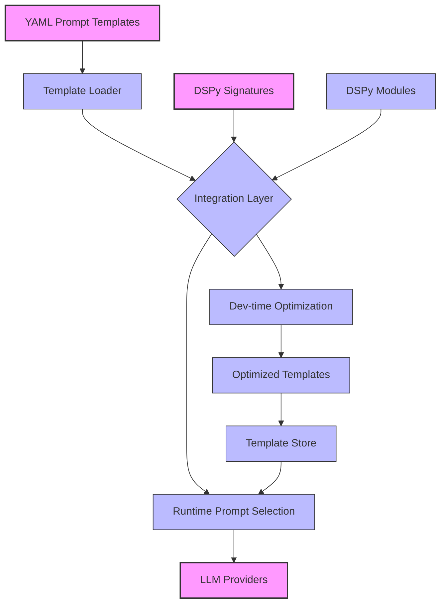

# DSPy Prompt Management

## Overview

This document explains how DSPy integrates with Opossum's existing prompt management system to provide systematic prompt optimization, evaluation, and versioning capabilities.

## Key Concepts

DSPy transforms traditional prompt engineering from a manual art into a systematic engineering discipline through:

1. **Programmatic Definition**: Prompts as code rather than strings
2. **Optimization Pipelines**: Automated refinement of prompts
3. **Compositional Structure**: Building complex prompts from simpler components
4. **Metric-Driven Evaluation**: Measuring prompt effectiveness objectively

## Integration with Existing Prompt System

### Architecture Overview



### Integration Components

1. **Prompt Adapter**: Bridges YAML templates and DSPy Signatures
2. **Optimization Manager**: Schedules and executes optimization runs
3. **Version Control**: Tracks prompt evolution and performance
4. **Template Store**: Manages optimized prompt variants

## Transforming YAML Templates to DSPy

### Current YAML Structure

```yaml
conversation:
  system_prompt: >
    You are Opossum Search, a helpful assistant.
    Respond in a friendly, conversational manner.
    If you don't know something, admit it.
  
  user_template: >
    User query: {{query}}
    Additional context: {{context}}
```

### DSPy Transformation

```python
# Converting YAML templates to DSPy signatures
from app.prompts.loader import get_prompt_template
import dspy

class ConversationSignature(dspy.Signature):
    """Signature for conversational responses."""
    query = dspy.InputField(desc="User's query")
    context = dspy.InputField(desc="Additional context for the query")
    response = dspy.OutputField(desc="Assistant's helpful response")

def create_signature_from_yaml(template_name):
    """Create a DSPy signature from a YAML template."""
    template = get_prompt_template(template_name)
    
    # Extract input fields from template
    input_fields = extract_fields_from_template(template)
    
    # Create a dynamic signature class
    SignatureClass = type(
        f"{template_name.title().replace('.', '')}Signature",
        (dspy.Signature,),
        {
            field: dspy.InputField() for field in input_fields
        } | {"response": dspy.OutputField()}
    )
    
    return SignatureClass
```

## Optimization Workflow

### Step 1: Define Optimization Targets

```python
# app/integrations/dspy/optimization.py
import dspy
from app.data.examples import load_examples

def optimize_prompt_template(template_name, num_examples=20):
    """Optimize a prompt template using DSPy."""
    # Load examples for this template
    examples = load_examples(template_name, limit=num_examples)
    
    # Create baseline module
    signature = create_signature_from_yaml(template_name)
    baseline = dspy.Predict(signature)
    
    # Define optimization metric
    metric = dspy.Metric(name="response_quality", 
                         fn=evaluate_response_quality)
    
    # Create and configure teleprompter
    teleprompter = dspy.Teleprompter(
        baseline, 
        metric=metric,
        max_rounds=5
    )
    
    # Run optimization
    optimized = teleprompter.optimize(examples)
    
    # Persist optimized template
    save_optimized_template(template_name, optimized)
    
    return optimized
```

### Step 2: Evaluation Metrics

DSPy allows for sophisticated evaluation of prompt quality:

```python
# Evaluating prompt effectiveness
def evaluate_response_quality(example, prediction):
    """Evaluate the quality of a model response."""
    # Option 1: LLM-based evaluation
    evaluator = dspy.Predict(
        instruction="Evaluate the quality of this response on a scale of 1-10.",
        input_keys=["query", "true_response", "predicted_response"],
        output_keys=["score", "reasoning"]
    )
    
    eval_result = evaluator(
        query=example.query,
        true_response=example.response,
        predicted_response=prediction.response
    )
    
    # Option 2: Programmatic metrics
    relevance_score = measure_relevance(example.query, prediction.response)
    coherence_score = measure_coherence(prediction.response)
    factuality_score = measure_factuality(prediction.response)
    
    # Combined score
    score = (float(eval_result.score) * 0.7 + 
             relevance_score * 0.1 + 
             coherence_score * 0.1 + 
             factuality_score * 0.1)
    
    return score
```

### Step 3: Versioning and Storage

```python
# Managing prompt versions
def save_optimized_template(template_name, optimized_module, metadata=None):
    """Save an optimized template version."""
    # Extract prompt from module
    optimized_prompt = extract_prompt_from_module(optimized_module)
    
    # Generate version info
    version_info = {
        "timestamp": datetime.now().isoformat(),
        "base_template": template_name,
        "performance_metrics": get_performance_metrics(optimized_module),
        "metadata": metadata or {}
    }
    
    # Store in database or file system
    store_optimized_template(
        template_name=template_name,
        template_content=optimized_prompt,
        version_info=version_info
    )
```

## Runtime Integration

### Using Optimized Prompts

```python
# app/integrations/dspy/runtime.py
from app.prompts.store import get_best_template

def get_optimized_prompt(template_name, context=None):
    """Get the best available prompt for this context."""
    # Check for context-specific optimized version
    if context:
        context_hash = hash_context(context)
        context_optimized = get_template_for_context(template_name, context_hash)
        if context_optimized:
            return context_optimized
    
    # Fall back to best general version
    return get_best_template(template_name)

def apply_prompt(template_name, **kwargs):
    """Apply a prompt with the given parameters."""
    # Get optimized template
    template = get_optimized_prompt(template_name, kwargs.get('context'))
    
    # Apply template parameters
    filled_prompt = template.format(**kwargs)
    
    return filled_prompt
```

## Development Workflow

DSPy prompt optimization integrates into the development workflow through:

1. **CI/CD Integration**: Automated optimization runs on PR
2. **Dashboard**: Visual comparison of prompt performance
3. **A/B Testing**: Systematic comparison of prompt variants
4. **Usage Analytics**: Tracking which prompts perform best in production

```python
# Example: CI/CD integration
def ci_optimize_prompts(changed_files):
    """Optimize prompts affected by code changes."""
    affected_templates = find_affected_templates(changed_files)
    
    optimization_results = []
    for template in affected_templates:
        try:
            optimized = optimize_prompt_template(template)
            optimization_results.append({
                "template": template,
                "status": "success",
                "improvement": calculate_improvement(template, optimized)
            })
        except Exception as e:
            optimization_results.append({
                "template": template,
                "status": "error",
                "error": str(e)
            })
    
    return optimization_results
```

## Benefits Over Traditional Approach

| Traditional Prompt Engineering | DSPy-Enhanced Approach |
|--------------------------------|------------------------|
| Manual trial and error | Systematic optimization |
| Subjective quality assessment | Metric-driven evaluation |
| Hard-coded templates | Programmatic definition |
| Ad-hoc versioning | Systematic version control |
| Context-blind templates | Context-aware optimization |
| Limited reuse | Compositional building blocks |

## Best Practices

1. **Start With Good Baselines**: Begin with well-crafted manual prompts
2. **Diverse Examples**: Collect varied examples for optimization
3. **Meaningful Metrics**: Define metrics that align with user needs
4. **Targeted Optimization**: Optimize for specific contexts and tasks
5. **Continuous Evaluation**: Monitor prompt performance in production
6. **Version Control**: Track prompt evolution and enable rollbacks

## Related Documentation

- Prompt Management
- DSPy Integration Overview
- DSPy Technical Implementation
- DSPy Usage Examples
