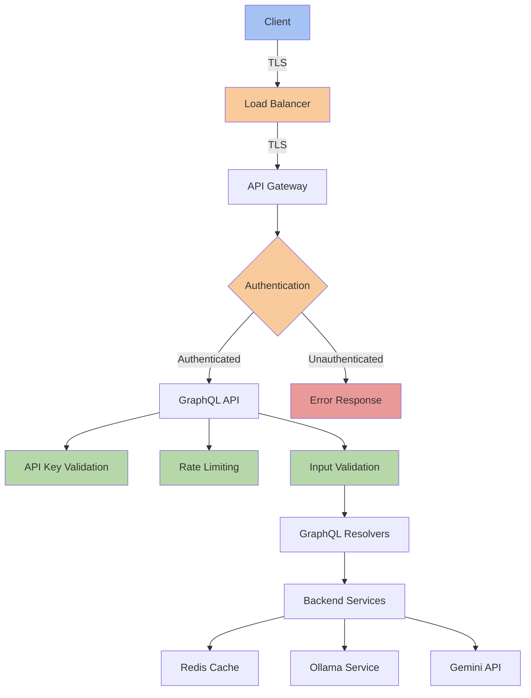

# Technical Documentation: Security Model

## 1. Security Architecture Overview

Opossum Search implements a comprehensive security model to protect user data, API infrastructure, and backend services. The security architecture follows these key principles:

- **Defense in Depth**: Multiple security controls at different layers
- **Principle of Least Privilege**: Minimal access rights for components
- **Secure by Default**: Conservative security defaults
- **Fail Secure**: Systems fail to a secure state
- **Input/Output Validation**: All data is validated at entry and exit points



## 2. Authentication and Authorization

### 2.1 Authentication Mechanisms

```python
# app/auth/authentication.py
async def authenticate_request(request):
    """Authenticate incoming request"""
    # Check for API key
    api_key = request.headers.get("x-api-key")
    if not api_key:
        api_key = request.query_params.get("api_key")
    
    if api_key:
        return await validate_api_key(api_key)
    
    # Check for JWT token
    auth_header = request.headers.get("authorization")
    if auth_header and auth_header.startswith("Bearer "):
        token = auth_header.replace("Bearer ", "")
        return await validate_jwt_token(token)
    
    # No valid authentication found
    return None
```

### 2.2 Authorization Framework

```python
# GraphQL auth directive implementation
class AuthDirective(SchemaDirectiveVisitor):
    def visit_field_definition(self, field, object_type):
        original_resolver = field.resolve
        required_role = self.args.get("requires", "USER")
        
        async def resolve_with_auth(obj, info, **kwargs):
            # Get user from context
            user = info.context.get("user")
            
            # Check authentication
            if not user:
                raise GraphQLError("Authentication required")
            
            # Check authorization
            if required_role == "ADMIN" and not user.get("is_admin"):
                raise GraphQLError("Admin privileges required")
                
            # Call original resolver
            return await original_resolver(obj, info, **kwargs)
            
        field.resolve = resolve_with_auth
        return field
```

### 2.3 Permission Model

| Role | Capabilities | Access Control |
|------|--------------|----------------|
| **Anonymous** | Basic search queries only | Rate limited to 10 requests/minute |
| **User** | Standard search, chat, image processing | Rate limited to 50 requests/minute |
| **Admin** | All features, system management | Rate limited to 100 requests/minute |

## 3. Data Security

### 3.1 Data Classification

| Category | Description | Examples | Protection |
|----------|-------------|----------|------------|
| **Public** | Non-sensitive, publicly available | Public documentation | Basic validation |
| **Internal** | Non-sensitive, internal use | Metrics, logs | Access control |
| **Confidential** | Business sensitive | API keys, user search history | Encryption, access control |
| **Restricted** | Highly sensitive | Authentication tokens | Encryption, strict access |

### 3.2 Encryption Implementation

```python
# app/security/encryption.py
from cryptography.fernet import Fernet

class DataEncryption:
    def __init__(self):
        self.key = self._get_encryption_key()
        self.cipher = Fernet(self.key)
    
    def _get_encryption_key(self):
        """Get encryption key from secure storage"""
        key = os.getenv("ENCRYPTION_KEY")
        if not key:
            raise SecurityError("Encryption key not configured")
        return key.encode()
    
    def encrypt(self, data):
        """Encrypt sensitive data"""
        if isinstance(data, str):
            data = data.encode()
        return self.cipher.encrypt(data)
    
    def decrypt(self, data):
        """Decrypt sensitive data"""
        return self.cipher.decrypt(data).decode()
```

### 3.3 Database Security

```python
# Redis security configuration in config.py
REDIS_HOST = os.getenv("REDIS_HOST", "localhost")
REDIS_PORT = int(os.getenv("REDIS_PORT", "6379"))
REDIS_PASSWORD = os.getenv("REDIS_PASSWORD", "")
REDIS_USE_SSL = os.getenv("REDIS_USE_SSL", "False").lower() == "true"

# Redis connection with security settings
async def get_redis_client():
    """Get Redis client with security settings"""
    return aioredis.Redis(
        host=Config.REDIS_HOST,
        port=Config.REDIS_PORT,
        password=Config.REDIS_PASSWORD,
        ssl=Config.REDIS_USE_SSL,
        ssl_cert_reqs="required" if Config.REDIS_USE_SSL else None,
        ssl_ca_certs=Config.REDIS_CA_CERT if Config.REDIS_USE_SSL else None
    )
```

### 3.4 Data Retention Policies

```python
# app/policies/retention.py
async def apply_retention_policies():
    """Apply data retention policies"""
    redis = await get_redis_client()
    
    # User search history - keep 90 days
    retention_days = 90
    cutoff = time.time() - (retention_days * 86400)
    
    # Remove expired search history
    user_keys = await redis.keys("user:*:searches")
    for key in user_keys:
        await redis.zremrangebyscore(key, 0, cutoff)
    
    # Image data - keep 7 days
    image_retention_days = 7
    image_cutoff = time.time() - (image_retention_days * 86400)
    
    # Remove expired image data
    image_keys = await redis.keys("image:data:*")
    for key in image_keys:
        timestamp = await redis.hget(key, "timestamp")
        if timestamp and float(timestamp) < image_cutoff:
            await redis.delete(key)
```

## 4. API Security

### 4.1 GraphQL Security Controls

```python
# GraphQL security configuration
graphql_app = GraphQL(
    schema,
    debug=Config.DEBUG,
    validation_rules=[
        cost_analysis_validation,   # Prevent resource-intensive queries
        depth_limit_validation,     # Prevent deeply nested queries
        query_complexity_validation # Limit overall query complexity
    ],
    introspection=Config.GRAPHQL_INTROSPECTION_ENABLED
)
```

### 4.2 Rate Limiting Implementation

```python
# app/security/rate_limiting.py
class RateLimiter:
    def __init__(self, redis_client):
        self.redis = redis_client
    
    async def is_rate_limited(self, client_id, limit_key="default"):
        """Check if client is rate limited"""
        # Get rate limit configuration
        limits = Config.RATE_LIMITS.get(limit_key, ["100 per day"])
        
        # Check each limit
        for limit in limits:
            count, period = self._parse_limit(limit)
            rate_key = f"ratelimit:{client_id}:{limit_key}:{period}"
            
            # Check current count
            current = await self.redis.get(rate_key)
            if current and int(current) >= count:
                return True  # Rate limited
        
        return False  # Not rate limited
    
    async def increment_rate_counter(self, client_id, limit_key="default"):
        """Increment rate counters for all applicable limits"""
        limits = Config.RATE_LIMITS.get(limit_key, ["100 per day"])
        
        for limit in limits:
            count, period = self._parse_limit(limit)
            seconds = self._period_to_seconds(period)
            rate_key = f"ratelimit:{client_id}:{limit_key}:{period}"
            
            # Increment counter and set expiration
            await self.redis.incr(rate_key)
            await self.redis.expire(rate_key, seconds, nx=True)
    
    def _parse_limit(self, limit):
        """Parse limit string like '100 per day'"""
        parts = limit.split(" per ")
        count = int(parts[0])
        period = parts[1]
        return count, period
    
    def _period_to_seconds(self, period):
        """Convert period to seconds"""
        if period == "second":
            return 1
        elif period == "minute":
            return 60
        elif period == "hour":
            return 3600
        elif period == "day":
            return 86400
        else:
            return 86400  # Default to day
```

### 4.3 Input Validation

```python
# app/validators/input_validator.py
class InputValidator:
    @staticmethod
    def validate_query(query_text):
        """Validate search query text"""
        if not query_text:
            raise ValidationError("Query cannot be empty")
        
        if len(query_text) > Config.MAX_QUERY_LENGTH:
            raise ValidationError(f"Query exceeds maximum length of {Config.MAX_QUERY_LENGTH}")
        
        # Check for potentially malicious patterns
        if re.search(r'<script|javascript:|data:text/html', query_text, re.IGNORECASE):
            raise ValidationError("Query contains potentially unsafe content")
        
        return query_text
    
    @staticmethod
    def sanitize_output(text):
        """Sanitize output text"""
        # Remove potential XSS vectors
        text = re.sub(r'<script.*?>.*?</script>', '', text, flags=re.DOTALL|re.IGNORECASE)
        text = re.sub(r'javascript:', '', text, flags=re.IGNORECASE)
        
        # Allow safe HTML tags if configured
        if Config.ALLOW_SAFE_HTML:
            # Use a whitelist approach
            allowed_tags = ['p', 'br', 'b', 'i', 'em', 'strong', 'ul', 'ol', 'li', 'code']
            # Implementation would use a proper HTML sanitizer like bleach
            return text
        
        # Otherwise strip all HTML
        return re.sub(r'<.*?>', '', text)
```

## 5. Image Processing Security

### 5.1 Image Validation

```python
# app/security/image_validation.py
def validate_image(image_data, mime_type=None):
    """Validate image for security concerns"""
    # Check size limits
    if len(image_data) > Config.MAX_IMAGE_SIZE:
        raise SecurityError(f"Image exceeds maximum size of {Config.MAX_IMAGE_SIZE} bytes")
    
    # Verify image format
    allowed_formats = ['image/jpeg', 'image/png', 'image/gif', 'image/webp']
    if mime_type and mime_type not in allowed_formats:
        raise SecurityError(f"Image format not allowed: {mime_type}")
    
    # Validate image integrity
    try:
        with wand.image.Image(blob=image_data) as img:
            # Check for suspiciously large dimensions
            if img.width > 10000 or img.height > 10000:
                raise SecurityError(f"Image dimensions too large: {img.width}x{img.height}")
            
            # Validate image format matches claimed format
            if mime_type and f"image/{img.format.lower()}" != mime_type.lower():
                raise SecurityError("Image format doesn't match claimed format")
            
            # Check for format-specific exploits
            if img.format.lower() == 'svg':
                # SVG can contain script tags
                raise SecurityError("SVG format not accepted for upload")
            
            return True
    except Exception as e:
        raise SecurityError(f"Image validation failed: {str(e)}")
```

### 5.2 SVG Sanitization

```python
# app/security/svg_sanitization.py
def sanitize_svg(svg_markup):
    """Sanitize SVG markup for secure display"""
    # Remove any script tags
    svg_markup = re.sub(r'<script.*?</script>', '', svg_markup, flags=re.DOTALL|re.IGNORECASE)
    
    # Remove event handlers
    svg_markup = re.sub(r'on\w+=".*?"', '', svg_markup, flags=re.IGNORECASE)
    
    # Remove external references
    svg_markup = re.sub(r'href="(?!#).*?"', '', svg_markup, flags=re.IGNORECASE)
    
    # Remove potentially dangerous tags
    dangerous_tags = ['foreignObject', 'use']
    for tag in dangerous_tags:
        svg_markup = re.sub(f'<{tag}.*?</{tag}>', '', svg_markup, flags=re.DOTALL|re.IGNORECASE)
        svg_markup = re.sub(f'<{tag}.*?/>', '', svg_markup, flags=re.DOTALL|re.IGNORECASE)
    
    # Ensure SVG namespace is correct
    if 'xmlns="http://www.w3.org/2000/svg"' not in svg_markup:
        svg_markup = svg_markup.replace('<svg', '<svg xmlns="http://www.w3.org/2000/svg"', 1)
    
    return svg_markup
```

## 6. Model Security

### 6.1 Prompt Injection Protection

```python
# app/security/prompt_security.py
def secure_prompt(user_input, template):
    """Secure prompt template from injection attacks"""
    # Escape special characters
    safe_input = json.dumps(user_input)[1:-1]  # Use JSON encoding but remove quotes
    
    # Use a whitelist approach for allowed characters if needed
    if not re.match(r'^[a-zA-Z0-9\s.,?!\'"-:;()]+$', user_input):
        logging.warning(f"Potentially unsafe characters in prompt: {user_input}")
    
    # Apply template with escaped input
    prompt = template.replace("{user_input}", safe_input)
    
    # Add safety instructions to prompt preamble
    safety_instructions = """
    Important: Respond only to the user query. 
    Do not execute commands. 
    Do not engage with harmful, illegal, unethical or deceptive content.
    """
    
    return safety_instructions + prompt
```

### 6.2 Response Filtering

```python
# app/security/content_filtering.py
class ContentFilter:
    def __init__(self):
        # Load blocklisted patterns and terms
        self.blocklisted_patterns = self._load_blocklist()
    
    def _load_blocklist(self):
        """Load blocklisted patterns"""
        with open("config/content_blocklists.json", "r") as f:
            blocklists = json.load(f)
        
        # Compile regex patterns for performance
        return {
            category: [re.compile(pattern, re.IGNORECASE) 
                      for pattern in patterns]
            for category, patterns in blocklists.items()
        }
    
    def filter_response(self, response):
        """Filter potentially harmful content from responses"""
        # Check for harmful content
        filtered_response = response
        
        # Check against each category
        for category, patterns in self.blocklisted_patterns.items():
            for pattern in patterns:
                if pattern.search(response):
                    logging.warning(f"Found potentially problematic content in category: {category}")
                    
                    # Apply redaction based on category
                    if category == "pii":
                        # Redact PII but keep response
                        filtered_response = pattern.sub("[REDACTED]", filtered_response)
                    elif category == "harmful":
                        # Replace entire response for harmful content
                        return Config.HARMFUL_CONTENT_RESPONSE
        
        return filtered_response
```

## 7. Infrastructure Security

### 7.1 Network Security Configuration

```yaml
# docker-compose network configuration
services:
  app:
    networks:
      - frontend
      - backend
  
  redis:
    networks:
      - backend
    # Not exposed to outside world
  
  ollama:
    networks:
      - backend
    # Not exposed to outside world

networks:
  frontend:
    # External-facing network
  backend:
    internal: true  # Not exposed externally
```

### 7.2 Container Security

```dockerfile
# Dockerfile with security best practices
FROM python:3.11-slim AS builder

# Use non-root user
RUN groupadd -r opossum && useradd -r -g opossum opossum

# Install dependencies
COPY requirements.txt .
RUN pip install --no-cache-dir -r requirements.txt

FROM python:3.11-slim

# Copy only necessary files
COPY --from=builder /usr/local/lib/python3.11/site-packages /usr/local/lib/python3.11/site-packages
COPY app/ /app/

# Set working directory
WORKDIR /app

# Use non-root user
USER opossum

# Set secure env defaults
ENV PYTHONUNBUFFERED=1 \
    PYTHONDONTWRITEBYTECODE=1 \
    PIP_DISABLE_PIP_VERSION_CHECK=1 \
    PIP_NO_CACHE_DIR=1

# Use unbuffered output, but don't write bytecode
# Healthcheck to verify application is running properly
HEALTHCHECK --interval=30s --timeout=5s --start-period=5s --retries=3 \
  CMD curl -f http://localhost:8000/health || exit 1

ENTRYPOINT ["python", "main.py"]
```

### 7.3 Secret Management

```yaml
# Kubernetes secrets configuration
apiVersion: v1
kind: Secret
metadata:
  name: opossum-secrets
type: Opaque
data:
  gemini-api-key: <base64-encoded-key>
  redis-password: <base64-encoded-password>
  encryption-key: <base64-encoded-key>
```

## 8. Monitoring and Incident Response

### 8.1 Security Logging

```python
# app/monitoring/security_logging.py
class SecurityLogger:
    def __init__(self):
        self.logger = logging.getLogger("security")
        # Configure structured logging
        self.logger.setLevel(logging.INFO)
        formatter = logging.Formatter(
            '{"timestamp": "%(asctime)s", "level": "%(levelname)s", '
            '"event": "%(message)s", "context": %(context)s}'
        )
        handler = logging.StreamHandler()
        handler.setFormatter(formatter)
        self.logger.addHandler(handler)
    
    def log_security_event(self, event_type, details, severity="INFO"):
        """Log security-related event"""
        context = {
            "event_type": event_type,
            "details": details,
            "severity": severity
        }
        
        # Add to context
        context_json = json.dumps(context)
        
        # Log event
        self.logger.info(f"security_{event_type}", extra={"context": context_json})
        
        # For high-severity events, push to alerts
        if severity in ["CRITICAL", "HIGH"]:
            self._push_security_alert(event_type, details, severity)
    
    def _push_security_alert(self, event_type, details, severity):
        """Push high-severity security alerts"""
        alert = {
            "event_type": event_type,
            "details": details,
            "severity": severity,
            "timestamp": datetime.datetime.now().isoformat()
        }
        
        # Push to Redis for alerting
        redis_client.lpush("security:alerts", json.dumps(alert))
        redis_client.publish("security:alerts:channel", json.dumps(alert))
```

### 8.2 Intrusion Detection

```python
# app/security/intrusion_detection.py
class IntrusionDetection:
    def __init__(self, redis_client):
        self.redis = redis_client
        self.security_logger = SecurityLogger()
    
    async def check_request_pattern(self, request, client_ip):
        """Check for suspicious request patterns"""
        # Track requests per IP
        key = f"security:requests:{client_ip}"
        await self.redis.incr(key)
        await self.redis.expire(key, 3600)  # Expire after 1 hour
        
        # Get request count in last hour
        request_count = int(await self.redis.get(key) or 0)
        
        # Check for rate-based attacks
        if request_count > Config.SECURITY_REQUEST_THRESHOLD:
            self.security_logger.log_security_event(
                "rate_limit_exceeded",
                {"client_ip": client_ip, "request_count": request_count},
                "MEDIUM"
            )
        
        # Check for path traversal attempts
        path = request.url.path
        if re.search(r'\.\./', path) or re.search(r'etc/passwd', path):
            self.security_logger.log_security_event(
                "path_traversal_attempt",
                {"client_ip": client_ip, "path": path},
                "HIGH"
            )
            return True
        
        # Check for SQL injection attempts
        query = request.query_params.get("query", "")
        if re.search(r'UNION\s+SELECT|SELECT\s+FROM', query, re.IGNORECASE):
            self.security_logger.log_security_event(
                "sql_injection_attempt",
                {"client_ip": client_ip, "query": query},
                "HIGH"
            )
            return True
        
        return False  # No intrusion detected
```

### 8.3 Incident Response Plan

```python
# app/security/incident_response.py
class IncidentResponse:
    def __init__(self):
        self.security_logger = SecurityLogger()
    
    async def handle_security_incident(self, incident_type, details):
        """Handle security incident based on type and severity"""
        # Log the incident
        self.security_logger.log_security_event(
            incident_type,
            details,
            details.get("severity", "MEDIUM")
        )
        
        # Take automated action based on incident type
        if incident_type == "api_key_compromise":
            await self._handle_compromised_api_key(details)
        elif incident_type == "rate_limit_abuse":
            await self._handle_rate_abuse(details)
        elif incident_type == "injection_attempt":
            await self._handle_injection_attempt(details)
        
        # Notify security team for high severity incidents
        if details.get("severity") in ["HIGH", "CRITICAL"]:
            await self._notify_security_team(incident_type, details)
    
    async def _handle_compromised_api_key(self, details):
        """Handle potentially compromised API key"""
        # Disable the API key
        api_key = details.get("api_key")
        if api_key:
            # Mark as compromised
            await redis_client.set(f"security:compromised_key:{api_key}", 1)
            # Set short expiry for any active sessions
            await redis_client.expire(f"session:key:{api_key}", 60)
```

## 9. Compliance Framework

### 9.1 Compliance Controls

| Requirement | Implementation | Verification |
|-------------|----------------|--------------|
| **Data Encryption** | All sensitive data encrypted at rest and in transit | Regular security audits |
| **Access Control** | Role-based access with least privilege | Permission reviews |
| **Audit Logging** | Comprehensive logging of security events | Log monitoring |
| **Data Protection** | Data retention policies, minimization | Periodic data reviews |
| **Vulnerability Management** | Regular dependency updates, scanning | CI/CD pipeline checks |

### 9.2 Privacy by Design

```python
# app/privacy/data_minimization.py
class DataMinimization:
    @staticmethod
    def minimize_query_logs(query_data):
        """Minimize data stored in query logs"""
        # Only store necessary fields
        minimized = {
            "query_type": query_data.get("query_type"),
            "timestamp": query_data.get("timestamp"),
            "backend_used": query_data.get("backend_used"),
            "response_time": query_data.get("response_time")
        }
        
        # Generate non-identifying hash of original query
        query_text = query_data.get("query_text", "")
        if query_text:
            minimized["query_hash"] = hashlib.sha256(query_text.encode()).hexdigest()
        
        # Don't store PII
        if "user_id" in query_data and not Config.STORE_USER_ASSOCIATION:
            minimized["user_id"] = hashlib.sha256(
                query_data["user_id"].encode()
            ).hexdigest()
        
        return minimized
```

### 9.3 Data Subject Rights

```python
# app/privacy/dsr.py
class DataSubjectRights:
    def __init__(self, redis_client):
        self.redis = redis_client
    
    async def get_user_data(self, user_id):
        """Get all data associated with a user"""
        # Collect all data related to user
        user_data = {}
        
        # Get user profile
        profile = await self.redis.hgetall(f"user:{user_id}:profile")
        if profile:
            user_data["profile"] = profile
        
        # Get user search history
        searches = await self.redis.zrange(
            f"user:{user_id}:searches", 
            0, -1, 
            withscores=True
        )
        if searches:
            user_data["searches"] = [
                {"query": s[0].decode(), "timestamp": s[1]}
                for s in searches
            ]
        
        return user_data
    
    async def delete_user_data(self, user_id):
        """Delete all data for a user (right to be forgotten)"""
        # Collect keys related to user
        user_keys = await self.redis.keys(f"user:{user_id}:*")
        
        # Delete all keys
        if user_keys:
            await self.redis.delete(*user_keys)
        
        # Log deletion for compliance
        await self.redis.lpush(
            "privacy:deletion_log",
            json.dumps({
                "user_id_hash": hashlib.sha256(user_id.encode()).hexdigest(),
                "timestamp": datetime.datetime.now().isoformat(),
                "keys_deleted": len(user_keys)
            })
        )
        
        return {"deleted": True, "key_count": len(user_keys)}
```

The Opossum Search security model provides comprehensive protection across all layers of the application, from user authentication through data processing to infrastructure security. By implementing these security controls, the system maintains confidentiality, integrity, and availability while meeting regulatory compliance requirements.